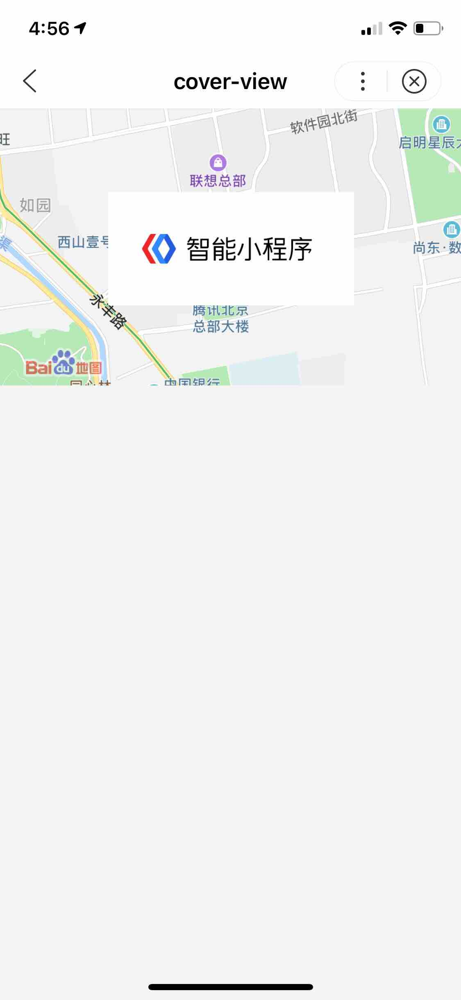

## view 视图容器

**解释**：视图容器。

**属性说明**：

|属性名 |类型  |默认值  |说明|
|---- | ---- | ---- |---- |
|hover-class | String  |  none  | 指定按下去的样式类。当  hover-class="none"  时，没有点击态效果|
|hover-stop-propagation| Boolean  | false | 指定是否阻止本节点的祖先节点出现点击态|
|hover-start-time| Number | 50 | 按住后多久出现点击态，单位毫秒|
|hover-stay-time| Number |400 |手指松开后点击态保留时间，单位毫秒|

**示例**：
<a href="swanide://fragment/0ec2ff19098945ea7ea26197454e741f1565503534116" title="在开发者工具中预览效果" target="_self">在开发者工具中预览效果</a>

* 在 swan 文件中

```html
<view>
    <view class="title">横向布局</view>
    <view class="rowlike">
        <view class="color-a" hover-class="hover" hover-start-time="100" hover-stay-time="200" hover-stop-propagation="false">
            <text>A</text>
        </view>
        <view class="color-b">
            <text>B</text>
        </view>
        <view class="color-c">
            <text>C</text>
        </view>
    </view>
</view>

<view class="bottom-block">
    <view class="title">纵向布局</view>
    <view class="collike">
        <view class="color-a">
            <text>A</text>
        </view>
        <view class="color-b">
            <text>B</text>
        </view>
        <view class="color-c">
            <text>C</text>
        </view>
    </view>
</view>
```

**Bug & Tip**：

1、 如果需要使用滚动视图，请使用 scroll-view。
2、 从基础库版本1.12.0开始支持事件捕获、冒泡。

## scroll-view 可滚动视图区域
**解释**：可滚动视图区域。
> 使用竖向滚动时，需要给定一个固定高度，可以通过css来设置height

**属性说明**：

|属性名 |类型  |默认值  | 必填 |说明|最低支持版本|
|---- | ---- | ---- |---- |---|
|scroll-x | Boolean  |  false  | 否 | 允许横向滚动|-|
|scroll-y| Boolean  | false | 否 |允许纵向滚动|-|
|upper-threshold| Number &#124; String | 50 | 否 | 距顶部/左边多远时（单位 px），触发 scrolltoupper 事件|-|
|lower-threshold| Number &#124; String |50 | 否 |距底部/右边多远时（单位 px），触发 scrolltolower 事件|-|
|scroll-top | Number &#124; String  | | 否 |设置竖向滚动条位置。要动态设置滚动条位置，用法`scroll-top="{= scrollTop =}"`|1.10.3|
|scroll-left| Number &#124; String  | | 否 |设置横向滚动条位置。要动态设置滚动条位置，用法`scroll-left="{= scrollLeft =}"`|-|
|scroll-into-view | String  | | 否 |值应为某子元素 id（id 不能以数字开头）,设置滚动方向后，按方向滚动到该元素，动态设置用法`scroll-into-view="{= scrollIntoView =}"`。|-|
|scroll-with-animation| Boolean  | false | 否 |在设置滚动条位置时使用动画过渡|-|
|enable-back-to-top| Boolean | false | 否 | ios点击顶部导航栏、安卓双击标题栏时，滚动条返回顶部，只支持竖向 |-|
|bindscrolltoupper | EventHandle  | | 否 |滚动到顶部/左边，会触发 scrolltoupper 事件|-|
|bindscrolltolower | EventHandle |  | 否 |滚动到底部/右边，会触发 scrolltolower 事件|-|
|bindscroll | EventHandle | | 否 | 滚动时触发， event.detail = {scrollLeft, scrollTop, scrollHeight, scrollWidth, deltaX, deltaY} |-|


**示例**：
<a href="swanide://fragment/cbb3914cf94d91d1273c190b0dead3201565503526386" title="在开发者工具中预览效果" target="_self">在开发者工具中预览效果</a>

* 在 swan 文件中

```html
<view class="wrap">
    <view class="title">纵向滚动</view>
    <scroll-view
        scroll-y
        class="scroll-view"
        scroll-into-view="{= toView =}"
        scroll-with-animation="true"
        bind:scrolltoupper="upper"
        bind:scrolltolower="lower"
        upper-threshold="1"
        scroll-top="{= scrollTop =}"
        lower-threshold="1"
        bind:scroll="myscroll"
        enable-back-to-top="true"
    >
        <view id="one" class="color-a">A</view>
        <view id="two" class="color-b">B</view>
        <view id="three"  class="color-c">C</view>
    </scroll-view>

    <view class="page-section-btns">
        <view class="next" bindtap="tap">next</view>
        <view bindtap="tapMove">move</view>
        <view class="scrollToTop" bindtap="scrollToTop">scrollToTop</view>
    </view>
    <view class="title">横向滚动</view>
    <scroll-view
        scroll-x
        class="scroll-view"
        bind:scrolltoupper="toLeft"
        bind:scrolltolower="toRight"
        scroll-left="{= scrollLeft =}"
        upper-threshold="1"
        lower-threshold="1"
        bind:scroll="scroll"
    >
        <view id="four" class="color-a row-view">A</view>
        <view id="five" class="color-b row-view">B</view>
        <view id="six" class="color-c row-view">C</view>
    </scroll-view>
</view>

```
* 在 js 文件中

```js
const order = ['one', 'two', 'three'];
Page({
    data: {
        scrollLeft: 'five',
        toView: 'one',
        scrollTop: 0,
    },

    toLeft() {
        swan.showToast({
            title: '到最左边了',
            icon: 'none'
        });
    },
    toRight() {
        swan.showToast({
            title: '到最右边了',
            icon: 'none'
        });
    },
    upper() {
        swan.showToast({
            title: '到顶了',
            icon: 'none'
        });
    },

    lower() {
        swan.showToast({
            title: '到底了',
            icon: 'none'
        });
    },

    scroll(e) {
        console.log('获取滚动事件的详细信息e.detail：');
        console.dir(e.detail);
        this.setData({
            scrollTop: e.detail.scrollTop
        })
    },
    scrollToTop(e) {
        console.log(e);
        this.setData({
          scrollTop: 0,
        });
    },
    tap(e) {
        for (let i = 0; i < order.length; ++i) {
            if (order[i] === this.data.toView) {
            const next = (i + 1) % order.length;
            this.setData({
                toView: order[next],
                scrollTop: next * 200,
            });
            break;
            }
        }
    },
    tapMove() {
        this.setData({
            scrollTop: this.data.scrollTop + 10,
        });
    }
});
```
**Bug & Tip**：

* 请勿在 scroll-view 中使用 textarea、map、canvas、video 组件；更多请看[原生组件说明](https://smartprogram.baidu.com/docs/develop/component/native/)。
* scroll-into-view 的优先级低于 scroll-top、scroll-left。
* 在滚动 scroll-view 时会阻止页面回弹，所以在 scroll-view 中滚动，是无法触发 onPullDownRefresh。
* 若要使用下拉刷新，请使用页面的滚动，而不是 scroll-view。
* scroll-into-view、scroll-top、scroll-left 需要在页面数据高度（或宽度）撑开时生效，若有异步加载数据，请在数据渲染完成时，重新动态赋值，才可生效。
* 在设置 scroll-view 组件 height 属性不是内容可视区总高度时，使用 swan.pageScrollTo() API 无法生效。


## swiper 滑块视图容器

**解释**：滑块视图容器。
> 内部只允许使用`<swiper-item>`组件描述滑块内容，否则会导致未定义的行为。

**属性说明**：

|属性名 |类型  |默认值  | 必填 |说明|最低版本|
|---- | ---- | ---- |---- |---- |
|indicator-dots | Boolean  |  false  | 否 |是否显示面板指示点|- |
|indicator-color| Color  | rgba(0, 0, 0, .3) | 否 |指示点颜色| -|
|indicator-active-color| Color | #333 | 否 |当前选中的指示点颜色| -|
|autoplay |Boolean  | false | 否 |是否自动切换| -|
|current|Number |0 | 否 |当前所在页面的 index| -|
|current-item-id|String|| 否 |当前所在滑块的 item-id ，不能与 current 被同时指定|1.11 <p>低版本请做<a href="https://smartprogram.baidu.com/docs/develop/swan/compatibility/">兼容性处理</a>|
|interval | Number | 5000 | 否 |自动切换时间间隔，单位ms|- |
|duration| Number |500 | 否 |滑动动画时长，单位ms|- |
|circular| Boolean |false | 否 |是否采用衔接滑动| -|
|vertical | Boolean  | false  | 否 |滑动方向是否为纵向|- |
|previous-margin|String|`"0px"`| 否 |前边距，可用于露出前一项的一小部分，支持px和rpx|1.11<p>低版本请做<a href="https://smartprogram.baidu.com/docs/develop/swan/compatibility/">兼容性处理</a>|
|next-margin|String|`"0px"`| 否 |后边距，可用于露出后一项的一小部分，支持px和rpx|1.11<p>低版本请做<a href="https://smartprogram.baidu.com/docs/develop/swan/compatibility/">兼容性处理</a>|
|display-multiple-items|Number|1| 否 |同时显示的滑块数量|1.11<p>低版本请做<a href="https://smartprogram.baidu.com/docs/develop/swan/compatibility/">兼容性处理</a>|
|bindchange | EventHandle |  | 否 |current 改变时会触发 change 事件，event.detail = {current: current, source: source}|- |
|bindanimationfinish|EventHandle| | 否 |动画结束时会触发 animationfinish 事件，event.detail 同上|1.11<p>低版本请做<a href="https://smartprogram.baidu.com/docs/develop/swan/compatibility/">兼容性处理</a>|

**change 事件 source 返回值**

change事件中的source字段，表示触发change事件的原因，可能值如下：

|值 |说明|
|---- | ---- |
| autoplay | 自动播放导致的swiper切换 |
| touch | 用户划动导致的swiper切换 |
| "" | 其他原因将返回空字符串 |

**Bug & Tip**：

* 如果在 bindchange 的事件回调函数中使用 setData 改变 current 值，则会导致 setData 被重复调用，因而通常情况下请在改变 current 值前检测 source 字段来判断是否是由于用户触摸引起的。
* 其中只可放置 swiper-item 组件，否则会导致未定义的行为。

## swiper-item 滑块视图容器子项

> 仅可放置在`<swiper>`组件中，宽高自动设置为100%。

**属性说明**：

|属性名 |类型  |默认值  | 必填 |说明|最低版本|
|---- | ---- | ---- |---- |---- |
|item-id|String| | 否 |该swiper-item的标识符|1.11 低版本请做<a href="https://smartprogram.baidu.com/docs/develop/swan/compatibility/">兼容性处理</a>|

**示例**：
<a href="swanide://fragment/d0dec68787a4c179328c6a22d80325981565503528602" title="在开发者工具中预览效果" target="_self">在开发者工具中预览效果</a>

* 在 swan 文件中

```html
<view class="wrap">
    <view class="title"></view>
    <view class="swiper-wrap">
        <swiper 
            indicator-color="rgba(0,0,0,0.30)"
            indicator-active-color="#fff"
            duration="{{switchDuration}}"
            interval="{{autoPlayInterval}}"
            autoplay="{{switchAutoPlayStatus}}"
            indicator-dots="{{switchIndicateStatus}}" 
            vertical="false"
            circular="true"
            current="0"
            current-item-id="0"
            previous-margin="0px"
            next-margin="0px"
            display-multiple-items="1"
            bind:change="swiperChange"
            bind:animationfinish="animationfinish"
        >
            <block s-for="item in items">
                <swiper-item class="{{item.className}}">
                    <view class="item">{{item.value}}</view>
                </swiper-item>
            </block>
        </swiper>
    </view>

    <view class="switch-wrap">
        <view>
            <text>指示器</text>
            <switch checked="{{switchIndicateStatus}}" bind:change="switchIndicate" class="switch"></switch>
        </view>
        <view>
            <text>自动播放</text>
            <switch checked="{{switchAutoPlayStatus}}" bind:change="switchAutoPlay" class="switch"></switch>
        </view>
    </view>

    <view class="slider-wrap">
        <view>
            <view class="slider-title-time">
                <text class="slider-title">幻灯片切换时长</text>
                <text class="slider-time">{{switchDuration}}ms</text>
            </view>
            <slider min="300" max="1500" value="{{switchDuration}}"  bind:change="changeSwitchDuration"></slider>
        </view>

        <view>
            <view class="slider-title-time">
                <text class="slider-title">自动播放间隔时长</text>
                <text class="slider-time">{{autoPlayInterval}}ms</text>
            </view>
            <slider min="1000" max="5000" value="{{autoPlayInterval}}" bind:change="changeAutoPlayInterval"></slider>
        </view>
    </view>
</view>
```

* 在 js 文件中

```js
Page({
    data: {
        items: [
            {
                className: 'color-a',
                value: 'A'
            }, {
                className: 'color-b',
                value: 'B'
            }, {
                className: 'color-c',
                value: 'C'
            }
        ],
        imgUrls: [
            'http://img02.tooopen.com/images/20150928/tooopen_sy_143912755726.jpg',
            'http://img06.tooopen.com/images/20160818/tooopen_sy_175866434296.jpg',
            'http://img06.tooopen.com/images/20160818/tooopen_sy_175833047715.jpg',
            'http://img06.tooopen.com/images/20160818/tooopen_sy_175866434296.jpg'
        ],
        current: 0,
        switchIndicateStatus: true,
        switchAutoPlayStatus: false,
        switchDuration: 500,
        autoPlayInterval: 2000
    },
    
    swiperChange(e) {
        console.log('swiperChange:', e.detail);
    },
    switchIndicate() {
        this.setData({
            switchIndicateStatus: !this.getData('switchIndicateStatus')
        });
    },
    switchAutoPlay() {
        this.setData({
            switchAutoPlayStatus: !this.getData('switchAutoPlayStatus')
        });
    },
    changeSwitchDuration(e) {
        this.setData({
            switchDuration: e.detail.value
        });
    },
    changeAutoPlayInterval(e) {
        this.setData({
            autoPlayInterval: e.detail.value
        });
    },
    animationfinish() {
        console.log('animationfinish');
    }
});
```


## movable-view 可移动视图容器

**解释**：可移动的视图容器，在页面中可以拖拽滑动。
> movable-view必须在`movable-area`组件中，并且必须是直接子节点，否则不能移动。

**属性说明**：

|属性名 |类型  |默认值  | 必填 |说明|
|---- | ---- | ---- |---- |
| direction | String  | none  | 否 |movable-view 的移动方向，属性值有 all 、 vertical 、 horizontal 、 none |
| inertia | Boolean | false | 否 |movable-view 是否带有惯性|
|out-of-bounds| Boolean | false | 否 |超过可移动区域后，movable-view 是否还可以移动。|
|x	| Number |   | 否 |定义 x 轴方向的偏移，如果 x 的值不在可移动范围内，会自动移动到可移动范围；改变 x 的值会触发动画。|
| y | Number  | | 否 |定义 y 轴方向的偏移，如果 y 的值不在可移动范围内，会自动移动到可移动范围；改变 y 的值会触发动画。|
| damping | Number |20 | 否 |阻尼系数，用于控制 x 或 y 改变时的动画和过界回弹的动画，值越大移动越快。|
| friction | Number |2	  | 否 |摩擦系数，用于控制惯性滑动的动画，值越大摩擦力越大，滑动越快停止；必须大于 0，否则会被设置成默认值。|
| disabled | Boolean |false | 否 |是否禁用   |
| scale | Boolean |false | 否 |是否支持双指缩放，默认缩放手势生效区域是在movable-view内。 |
| scale-min | Number |0.5 | 否 |定义缩放倍数最小值   |
| scale-max | Number |10 | 否 |定义缩放倍数最大值   |
| scale-value | Number |1 | 否 |定义缩放倍数，取值范围为 0.5 - 10  。 |
|animation|Boolean|true| 否 |是否使用动画|
| bindchange | EventHandle | | 否 |拖动过程中触发的事件，event.detail = {x: x, y: y, source: source}，其中source表示产生移动的原因，值可为touch（拖动）。|
| bindscale | EventHandle | | 否 |缩放过程中触发的事件，event.detail = {x: x, y: y, scale: scale} |
| htouchmove | EventHandle | | 否 |手指初次触摸后发生横向移动，如果catch此事件，则意味着touchmove事件也被catch|
|vtouchmove| EventHandle | | 否 |手指初次触摸后发生纵向移动，如果catch此事件，则意味着touchmove事件也被catch|

**direction 有效值**:

| 值 | 说明 |
| ---- | ---- |
| all | 水平方向和垂直方向 |
| vertical | 垂直方向 |
| horizontal | 水平方向 |
| none | 不可移动 |


**Bug & Tip**：

* movable-view 必须设置 width 和 height 属性，不设置默认为 10px。
* movable-view 默认为绝对定位，top 和 left 属性为 0px。
* 当 movable-view 小于 movable-area 时，movable-view 的移动范围是在 movable-area 内。
* 当 movable-view 大于 movable-area 时，movable-view 的移动范围必须包含 movable-area（x 轴方向和 y 轴方向分开考虑）。
* movable-view 必须在组件中，并且必须是直接子节点，否则不能移动。

**示例**：
<a href="swanide://fragment/34026129ece94156c05e4567f773288e1565511303256" title="在开发者工具中预览效果" target="_self">在开发者工具中预览效果</a>

* 在 swan 文件中

```html
<view class="container">
    <view class="section">
        <view class="content-title">
            movable-view区域小于movable-area
        </view>
        <movable-area>
            <movable-view x="{=x=}" y="{=y=}" damping="20" disabled="false" direction="all">text</movable-view>
        </movable-area>
        <button bind:tap="move" class="move-button" type="primary">点击移动到 (30px, 30px)</button>
    </view>
    <view class="section">
        <view class="content-title">
            movable-view区域大于movable-area
        </view>
        <movable-area>
            <movable-view class="bigger-area" direction="all">text</movable-view>
        </movable-area>
    </view>
    <view class="section">
        <view class="content-title">
            只可以横向移动
        </view>
        <movable-area htouchmove>
            <movable-view direction="horizontal">text</movable-view>
        </movable-area>
    </view>
    <view class="section">
        <view class="content-title">
            只可以纵向移动
        </view>
        <movable-area vtouchmove>
            <movable-view direction="vertical">text</movable-view>
        </movable-area>
    </view>
    <view class="section">
        <view class="content-title">
            可超出边界
        </view>
        <movable-area>
            <movable-view direction="all" out-of-bounds>text</movable-view>
        </movable-area>
    </view>
    <view class="section">
        <view class="content-title">
            带有惯性
        </view>
        <movable-area>
            <movable-view direction="all" inertia friction="2">text</movable-view>
        </movable-area>
    </view>
    <view class="section">
        <view class="content-title">
            可放缩
        </view>
        <movable-area>
            <movable-view direction="all" animation="false" bindchange="onChange" bindscale="onScale" scale scale-min="0.5" scale-max="4" scale-value="{{scale}}">
                text
            </movable-view>
        </movable-area>
        <button bind:tap="scale" class="scale-button" type="primary">点击放大3倍</button>
    </view>
</view>
```

* 在 js 文件中

```js
Page({
    data: {
        title: 'movable-view',
        x: 0,
        y: 0,
        scale: 2
    },
    move() {
        this.setData({
            x: 30,
            y: 30
        })
    },
    scale() {
        this.setData({
            scale: 3
        })
    },
    onChange(e) {
        console.log(e.detail)
    },
    onScale(e) {
        console.log(e.detail)
    }
});
```
## movable-area 可移动视图区域

**解释**：`movable-view` 的可移动区域。
> `movable-area` 必须设置width和height属性，不设置默认为10px。

|属性名	|类型	|默认值| 必填 |	说明|
|--|--|--|--|
|scale-area	|Boolean|	false| 否 |	当里面的movable-view设置为支持双指缩放时，设置此值可将缩放手势生效区域修改为整个movable-area 。|

## cover-view 文本视图

**解释： **覆盖在<a href="https://smartprogram.baidu.com/docs/develop/component/native/">原生组件</a>之上的文本视图。只支持嵌套cover-view、cover-image组件。

> 客户端创建的[原生组件](https://smartprogram.baidu.com/docs/develop/component/native/)，不支持嵌套在其它组件中使用。

**属性说明： **

| 属性 | 类型 | 默认值 | 必填 | 说明 |
|------ |------ |------ |------ |------ |
| scroll-top | number | | 否 | 设置顶部滚动偏移量，仅在设置了overflow-y: scroll成为滚动元素后生效 |

**示例**：

<a href="swanide://fragment/e56bb94ee8226ee3635915e1596f239b1565512006326" title="在开发者工具中预览效果" target="_self">在开发者工具中预览效果</a>

* 在 swan 文件中
```html
<map id="myMap"
     longitude="{{longitude}}"
     latitude="{{latitude}}">
    <cover-view class="cover-view">
        <cover-view class="container">
            <cover-view class="flex-wrp" style="flex-direction:row;">
              <cover-view class="flex-item demo-text-1"></cover-view>
              <cover-view class="flex-item demo-text-2"></cover-view>
              <cover-view class="flex-item demo-text-3"></cover-view>
            </cover-view>
        </cover-view>
    </cover-view>
</map>
```
* 在 js 文件中
```js
Page({
    data: {
        latitude: '40.042500',
        longitude: '116.274040'
    },
    onReady() {
        this.mapContext = swan.createMapContext('myMap');
    }
});
```

**图示**

<div class="m-doc-custom-examples">
    <div class="m-doc-custom-examples-correct">
        
    </div>
    <div class="m-doc-custom-examples-correct">
        
    </div>
    <div class="m-doc-custom-examples-correct">
        
    </div>
</div>

## cover-image 图片视图

**解释：**覆盖在<a href="https://smartprogram.baidu.com/docs/develop/component/native/">原生组件</a>之上的图片视图（与 cover-view 相比，仅支持图片）,支持嵌套在 <a href="https://smartprogram.baidu.com/docs/develop/component/view/#cover-view/">cover-view</a> 里。

> 客户端创建的[原生组件](https://smartprogram.baidu.com/docs/develop/component/native/)，覆盖在原生组件之上的图片视图。可覆盖的原生组件同cover-view，支持嵌套在cover-view里。

**属性说明： **

|属性名 |类型  |默认值  | 必填 |说明|
|---- | ---- | ---- | ---- |---- |
| src | String | | 否 |图标路径，支持临时路径、网络地址。暂不支持 base64 格式。|
|bindload|	EventHandle| | 否 |图片加载成功时触发|
|binderror|	EventHandle	| | 否 |图片加载失败时触发|


**示例**：

<a href="swanide://fragment/23aebf6b1898af1931dba33c5df80f331565505998697" title="在开发者工具中预览效果" target="_self">在开发者工具中预览效果</a>

* 在 swan 文件中

```html
<map id="myMap" style="width: 100%" longitude="{{longitude}}" atitude="{{latitude}}">
    <cover-image class="cover-image"
        src="https://b.bdstatic.com/miniapp/image/cover-image.png">
    </cover-image>
</map>
```

**图示**

<div class="m-doc-custom-examples">
    <div class="m-doc-custom-examples-correct">
        
    </div>
    <div class="m-doc-custom-examples-correct">
        
    </div>
    <div class="m-doc-custom-examples-correct">
        
    </div>
</div>

**Bug & Tip**：

* 支持 css transition 动画，transition-property 只支持 transform (translateX, translateY) 与 opacity。
* 文本建议都套上 cover-view 标签，避免排版错误。
* 只支持基本的定位、布局、文本样式。不支持设置单边的 border、background-image、shadow、overflow: visible 等。
* 建议子节点不要溢出父节点。
* 默认设置的样式有：white-space: nowrap; line-height: 1.2; display: block。
* 建议不要频繁改变 s-if 表达式的值控制显隐，否则会导致 cover-view 显示异常。
* IOS端暂不支持一个页面有多个video时嵌套cover-view。
* cover-view 和 cover-image 从基础库版本1.12.0开始支持事件捕获、冒泡。


