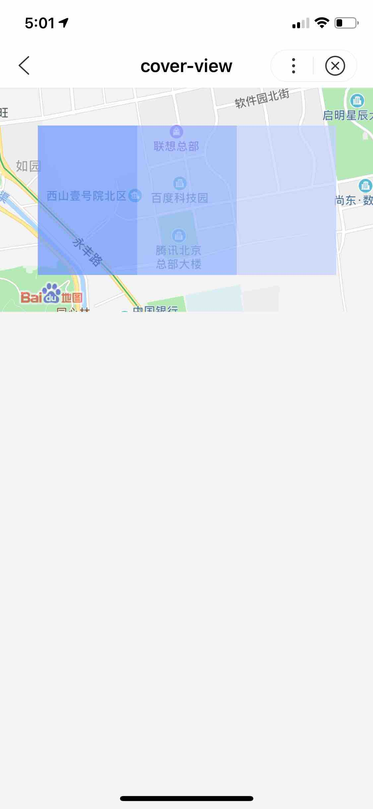

**解释**： 覆盖在<a href="https://smartprogram.baidu.com/docs/develop/component/native/">原生组件</a>之上的文本视图。只支持嵌套cover-view、cover-image组件。客户端创建的[原生组件](https://smartprogram.baidu.com/docs/develop/component/native/)，不支持嵌套在其它组件中使用。

**百度APP中扫码体验：**


**属性说明**

| 属性 | 类型 | 默认值 | 必填 | 说明 |
|------ |------ |------ |------ |------ |
| scroll-top | number | | 否 | 设置顶部滚动偏移量，仅在设置了overflow-y: scroll成为滚动元素后生效 |

**图片示例**：

<div class="m-doc-custom-examples">
    <div class="m-doc-custom-examples-correct">
        
    </div>
    <div class="m-doc-custom-examples-correct">
        
    </div>
    <div class="m-doc-custom-examples-correct">
        
    </div>
</div>

**代码示例**：


<a href="swanide://fragment/e56bb94ee8226ee3635915e1596f239b1565512006326" title="在开发者工具中预览效果" target="_self">在开发者工具中预览效果</a>

* 在 swan 文件中
```html
<map id="myMap"
     longitude="{{longitude}}"
     latitude="{{latitude}}">
    <cover-view class="cover-view">
        <cover-view class="container">
            <cover-view class="flex-wrp" style="flex-direction:row;">
              <cover-view class="flex-item demo-text-1"></cover-view>
              <cover-view class="flex-item demo-text-2"></cover-view>
              <cover-view class="flex-item demo-text-3"></cover-view>
            </cover-view>
        </cover-view>
    </cover-view>
</map>
```
* 在 js 文件中
```js
Page({
    data: {
        latitude: '40.042500',
        longitude: '116.274040'
    }
});
```

 
