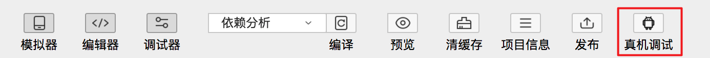

您可选择使用**开发者工具**和**控制台**两种方式，进行真机调试。为方便在真实的移动设备上对百度 App 客户端中的智能小程序进行调试，我们提供了专用的真机调试安装包。这是一个针对智能小程序调试的百度 App，目前暂时只支持 Android 系统。
#### 调试前，您需进行如下操作：
1、 请前往 [最新 Android 真机调试安装包](https://b.bdstatic.com/swan-debug/baidusearch_AndroidPhone_remote_target_debug_20180903.apk) 下载。通过你常用的方式将 APK 安装到目标设备中。
2、 将被调试的移动设备通过数据线连接到当前电脑上，确保在移动设备上已经打开 USB 调试功能，并通过授权。详情可参考：<a href="https://jingyan.baidu.com/article/948f5924ebe158d80ff5f9ab.html ">安卓手机如何开启开发者模式 </a>。
3、 正确安装好真机调试安装包，您将会在设备中看到如下“智能小程序”的图标。
>  在调试阶段微信支付、分享、登陆等部分功能可能会出现异常，小程序在正式使用时以上功能均可正常使用。

启动后，打开需要被调试的智能小程序。

## 使用开发者工具进行真机调试
### 准备工作
* 连接被调试的设备；
* 在百度 App 真机调试包中打开需要被调试的智能小程序。

### 启动真机调试器

1、 开发者工具为真机调试提供了功能入口，进入开发者工具主窗口后，在工具栏中单击“真机调试”将会打开一个真机调试对话框。

2、 根据对话框提示内容，连接移动设备与电脑连接后，会自动显示出设备序列号，后续步骤均变为可用状态。

3、 单击“启动真机调试器”按钮打开调试器窗口。若当前真机调试器窗口已经打开，则会自动将其显示到最顶层。

**说明**：
连接过程中出现问题，可根据对话框提示进行修改，或使用<a  href="http://smartprogram.baidu.com/docs/develop/debug/remoterelease/#使用控制台进行真机调试/">控制台</a>修改。


4、调试过程

<!-- <div style="margin-left: 30px"> -->
真机调试器窗口中的调试界面与常见的 Chrome 浏览器的调试界面类似，更多请参见“工具”的“[调试工具](../../devtools/smartappdebug/#调试工具)”部分。
 
<!--  -->

<!-- </div> -->

5、单击“结束调试”按钮或者关闭真机调试器窗口即可结束当前智能小程序的真机调试。

## 使用控制台进行真机调试
adb-devtools 是一个利用 ADB 工具调试 Android 版智能小程序的远程调试命令。


1、执行如下命令行，完成安装。
```shell
npm install adb-devtools -g
```
2、被调试的手机通过数据线连接电脑，同时确保设备打开了开发者模式（参考：[如何打开开发者模式](https://jingyan.baidu.com/article/948f5924ebe158d80ff5f9ab.html)）

3、启动待调试的智能小程序后，执行如下命令，即可自动打开调试窗口进行远程调试。

```shell
devtools
```
