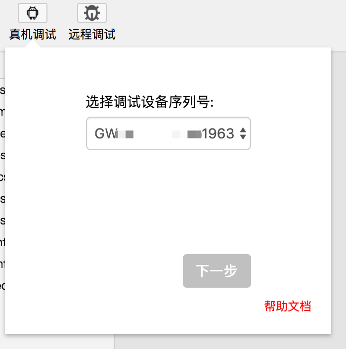
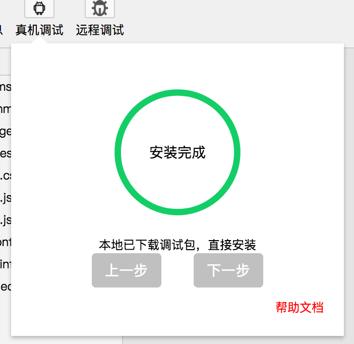
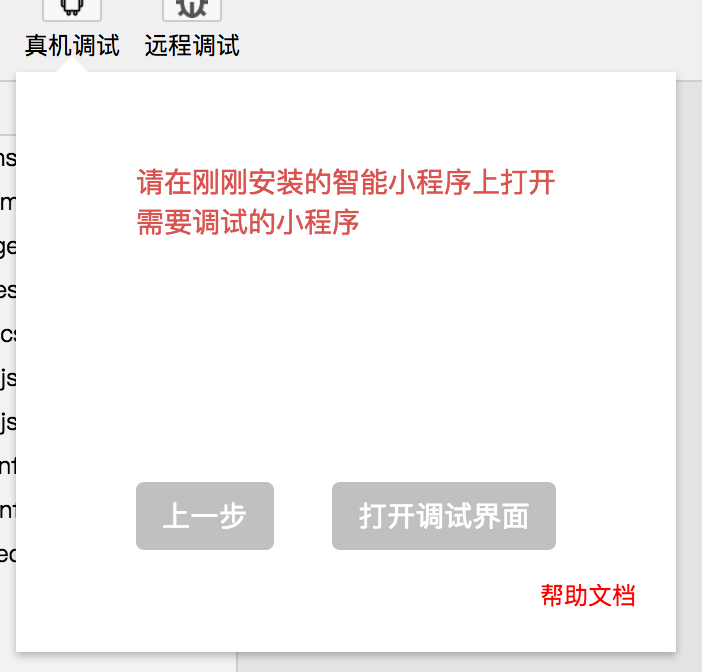

使用开发者工具对真机上的小程序页面进行真机调试，帮助开发者快速调试、定位问题。为方便在真实的移动设备上对百度 App 客户端中的智能小程序进行调试，我们提供了专用的真机调试安装包。这是一个针对智能小程序调试的百度 App，目前暂时只支持 Android 系统。

## 调试步骤
1、 打开开发者工具，单击工具栏上的『真机调试』按钮。
2、 使用数据线连接手机和电脑（详情可见下方 设备与电脑连接），选择需要调试的设备序列号，点击下一步。

3、 自动检测连接设备是否安装『智能小程序』,未安装后会检测电脑本地/tmp目录是否有安装包，若无会先下载包至/tmp目录下，下载后进行安装（手机需要点击安装，若超时则安装失败），安装完成按钮弹出，点击下一步。

4、 打开刚刚自动安装的『智能小程序』APP，扫描工具生成的当前开发小程序的预览二维码（若未在『智能小程序』打开小程序，调试不了），点击『打开调试界面』按钮。

5、 进入真机调试界面，真机调试器窗口中的调试界面与常见的 Chrome 浏览器的调试界面类似，更多请参见“工具”的“[调试工具](../../devtools/smartappdebug/#调试工具)”部分。
 


## 设备与电脑连接
1、 打开设备的开发者模式，并开启开发者选项中的USB调试（参考：[如何打开USB调试](https://jingyan.baidu.com/article/574c521961b8b66c8c9dc16b.html)）
2、 最理想的情况，进行了第一步就可以在真机调试界面选择需调试设备序列号了，但是开启了USB模式还没有显示序列号的话，可能是电脑没有当前被连接设备的驱动，此时有两种方法解决
- 在电脑中下载手机助手（例：豌豆荚）后在重新插线进行连接
- 全局安装adb-devtools，并在终端执行devtools
    ```shell
    npm install adb-devtools -g
    devtools
    ```
