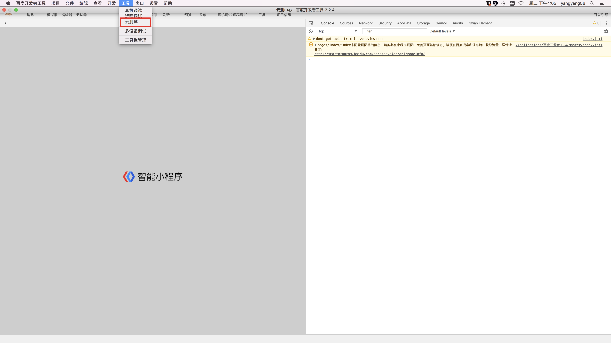
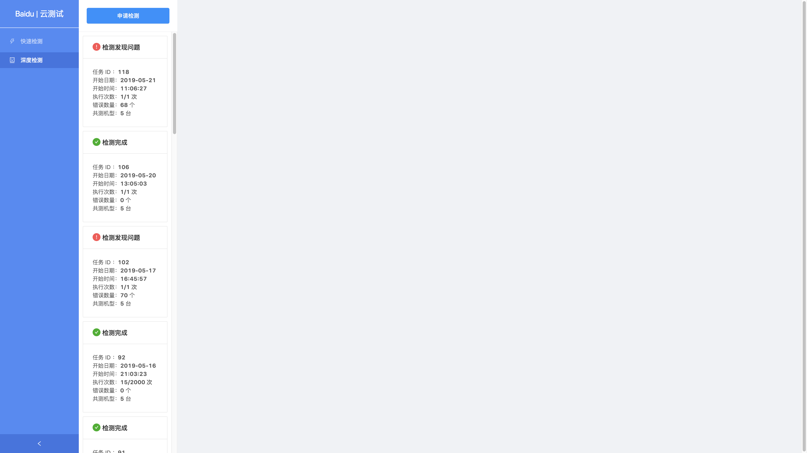
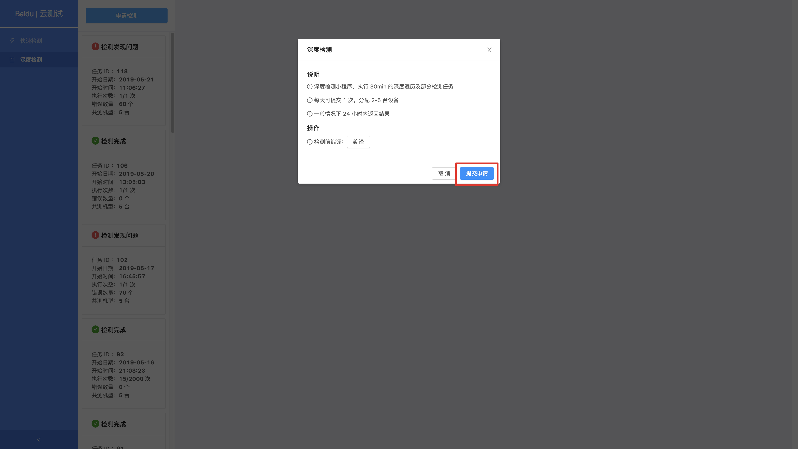
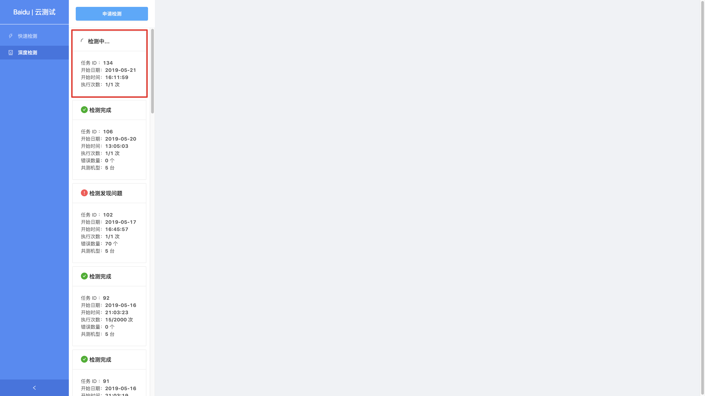
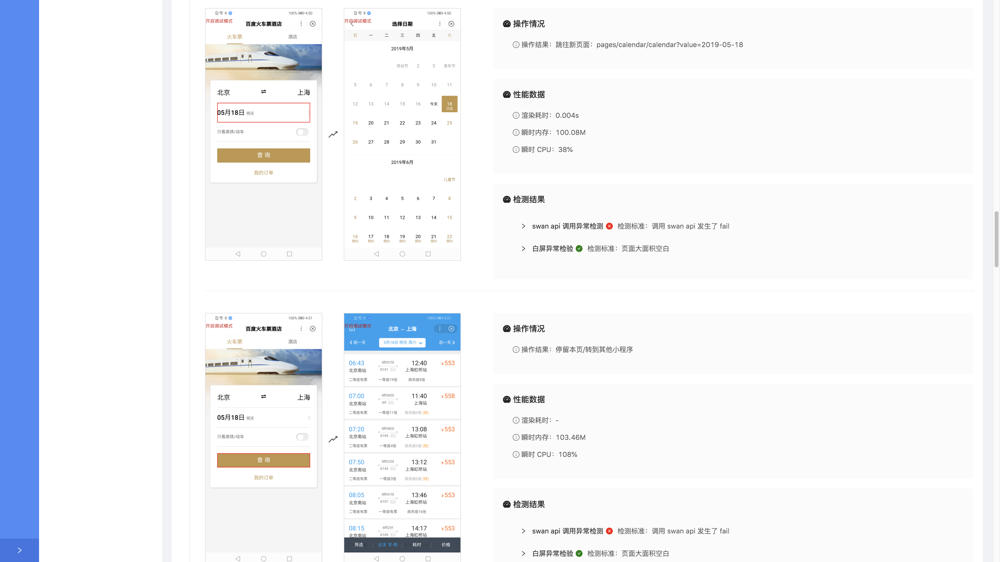

智能小程序云测试服务，是智能小程序云测中心提供的一套基于云端真机的自动化检测方案，用以帮助开发者较为全面地评估小程序质量，发现小程序缺陷，以提高审核通过率。

## 功能特性

当前，云测试服务提供快速检测和深度检测两种检测模式，单个小程序每天可以免费提起 2 次快速检测、1 次深度检测。

**提起检测申请后**：

* 被测小程序会被随机分配到一定数量的真机上，分配的真机数取决于当时的资源情况。
    快速检测：1-2 台
    深度检测：2-5 台 
  
* 使用特定的遍历策略，模拟用户使用。
    快速检测：10min
    深度检测：30min
  
* 通过一定的策略来检测缺陷，执行的检测策略取决于当时的资源情况。

**执行测试过程中会对小程序页面执行以下检测策略**：

|名称|说明|
|--|--|
|webview 嵌套检测|	检测页面是否为 web-view 组件嵌套的网页|
|授权异常检测|	频繁要求用户进行授权操作|
|Swan Api 调用异常检测|	检测在模拟用户使用小程序过程中，是否发生 Swan Api 调用异常|
|页面空屏检测	|页面加载完成后是否无内容，如页面出现白屏、黑屏、内容空缺等情况|
|DOM复杂度检测	|检测页面的总节点数是否少于 1500， 子节点最大深度不超过 32 个|
|图片清晰度检测|	通过百度 AI 能力给被测小程序使用到的图片进行清晰度评分|
|图片质量检测	|通过百度 AI 能力给被测小程序使用到的图片进行质量评分|

## 接入介绍

1. 在智能小程序开发者工具（[2.2.4](https://smartprogram.baidu.com/docs/develop/devtools/history/)及以上版本）工具栏，点击云测试，进入 "小程序云测中心"。

    

        

            
        

        

            
        
    
    

2. 选择要进行的检测策略，点击 "提交申请"。
> 如果需要对待测小程序进行重新编译，可以先点击 "检测前编译" 按钮。

 
3. 提交检测申请后，当次申请会出现在报告列表中。
 
4. 测试结束后可以点击报告进行查看。

    

        

            
        

        

            
        
    
    

## 常见问题

#### Q：提交检测申请后多久可以收到测试报告？
A：提交检测申请后会进行任务排队等待，一般情况下 “快速检测” 20 分钟内返回结果，“深度检测” 45 分钟内返回结果，最晚 24 小时内会执行完成并返回结果。

#### Q：测试结果是否会影响小程序的提审和发布？
A：不会，云测试只是一种提供给开发者自主检测发现开发中小程序缺陷的辅助工具。

#### Q：为什么我的小程序中有一些页面没有测试到？
A：“快速检测” 支持执行 10min 的遍历，"深度检测" 支持执行 30min 的遍历，遍历页面的覆盖度受限于遍历时长。此外，有一些页面需要业务登录或特殊操作后方可进入，目前遍历策略暂无模拟业务登录及进行特殊业务操作的能力。

#### Q："快速检测" / "深度检测" 能发现业务类错误吗？
A：不能，业务类错误需要通过编写业务类测试用例来检测发现，当前提供的两种检测模式仅提供了通用化的检测能力。业务类测试用例的编写和使用，可以考虑使用我们即将开源的 Bat Engine 自动化测试引擎及 "录制回放" 来进行。

#### Q：云测试是真实的机器吗？
A：是的。机器由智能小程序云测中心部署和维护。