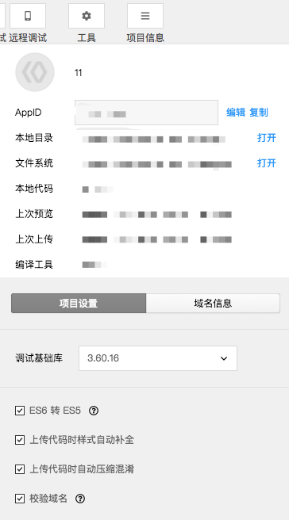

开发者工具从 [2.2.7](https://smartprogram.baidu.com/docs/develop/devtools/history/) 版本提供 ES6 转 ES5、样式补全、压缩代码等代码编译能力，开发者可在菜单栏“项目信息”中，勾选需要开启的功能。
 

## ES6 转 ES5

在开发者工具中，会默认使用 babel 将开发者 ES6 语法代码转换为三端都能很好支持的 ES5 的代码，帮助开发者解决环境不同所带来的开发问题。
需要注意的是：
    为了提高代码质量，在开启 ES6 转换功能的情况下，默认启用 javasctipt 严格模式，请参考 "[use strict](https://developer.mozilla.org/en-US/docs/Web/JavaScript/Reference/Strict_mode)"

## 样式补全

开启此选项，开发者工具会自动检测并补全缺失样式，保证在低版本系统上的正常显示。尽管可以规避大部分的问题 ，还是建议开发者需要在 iOS 和 Android 上分别检查小程序的真实表现。

## 压缩代码

开启此选项，开发者工具在上传代码时候将会帮助开发者压缩和混淆 javascript 代码，减小代码包体积。