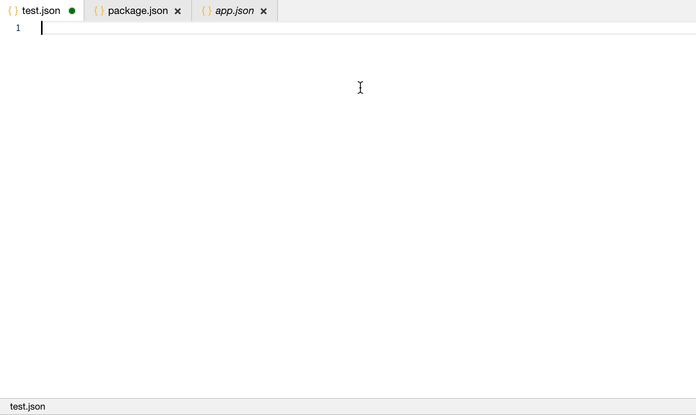
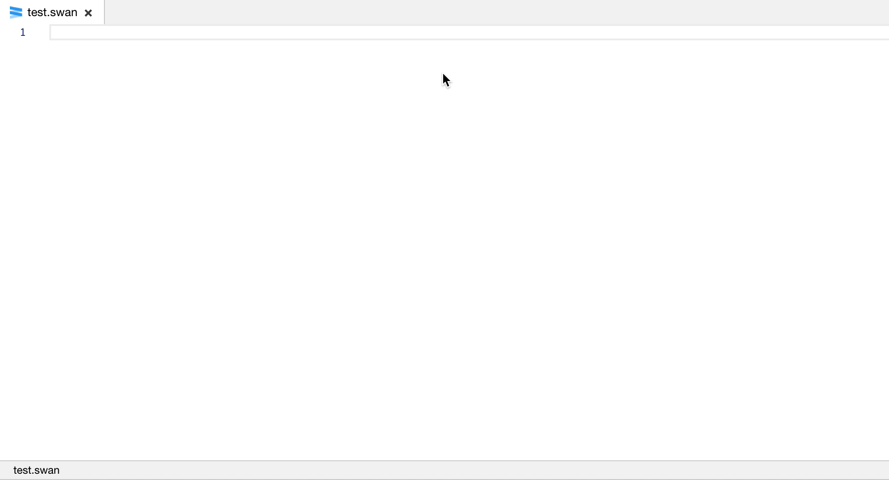
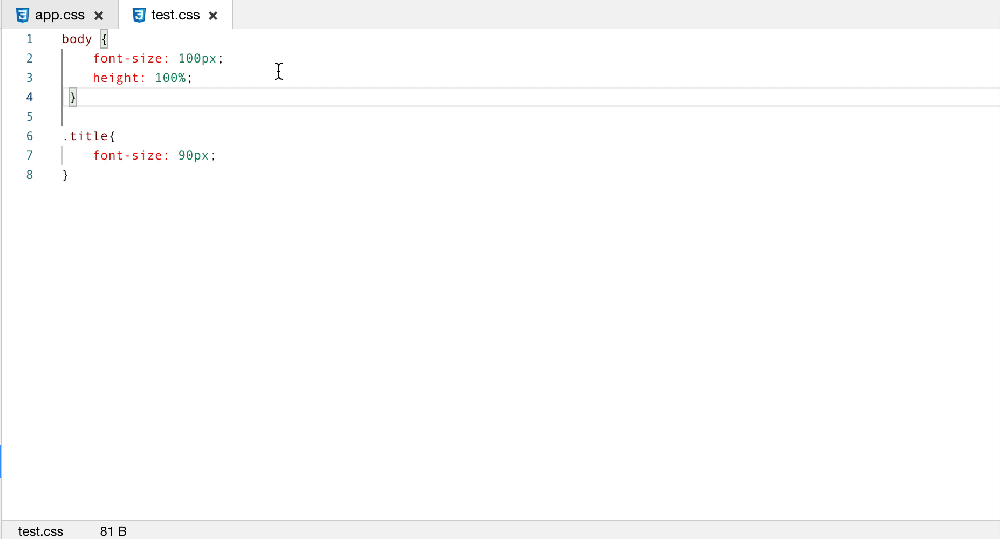
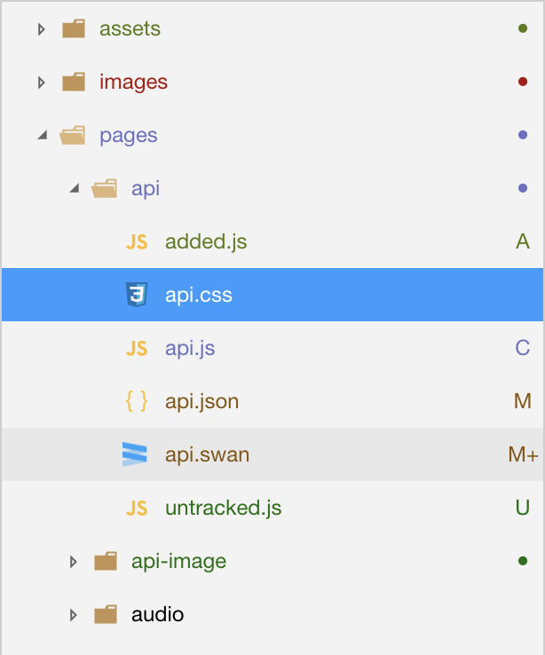
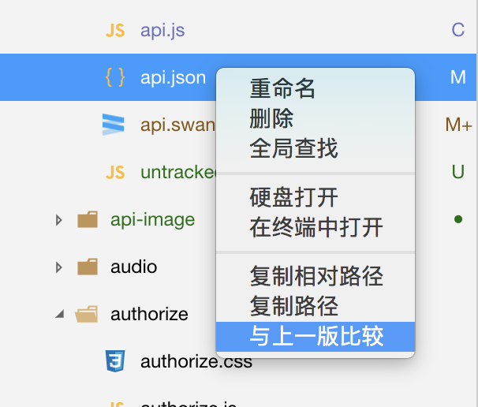
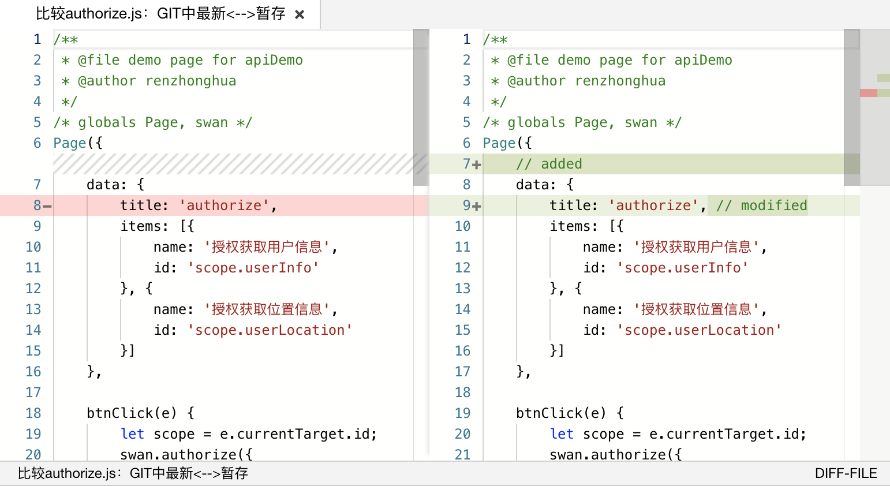
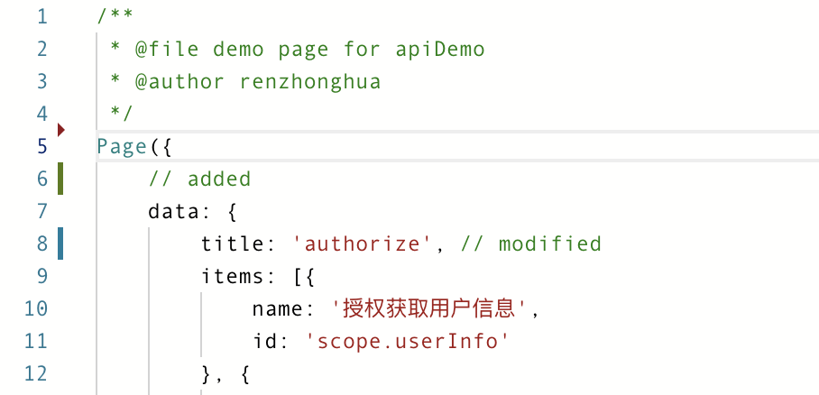
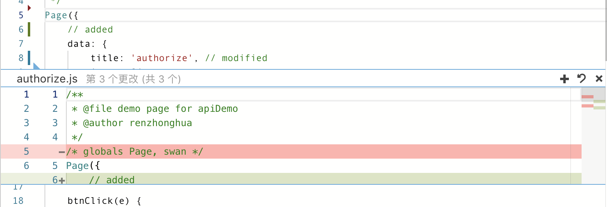

## 文件支持
工具目前提供了 4 种文件的编辑：swan、css、js、json 以及图片文件的预览。

## 文件操作

新建页面的方式：在目录树上右键，选择新建 Page，输入名称后将自动生成页面所需要的 swan、css、js、json。

## 自动保存

1、如果设置中开启了 “修改文件时自动保存”（设置-编辑设置-修改文件自动保存），工具在修改文件时会自动保存到硬盘中，无需手动保存的效果。
2、设置中开启 “编译时自动保存所有文件”（设置-编译设置-编译时自动保存所有文件），在点击编译时自动保存所有文件的效果。

## 自动补全

同大部分编辑器一样，工具提供了较为完善的自动补全：

1、js 文件编辑会帮助开发补全所有的 API 及相关的注释解释，并提供代码模板支持。
2、swan 文件编辑会帮助开发者直接写出相关的标签和标签中的属性。
3、json 文件编辑会帮助开发者补全相关的配置，并给出实时的提示。
4、css 文件编辑会帮助开发者将px转换为rpx，并给出实时的提示。 开发者可在设置-编辑设置-设计稿宽度中设置rpx转换基准宽度。

js 补全

代码模板支持

json 补全

swan 补全

px转换rpx

##Git 状态展示
如果所在的小程序工程目录（project.config.json 所在目录）存在 Git 仓库，编辑器可以展示目前的 Git 状态。

###目录树
如图所示，当某些文件存在变动时，目录树的文件右侧将展示相应的图标来表明这一状态。当某一目录下存在有变动的文件时，此目录的右侧亦会展示一个圆点图标表明此情况。

文件图标状态的含义如下：

|图标 | 含义 |
|---|---|
|U|文件未追踪（Untracked）|
|A|新文件（Added, Staged）|
|M|文件有修改（Modified）|
|M+|文件有修改且被追踪（Modified, Staged）|
|C|文件有冲突（Conflict）|
|D|文件被删除（Deleted）|

文件夹目录图标状态的含义如下：

|图标 | 含义 |
|---|---|
|小红点|目录下至少存在一个删除状态的文件|
|小橙点|目录下至少存在一个修改状态的文件|
|小绿点|目录下至少存在一个未追踪状态的文件|
|小浅绿点|目录下至少存在一个新加入追踪状态的文件|
|小紫点|目录下至少存在一个冲突状态的文件|

如果某一文件存在修改（Modified），可以右键点击此文件，并选择 “与上一版本比较”，则可以查看当前工作区文件与 HEAD 版本的比较。

###文件编辑
存在 Git 仓库时编辑文件内容，将会在所编辑代码左侧实时显示相对于上一版本内容的比较。

样式说明如下：
|图标 | 含义 |
|---|---|
|蓝色线条|此处的代码有变动|
|绿色线条|此处的代码是新增的|
|红色三角箭头|此处有代码被删除|

点击对应线条将显示diff详情，功能包括: 暂存更改、还原更改、关闭

功能说明如下：

|功能 | 含义 |
|---|---|
|暂存更改|暂存当前代码块内容|
|还原更改|还原当前代码块内容至上一版本|
|关闭|关闭diff详情|

## 项目配置文件
可以在项目根目录使用`project.swan.json`文件对项目进行配置。

|字段名 | 类型 |说明|
|---|---|---|
|smartProgramRoot|String|小程序源码的目录(需为相对路径)|
|appid|String| 项目的 AppID，如有变更，请在项目信息中修改 |
|compilation-args|Object|条件参数，目前包含自定义编译条件参数和项目设置编译参数|
|compileType|String|编译类型|
|setting|Object|项目设置|
|developType|String|开发模式|
|editor|Object|编辑器参数|
|host|String|宿主名称|
|preview|Object|web预览信息|
|publish|Object|发布信息|
|swan|Object|宿主信息|

setting 中可以指定以下设置

|名称 | 类型  | 说明|
|---|---|---|
|urlCheck|Boolean|是否检查安全域名|

compilation-args.common 中可以指定以下设置

|名称 | 类型  | 说明|
|---|---|---|
|ignoreTransJs|Boolean|ES6 转 ES5|
|ignorePrefixCss|Boolean|上传代码时样式自动补全|
|ignoreUglify|Boolean|上传代码时自动压缩混淆|
