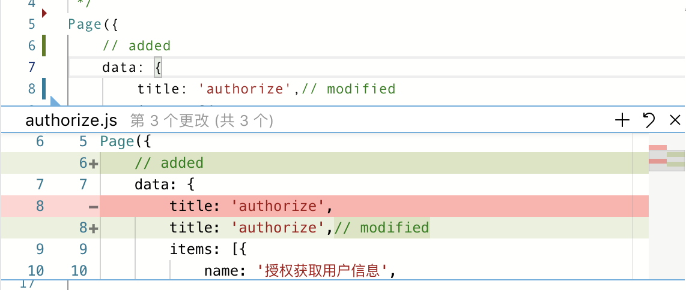

>此功能在`2.11.0-rc`之后版本可用。

如果所在的智能小程序工程目录（project.config.json 所在目录）存在 Git 仓库，编辑器可以展示目前的 Git 状态。

### 目录树
如图所示，当某些文件存在变动时，目录树的文件右侧将展示相应的图标来表明这一状态。当某一目录下存在有变动的文件时，此目录的右侧亦会展示一个圆点图标表明此情况。

文件图标状态的含义如下：

|图标 | 含义 |
|---|---|
|U|文件未追踪（Untracked）|
|A|新文件（Added, Staged）|
|M|文件有修改（Modified）|
|M+|文件有修改且被追踪（Modified, Staged）|
|C|文件有冲突（Conflict）|
|D|文件被删除（Deleted）|

文件夹目录图标状态的含义如下：

|图标 | 含义 |
|---|---|
|小红点|目录下至少存在一个删除状态的文件|
|小橙点|目录下至少存在一个修改状态的文件|
|小绿点|目录下至少存在一个未追踪状态的文件|
|小浅绿点|目录下至少存在一个新加入追踪状态的文件|
|小紫点|目录下至少存在一个冲突状态的文件|

如果某一文件存在修改（Modified），可以右键点击此文件，并选择 “与上一版本比较”，则可以查看当前工作区文件与 HEAD 版本的比较。

### 文件编辑
存在 Git 仓库时编辑文件内容，将会在所编辑代码左侧实时显示相对于上一版本内容的比较。

样式说明如下：

|图标 | 含义 |
|---|---|
|蓝色线条|此处的代码有变动|
|绿色线条|此处的代码是新增的|
|红色三角箭头|此处有代码被删除|

点击对应线条将显示diff详情，功能包括: 暂存更改、还原更改、关闭

功能说明如下：

|功能 | 含义 |
|---|---|
|暂存更改|暂存当前代码块内容|
|还原更改|还原当前代码块内容至上一版本|
|关闭|关闭diff详情|