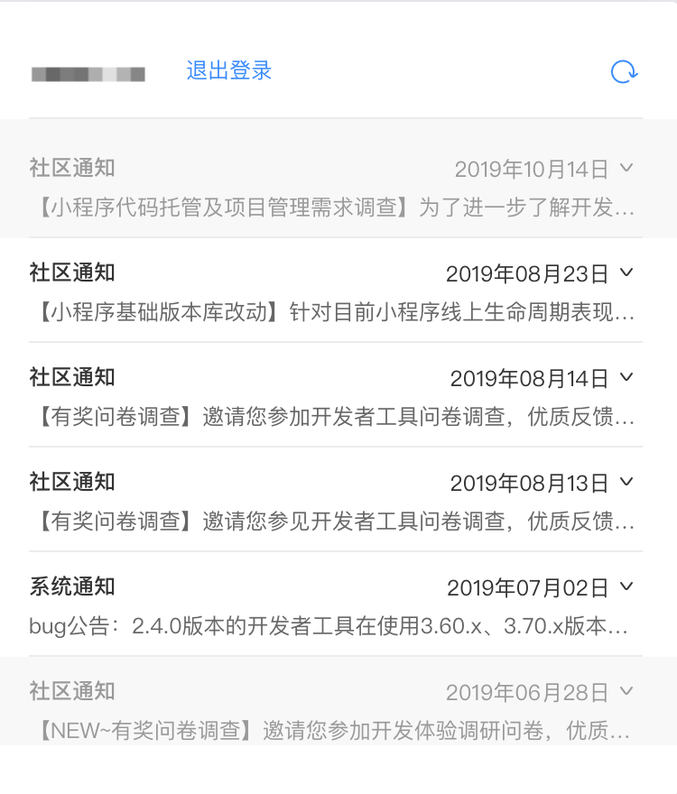
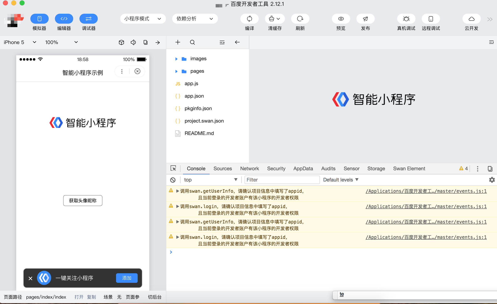
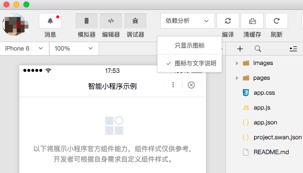

 

点击用户头像可以切换账号，点击消息可以查看开发者工具收到的消息。

    

        
    

    

        
    
     

|按钮名称|说明|
|--|--|
|模拟器、编辑器、调试器按钮|控制主界面模块显示/隐藏。至少需要一个模块显示。|
|编译按钮|可以设置智能小程序的进入场景、页面参数、进入的页面路径等调试参数。|
|清缓存按钮|可以便捷的清除工具上的文件缓存、数据缓存、授权缓存和登录状态，方便开发者调试。|
|刷新按钮|点击可以刷新模拟器。|
|预览按钮|本地编译产出上传至服务器后生成小程序以及 web 小程序二维码，使用百度App扫码即可查看。|
|发布按钮|点击发布成功后可以生成体验版以及提交审核，需要登录官网查看。|
|真机调试按钮|启动真机调试。|
|远程调试按钮|启动远程调试。|
|项目信息按钮|可以查看项目的详细信息。|
|工具按钮|可以进行白屏检测操作。|

### 工具栏管理
在工具栏上点击鼠标右键，可以打开工具栏管理

