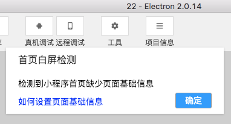
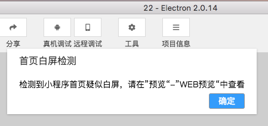

百度智能小程序为开发者提供对接百度搜索生态的能力，为了能让智能小程序正常导入搜索流量，百度开发者工具提供了白屏检测功能，主要检测 H5 首页的基础信息设置及页面复杂度情况。
具体检测内容如下：

    1、检测首页document.title是否为空，如果为空直接报错。
    2、检测首页是否存在name为description的meta标签并且content值不能为空。
    3、检测首页是否存在name为keywords的meta标签并且content值不能为空。
    4、检测首页页面复杂度是否满足入搜索要求。

* 页面基础信息报错

* 白屏检测报错
