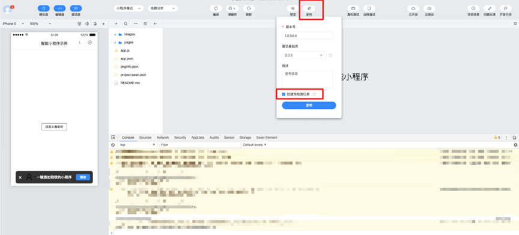
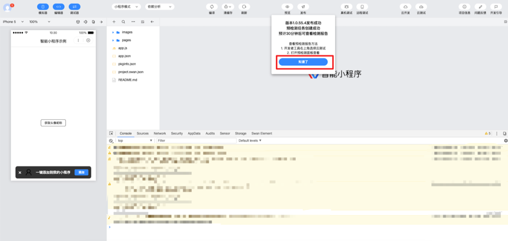
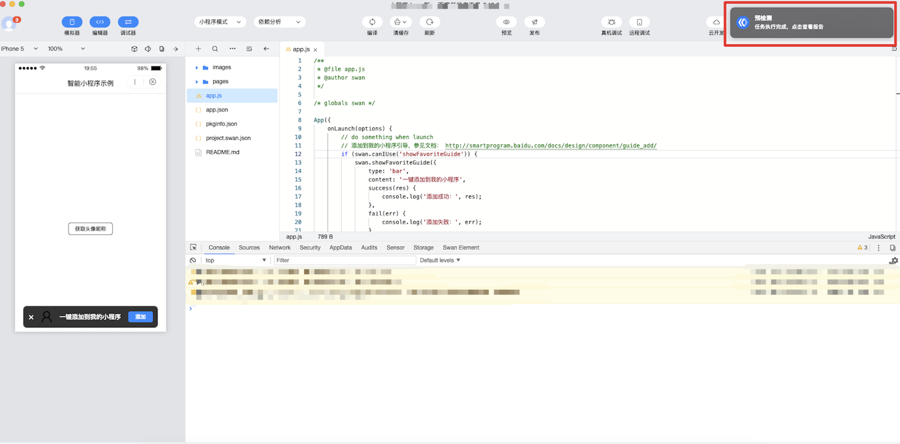
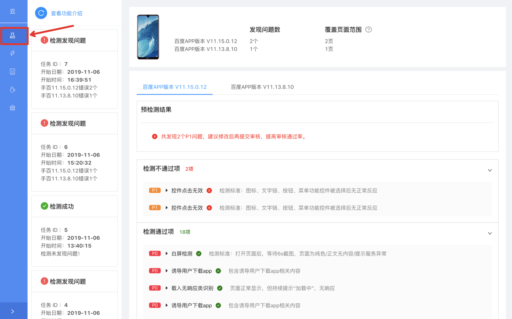
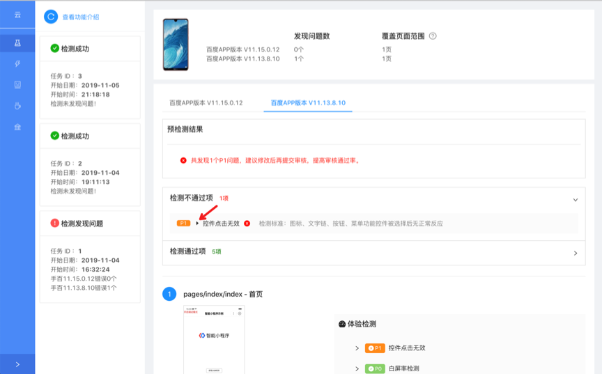
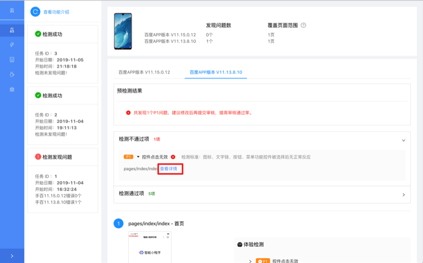
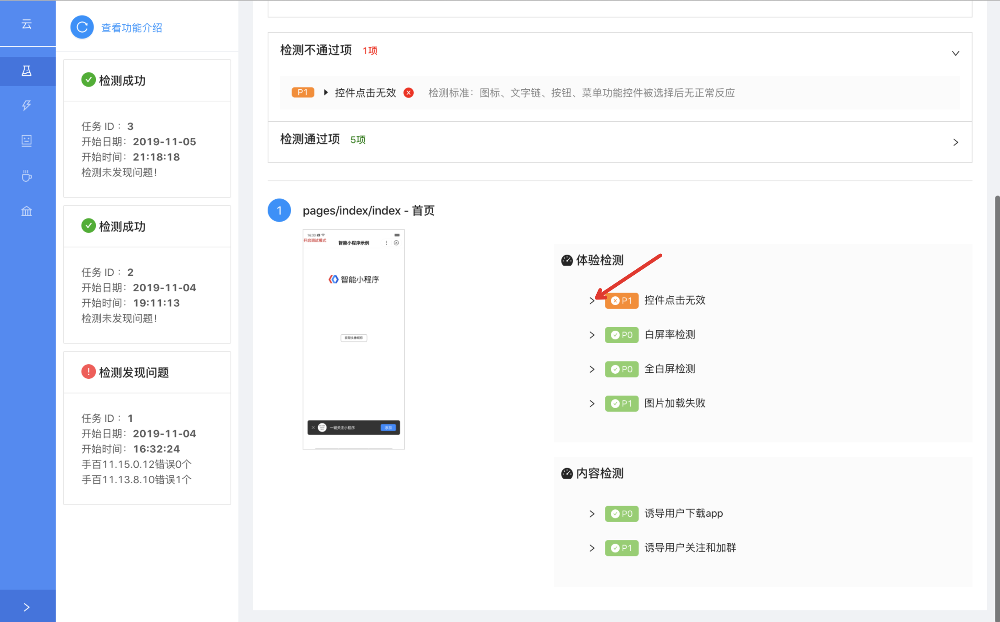
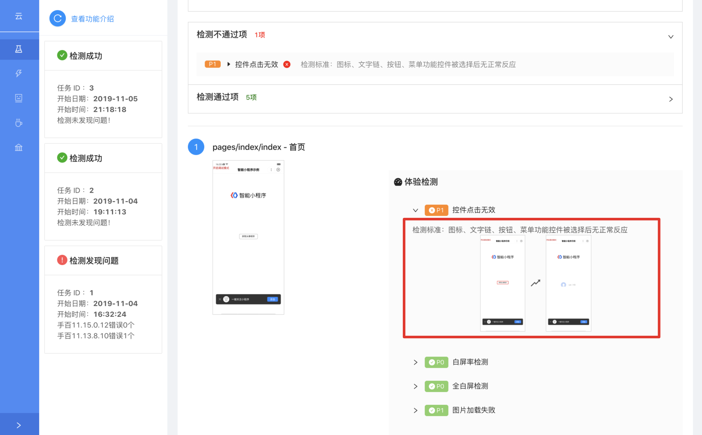

 

开发者在提交代码包审核之前，可通过预检测工具对代码包进行检测，提前发现可能存在的问题并进行修复，提升代码包通过审核的几率。

> 目前预检测工具处于小流量测试阶段，v2.16.0以下版本不支持该工具。

### 预检测范围

如下表所示，预检测会对小程序页面执行以下检测策略：

<table>
<tr>
    <td>类别</td> 
    <td>检测项</td>   
</tr>
<tr>
    <td rowspan="8">体检检测</td>
    <td>首页白屏检测</td> 
</tr>    
<tr>
    <td>非首页白屏检测</td> 
</tr> 
<tr>
    <td>页面部分白屏</td> 
</tr>
<tr>
    <td>控件点击无效</td> 
</tr>
<tr>
    <td>图片加载失败</td> 
</tr>
<tr>
    <td>页面存在无意义字符</td> 
</tr>
<tr>
    <td>页面存在文字展示异常</td> 
</tr>
<tr>
    <td>页面持续提示“加载中”</td> 
</tr>
</tr>
    <td rowspan="2"> 内容检测</td>
    <td>诱导用户下载app</td>
</tr>
<tr>    
    <td>诱导用户关注和加群</td>   
</tr>
</table>

### 预检测和云检测工具的区别 

预检测工具主要检测代码包审核准入规则，并且是固定检测范围及深度的，云测试工具可自定义选择测试深度、范围、检测项。预检测工具适用于开发者在提交代码包审核之前进行自检测与问题整改。

## 如何使用预检测工具 

1. 提交代码包时，在开发者工具中点击发布，系统会默认勾选创建预检测任务。

> 勾选创建检测任务后，检测结果仅为开发者提供整改参考，不会阻塞发布流程。

2. 点击发布后，若成功创建预检测任务，系统会进行弹窗提示，请等待30分钟后查看检测报告。

    

3. 检测完成后，系统会进行弹窗及站内信提示，可点击弹窗，也可在开发者工具右上角点击云测试，进入小程序云测试中心。

    

4. 在云测试中心点击预检测按钮，查看预检测结果，历史检测记录都会展示在此处。

    

5. 若检测存在问题，开发者可点击展开检测不通过项对应的具体页面路径，点击“查看详情”，可查看该页面预检测详情。

    

    

6. 页面预检测详情包含体验检测及内容检测两部分，开发者可点击展开对应问题详情。如下图，展开后可见该页面控件点击无效的具体位置。

    

    

7. 开发者可参考以上检测结果对代码进行修改并重新提交发布。注：检测问题按照重要性给出分类，P0最高，依次类推，请优先整改重要性高的问题。

