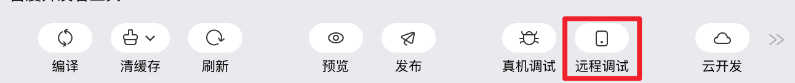
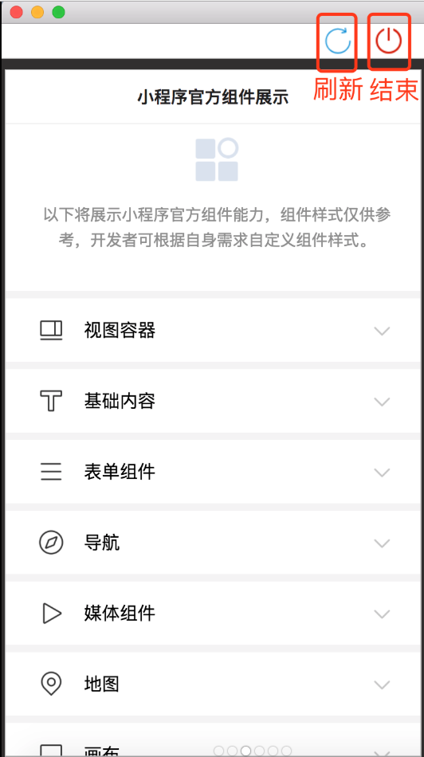
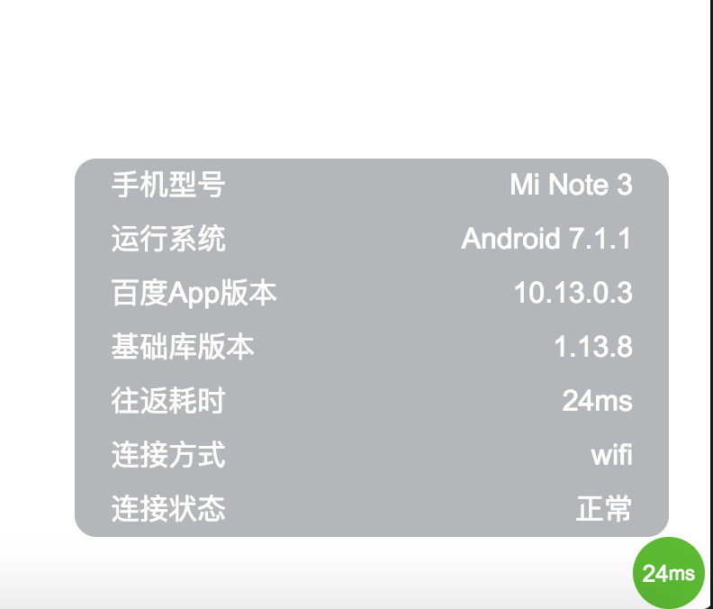
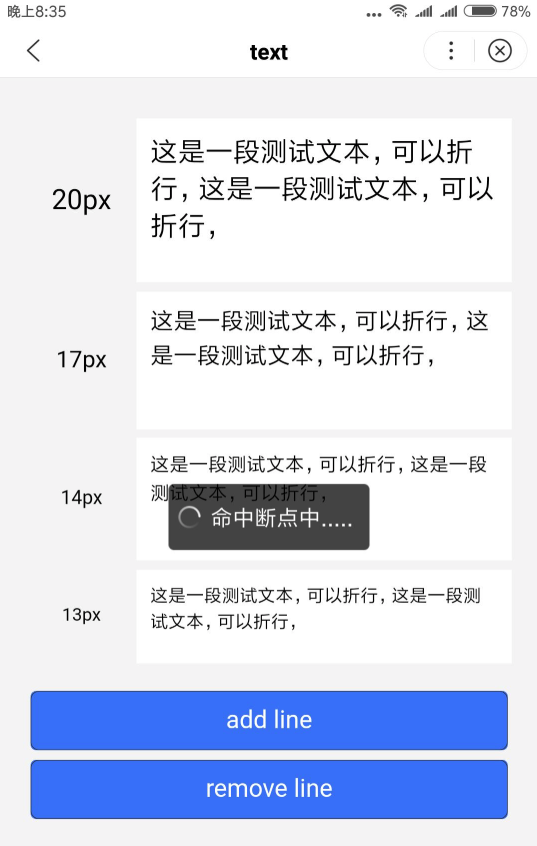

使用开发者工具，连接局域网，对百度 App 中的小程序进行调试，帮助开发者快速调试、查找小程序在百度 App 客户端中存在的问题。
## 前提条件：

1. 百度 App 客户端的版本在10.13.5及以上；
2. 开发者工具和百度 App 客户端在同一局域网内；
3. 百度 App 客户端的登录用户和开发者工具的登录用户是当前 appid（智能小程序ID）的开发者。

## 调试步骤：
1. 打开开发者工具，单击工具栏上的“远程调试”按钮。
2. 使用百度 APP 客户端扫码，打开远程调试窗口。

3. 远程调试窗口包括：页面视图、调试器视图和信息球。
    3.1 页面视图：远程调试工具的页面视图和客户端中的页面视图保持同步，展示了小程序页面的运行情况。远程调试工具端的镜像视图不支持TabBar等NA组件
    > * 刷新按钮：修改代码后，点击刷新按钮使百度 App 客户端获得最新的开发代码，无需重新扫码打开远程调试窗口，实现静默刷新;
    > * 结束调试按钮：点击顶部的结束调试按钮，结束远程调试.
    
    
    
    3.2 调试器：调试器在小程序的调试中起到了非常重要的作用：
    > * 在调试器的console面板中，开发者可以调试代码、查看小程序输出信息;
    > * 在调试器的source面板中，可以查看源代码，进行断点调试;
    > * 在调试器的network面板中，可以查看小程序发出的网络请求。

    
    3.3 信息球：时展示了百度 App 客户端和远程调试窗口之间的信息传输延时：
    > * 将鼠标放到信息球上，会出现客户端的基本信息，包括手机型号、运行系统、百度App版本、基础库版本、往返耗时、连接方式、连接状态。
    > * 信息球的延迟越小，远程调试窗口和百度 App 客户端的通信越流畅：当延时小于50时，信息球的颜色为绿色;当延时大于50小于100时，信息球的颜色变成橙色;当延时大于100时，信息球的颜色变为红色。 

    * 信息球的位置可以拖拽变化：

    

        

            
        

        

            
        
    
    
    

    * 手机端显示：

    

        

            
        

        

            
        
    
    
