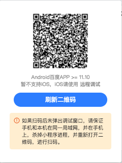

使用开发者工具对真机上的小程序页面进行真机调试，帮助开发者快速调试、定位问题。为方便在真实的移动设备上对百度 App 客户端中的智能小程序进行调试，我们从开发者工具 **2.4.3** 以上版本，提供了无线调试方式，目前只支持 **Android 系统**。

## 前提条件
1. 安卓手机，基础库版本 2.10.34 及以上；
2. 无线模式下：开发者工具和百度 App 客户端在同一局域网内；

## 调试步骤

### 无线调试模式
> 无线调试模式整体流程：手机上扫描二维码后，会在手机上调起当前小程序，电脑上自动打开真机调试窗口；

1. 打开开发者工具，单击工具栏上的『真机调试』按钮。
2. 等待生成调试二维码

    

        
    

    

        
    
    

3. 用百度APP扫描二维码
	>Tips: 在扫码前，需要保证 1.杀掉当前手机上调试小程序的进程，注意是杀掉小程序进程，而不是点击小程序界面右上角按钮置于后台；2.关闭电脑上真机调试窗口；

4. 二次打开真机调试：当再次编辑代码保存后，会生成新的真机调试二维码。进行真机调试前，需要杀掉手机上调试小程序进程和电脑上关闭真机调试窗口，然后重复上面步骤即可；

## 常见问题
#### 无线模式下，扫码失败，无响应？
- 请保证手机和电脑在**同一局域网**；
- 安卓手机，百度APP版本 >= 11.10;
- 保证手机上**调试小程序进程**和PC上**真机调试窗口**都处于关闭状态下，扫描二维码进入调试；
- 上面前置条件都满足情况下，再扫码，如果还是未响应，请点击二维码上面的 `强制刷新` 按钮；

#### 再次编辑后，如何真机调试？
由于真机调试现在不支持刷新功能，需要手动杀掉手机上调试小程序进程和PC上调试窗口的关闭。然后再重复首次流程，即扫码调试；

#### 真机调试的页面与预览不一致的问题？
真机调试的渲染页面分为俩个，手机上的页面和电脑上的镜像页面，都是真机调试的页面，以手机上渲染的页面为准。因为电脑的镜像页面，没办法渲染Native的组件，如底部的Tabbar、map等等组件。建议电脑上的镜像页面，仅仅作为调试页面结构和CSS使用。

#### iOS如何真机上调试？
iOS暂时不支持真机调试，建议使用 [远程调试](https://smartprogram.baidu.com/docs/develop/debug/remotedebugging/) 。

#### 其他真机调试相关问题或者建议？
真机调试相关的问题，可以联系客服微信：`wx2swan-helper`，验证信息 `真机调试`。
