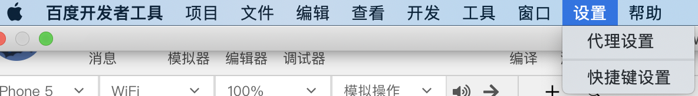
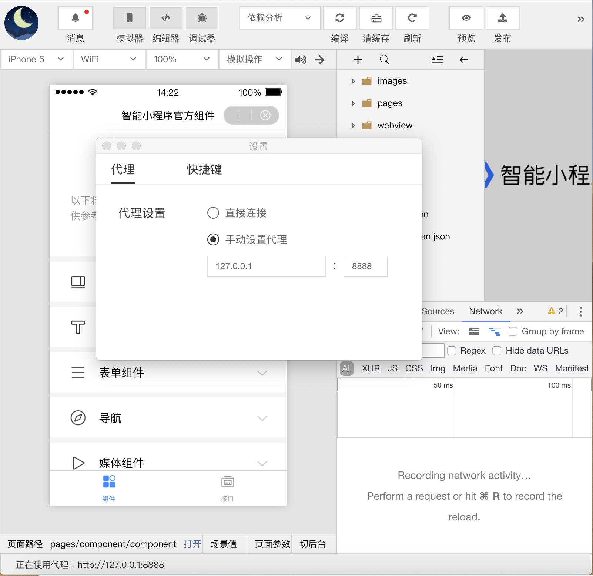
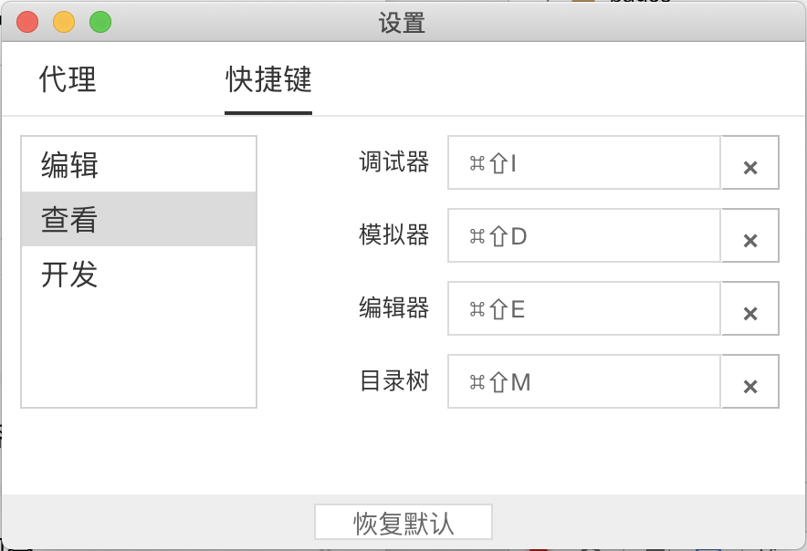
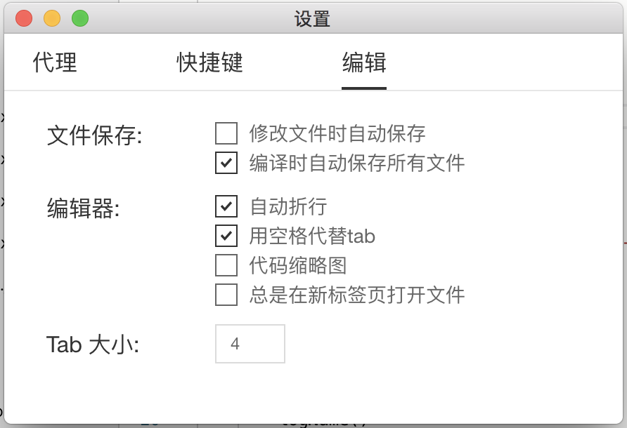

在菜单栏单击“设置”，可以对代理和快捷键进行设置。

## 代理设置

可以直接连接，也可以手动设置代理，代理设置修改后会立即生效。

- 直接连接：直接访问网络，不使用代理；
- 手动设置代理：手动设置代理的域名（或 ip）和端口，手动设置代理后会在开发者工具左下角显示正在使用的代理。
1. 

## 快捷键设置

可对菜单中“编辑”、“查看”、“开发”相关的快捷键进行设置。

## 编辑设置

可对编辑时“文件保存”、“编辑器”、“Tab大小”相关的规则进行设置。

