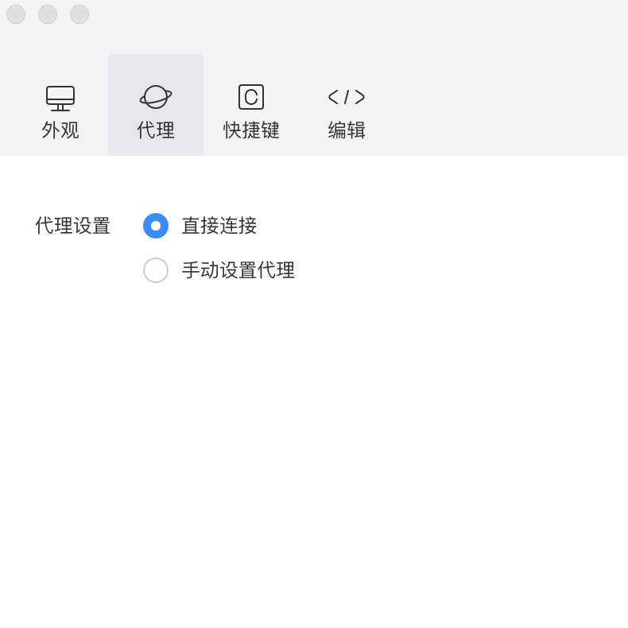
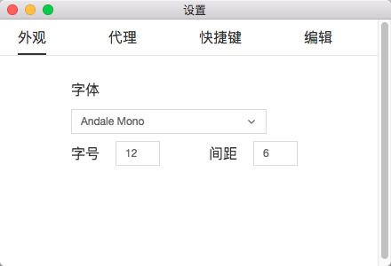

## 快捷键设置
### 项目

|Mac OS 快捷键 | Windows 快捷键 | 说明 |
|---|---|---|
| ⌘ + Q | ctrl + Q | 退出开发者工具 |
| ⇧ + ⌘ + N | shift + ctrl + N | 新建项目 |
| ⇧ + ⌘ + W | shift + ctrl + W | 关闭当前项目 |

### 文件

|Mac OS 快捷键 | Windows 快捷键 | 说明 |
|---|---|---|
| ⌘ + N | ctrl + N | 新建文件 |
| ⌘ + S | ctrl + S | 保存当前文件 |
| ⇧ + ⌘ + S | shift + ctrl + S | 保存所有文件 |
| ⌘ + W | ctrl + W | 关闭当前文件 |

### 编辑

|Mac OS 快捷键 | Windows 快捷键 | 说明 |
|---|---|---|
| ⌘ + X | ctrl + X | 剪切 |
| ⌘ + C | ctrl + C | 复制 |
| ⌘ + V | ctrl + V | 粘贴 |
| ⇧ + ⌘ + W | shift + ctrl + W | 粘贴并匹配样式 |
| ⌘ + A | ctrl + A | 全选 |
| ⌘ + Z | ctrl + Z | 撤销 |
| ⇧ + ⌘ + Z | shift + ctrl + Z | 重做 |
| ⌘ + [ | ctrl + [ | 左缩进 |
| ⌘ + ] | ctrl + ] | 右缩进 |
| ⇧ + ⌥ + F | shift + alt + F | 格式化代码 |
| ⌥ + ⇧ | alt + ⇧ | 代码上移一行 |
| ⌥ + ⇩ | alt + ⇩ | 代码下移一行 |
| ⇧ + ⌥ + ⬆ | shift + alt + ⬆ | 复制并向上粘贴 |
| ⇧ + ⌥ + ⬇ | shift + alt + ⬇ | 复制并向下粘贴 |
| ⌘ + P | ctrl + P | 跳转到文件 |
| ⌘ + ⌥ + ⬅ | ctrl + alt + ⬅ | 上一个编辑器 |
| ⌘ + ⌥ + ➡| ctrl + alt + ➡ | 下一个编辑器 |
| ⌘ + F| ctrl + F | 文件内搜索 |
| ⇧ + ⌘ + F| shift + ctrl + F | 项目内搜索 |
| ^ + ⌘ + 空格符| ^ + ctrl + 空格符 | 表情与符号 |

### 查看

|Mac OS 快捷键 | Windows 快捷键 | 说明 |
|---|---|---|
| ⇧ + ⌘ + T | shift + ctrl + T | 工具栏 |
| ⇧ + ⌘ + L | shift + ctrl + L | 调试器 |
| ⇧ + ⌘ + D | shift + ctrl + D | 模拟器 |
| ⇧ + ⌘ + E | shift + ctrl + E | 编辑器 |
| ⇧ + ⌘ + M | shift + ctrl + M | 目录树 |
| ⇧ + ⌘ + R | shift + ctrl + R | 强制刷新 |
| ^ + ⌘ + F | ^ + ctrl + F | 进入/退出全屏 |

### 开发

|Mac OS 快捷键 | Windows 快捷键 | 说明 |
|---|---|---|
| ⇧ + ⌘ + P | shift + ctrl + P | 预览 |
| ⇧ + ⌘ + U | shift + ctrl + U | 发布 |
| ⌘ + R | ctrl + R | 刷新 |
| ⌘ + B | ctrl + B | 编译 |

### 窗口

|Mac OS 快捷键 | Windows 快捷键 | 说明 |
|---|---|---|
| ⌘ + M | ctrl + M | 最小化窗口 |
| ⇧ + ⌘ + W | shift + ctrl + W | 关闭窗口 |

## 编辑设置
* 修改文件时自动保存
* 编译时自动保存所有文件
* 自动折行
* 用空格代替 Tab
* 代码缩略图
* 总是在新标签页打开文件
* Tab 大小

## 代理设置
可以配置不使用代理或使用自定义代理。

## 外观设置
支持配置代码编辑器习惯和风格。
* 字体
* 字号
* 间距

