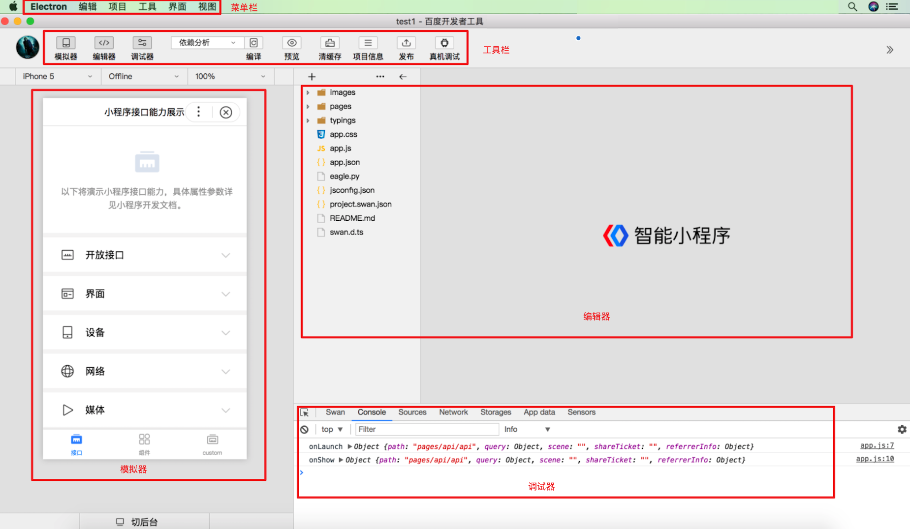

 

## 工具栏

* 模拟器、编辑器、调试器按钮：控制主界面模块显示/隐藏。至少需要一个模块显示。

* 编译按钮：可以设置智能小程序的进入场景、页面参数、进入的页面路径等调试参数

* 预览按钮：本地编译产出上传至服务器后生成小程序以及 web 小程序二维码，使用百度App扫码即可查看

* 清缓存按钮：可以便捷的清除工具上的文件缓存、数据缓存、授权缓存和登录状态，方便开发者调试。

* 项目信息按钮：可以查看项目的详细信息。

* 发布按钮：点击发布成功后可以生成体验版以及提交审核，需要登录官网查看。

* 刷新按钮：点击可以刷新模拟器。

* 真机调试按钮：启动真机调试。

* 远程调试按钮：启动远程调试。

## 模拟器

模拟器可以模拟智能小程序在百度 App 的表现。智能小程序的代码通过编译后可以在模拟器上直接运行。

开发者可以选择不同的设备来调试智能小程序在不同尺寸机型上的适配问题。

模拟器底部的切后台按钮可以模拟移动设备切换窗口的操作。

## 编辑器

编辑器可以进行小程序开发，编辑保存文件，对项目中进行新增文件、删除文件、文件重命名、打开文件等操作。
### 文件支持
工具目前提供了4种文件的编辑：swan、js、json、css以及图片文件的预览。
### 文件操作
新建页面有两种方式

1. 在目录树上右键，
在代码编辑区域调用小程序api可以获得代码提示。

常用快捷键（需当前焦点在编辑器中）

|Mac OS 快捷键 | Windows 快捷键 | 说明 |
|---|---|---|
| ⌘ + W | ctrl + W | 关闭当前tab页 |
| ⌘ + S | ctrl + S | 保存当前文件的改动 |
| ⌘ + Z | ctrl + Z | 撤销当前改动 |
| ⌘ + F | ctrl + F | 在当前页面中搜索内容 |
| shift + option + F| shift + alt + F | 格式化当前文件 |

## 调试器

提供查看组件树、console、查看源文件、查看网络请求、查看storage等功能
