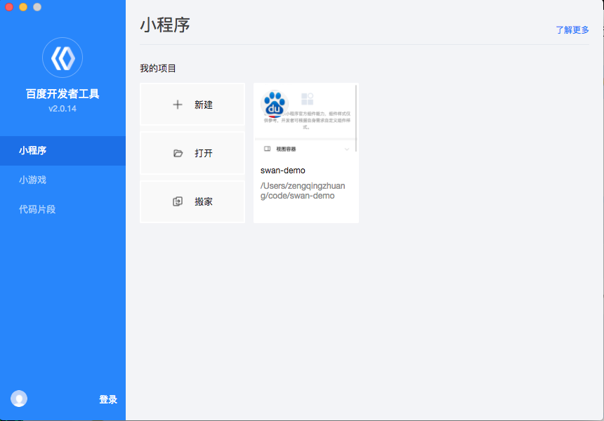
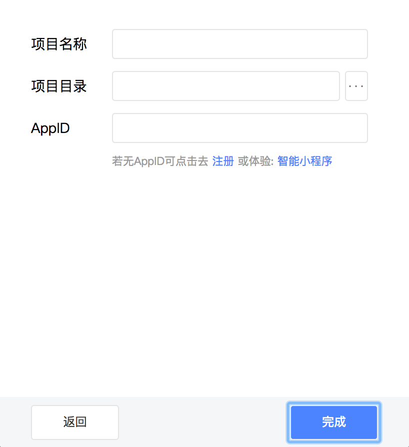
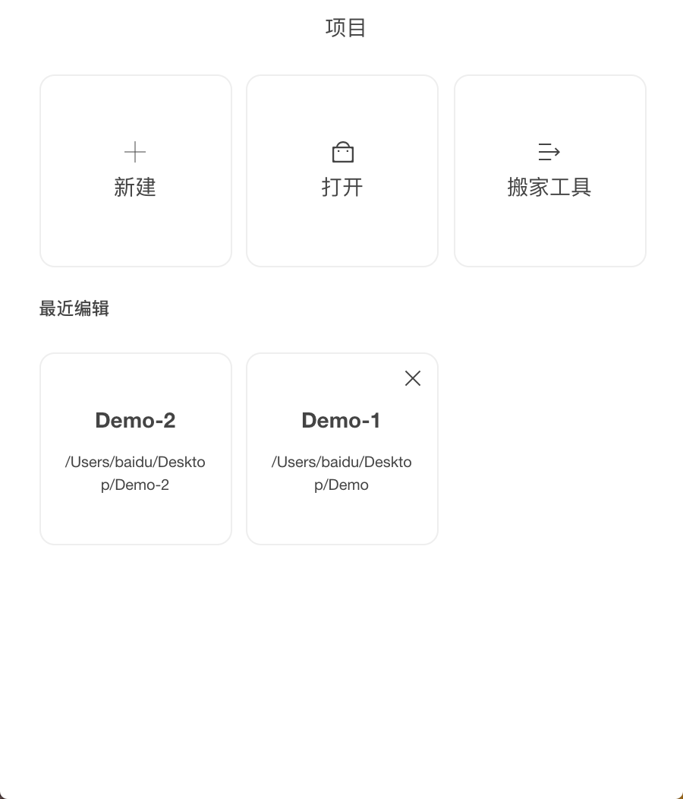
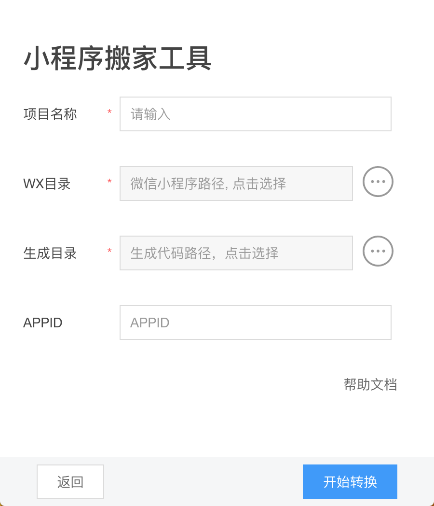

为了帮助开发者简单高效地开发和调试智能小程序，我们推出了百度开发者工具。
正式版本下载链接：[windows 64](http://smartprogram.baidu.com/mappconsole/api/devDownload?system=windows&type=online) / [mac](http://smartprogram.baidu.com/mappconsole/api/devDownload?system=mac&type=online)
Beta 版本下载链接：[Windows-beta](http://smartprogram.baidu.com/mappconsole/api/devDownload?system=windows&type=beta) / [mac-beta](http://smartprogram.baidu.com/mappconsole/api/devDownload?system=mac&type=beta)

使用百度开发者工具调试，开发者可以完成智能小程序的 API 和页面的开发调试、智能小程序预览和发布等功能。

## 项目选择及管理页

    1、点击新建会进入新建页面。
    2、打开按钮可以打开一个本地已经创建好的智能小程序。
    3、使用搬家工具转换已有的微信小程序

## 新建页面

新建页面需要开发者填写项目的名称、项目开发路径和 AppID。信息校验无误后会自动生成一个空白的智能小程序工程。

    1、如果开发者尚没有 AppID 可以点击'注册'，注册 AppID 或者点击'智能小程序'选择体验模式，但体验模式下，部分 API 可能无法正常调用。
    2、如果选择一个空目录，会直接创建在该目录下；如果选择一个非空目录，会使用项目名称生成一个文件夹来存放新生成的智能小程序项目。

 

## 管理项目

对本地项目进行删除

 

 ## 搬家工具
将微信小程序转换为智能小程序 https://smartprogram.baidu.com/docs/develop/tutorial/move/

