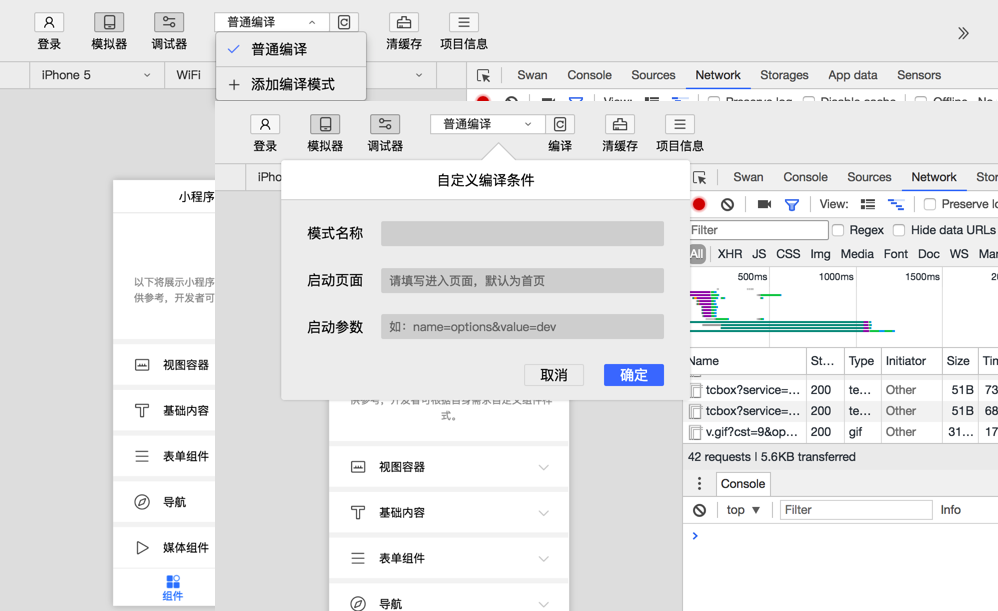
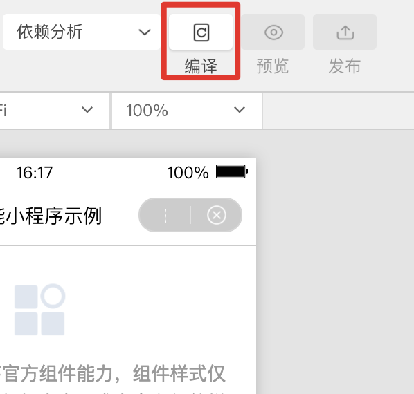

模拟器
-----

模拟器提供了和百度App客户端一致的运行环境，对于绝大部分的 API 均能够在模拟器上呈现出与客户端一致的状态。

自定义编译
-----

点击工具栏中的编译按钮，可以编译当前代码，并自动刷新模拟器。
同时为了帮助开发者调试从不同场景值进入具体的页面，开发者可以添加或选择已有的自定义编译条件进行编译和代码预览（如图）。
已有的自定义编译条件会记录在`project.swan.json`中，开发者可以将其托管于工具内部处理。

** 注：编译条件跟项目相关，每个项目可以保存自己相关的编译条件 **

编译
-----

点击工具栏中的编译按钮，可以编译当前工程代码，并自动刷新模拟器，展现最新的页面效果。

前后台切换
-----

工具栏中切后台模拟了智能小程序被切换到后台的情况。

调试工具
-----

调试工具分为 6大功能模块：Swan、Sources、Network、Console、Storage、App data、Sensors。

### Swan panel

Swan panel 用于帮助开发者查看真实的页面结构以及对应的 css 属性，同时可以通过修改对应 css 属性，在模拟器中实时看到修改的情况（仅为实时预览，无法保存到文件）。通过调试模块左上角的选择器，还可以快速定位页面中组件对应的 swan 代码。

### Sources panel
Sources panel 用于显示当前项目的脚本代码文件，智能小程序框架会对脚本文件进行打包编译的工作，因此在 Sources panel 中开发者看到的文件是经过处理之后的脚本文件。

### Network panel

Network Panel 中展示了 request 和 socket 的请求情况。

注：uploadFile 、downloadFile暂时不支持在 Network Panel 中查看

### Console panel

开发者可以在此输入和调试代码, 程序中的 console 信息也会在 Console panel 中提示。

### Storage panel

Storage panel 用于显示当前项目使用 swan.setStorage 或者 swan.setStorageSync 后的数据存储情况。

可以直接在 Storage panel 上对数据进行删除（按 delete 键）、新增、修改。

### App data panel
用于显示当前项目运行时智能小程序 AppData 具体数据，实时地反映项目数据情况，可以在此处编辑数据，并及时地反馈到界面上。

### Sensors panel
用于设置地理信息、陀螺仪、指南针数据，调用相关 API 时会读取在这里设置好的数据。

预览&发布
-----

当开发者登录后，如果填写项目信息时的 AppID 是正确的，此时工具栏会显示预览和发布按钮

### 预览

当点击预览按钮时，开发者工具会对当前项目进行编译，然后制作压缩包上传到服务器，并生成预览二维码，用百度app扫码后可以看到相应页面。

### 发布

当点击发布按钮时，开发者工具会对当前项目进行编译，然后制作压缩包上传到服务器，上传成功后，可以在智能小程序官网的开发管理一栏看到提交的相关信息。

