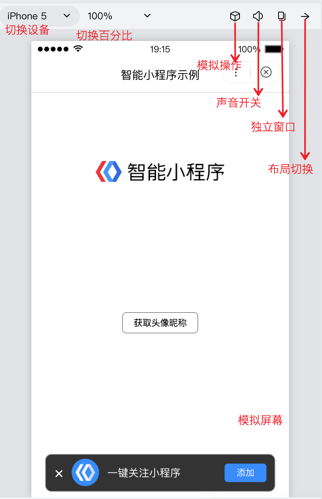
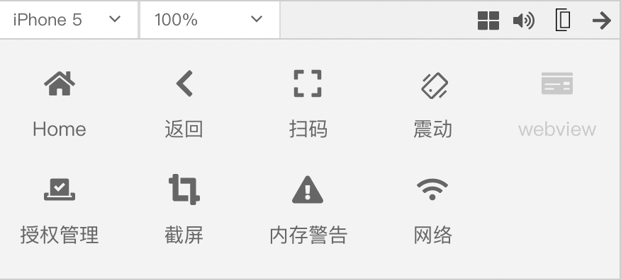

## 模拟器

模拟器提供了和百度App客户端一致的运行环境，对于绝大部分的 API 均能够在模拟器上呈现出与客户端一致的状态。

    

        
    

    

        
    

    

        
    
     

### 切换设备
开发者可以选择不同的设备，也可以添加自定义设备来调试小程序在不同机型上的适配问题。
### 切换百分比
开发者可以控制模拟屏幕的显示比例。
### 模拟操作
在模拟器进行调试的时候，很多真实手机上的操作，比如截屏、震动等，可以通过模拟操作面板来模拟。

    

        
    

    

        
    
   

**功能介绍**：

|功能|说明|
|--|--|
|Home|切后台|
|返回|返回上一页|
|扫码|设置扫码返回结果。当未设置扫码返回结果时，调用swan.scanCode api会出现图标跳动提示，提示开发者设置扫码返回结果。|
|震动|模拟手机震动|
|webview|当前页面有web-view组件时，点击打开当前web-view组件调试器|
|授权管理|打开授权管理页面|
|截屏|模拟手机截屏操作|
|内存警告|模拟内存警告|
|网络|切换网络|

### 独立窗口
开发者可以通过点击|独立窗口|按钮，将模拟器区域从开发者工具主窗口弹出，以独立窗口的形式展现。
### 布局切换
在模拟器设备宽度小于1000时可将模拟器的位置与编辑器、调试器进行左右切换

## 自定义编译

点击工具栏中的编译按钮或者使用快捷键 Ctrl(⌘) + B，可以编译当前代码，并自动刷新模拟器。
同时为了帮助开发者调试从不同场景值进入具体的页面，开发者可以添加或选择已有的自定义编译条件进行编译和代码预览（如图）。
已有的自定义编译条件会记录在`project.swan.json`中，开发者可以将其托管于工具内部处理。

** 注：编译条件跟项目相关，每个项目可以保存自己相关的编译条件 **

## 前后台切换

工具栏中切后台模拟了智能小程序被切换到后台的情况。

 