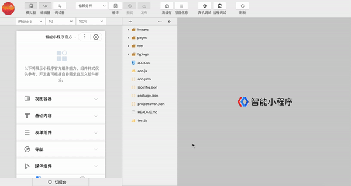

## 模拟器

模拟器提供了和百度App客户端一致的运行环境，对于绝大部分的 API 均能够在模拟器上呈现出与客户端一致的状态。

开发者可以自定义设备类型、网络类型、设备缩放比。

## 编辑器

编辑器可以进行小程序开发，编辑保存文件，对项目中进行新增文件、删除文件、文件重命名、打开文件等操作。

在代码编辑区域调用小程序api可以获得代码提示。

常用快捷键（需当前焦点在编辑器中）

|Mac OS 快捷键 | Windows 快捷键 | 说明 |
|---|---|---|
| ⌘ + W | ctrl + W | 关闭当前tab页 |
| ⌘ + S | ctrl + S | 保存当前文件的改动 |
| ⌘ + Z | ctrl + Z | 撤销当前改动 |
| ⌘ + F | ctrl + F | 在当前页面中搜索内容 |
| shift + option + F| shift + alt + F | 格式化当前文件 |

## 编译

点击工具栏中的编译按钮，可以编译当前工程代码，并自动刷新模拟器，展现最新的页面效果。

自定义编译

点击工具栏中的编译按钮，可以编译当前代码，并自动刷新模拟器。
同时为了帮助开发者调试从不同场景值进入具体的页面，开发者可以添加或选择已有的自定义编译条件进行编译和代码预览（如图）。
已有的自定义编译条件会记录在`project.swan.json`中，开发者可以将其托管于工具内部处理。

** 注：编译条件跟项目相关，每个项目可以保存自己相关的编译条件 **

## 前后台切换

工具栏中切后台模拟了智能小程序被切换到后台的情况。

## 调试器
可在调试器中直接进行调试。
