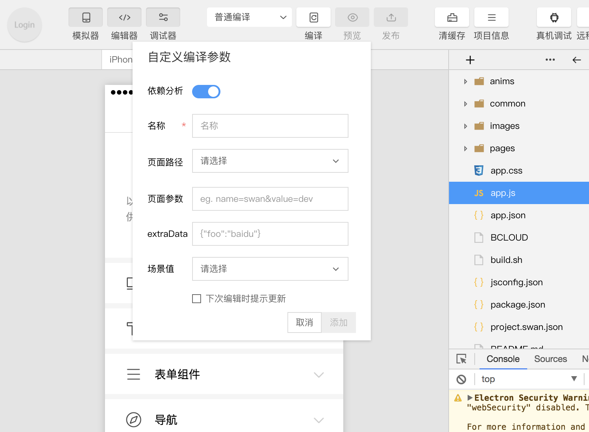

 

点击工具栏中的编译按钮或者使用快捷键 Ctrl(⌘) + B，可以编译当前代码，并自动刷新模拟器。
同时为了帮助开发者调试从不同场景值进入具体的页面，开发者可以添加或选择已有的自定义编译条件进行编译和代码预览（如图）。
已有的自定义编译条件会记录在`project.swan.json`中，开发者可以将其托管于工具内部处理。

** 注：编译条件跟项目相关，每个项目可以保存自己相关的编译条件 **

