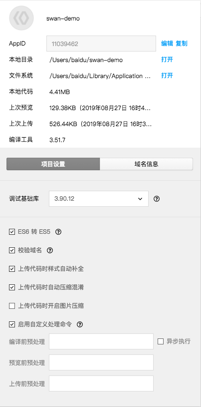

在项目信息面板中，我们提供了以下几个默认的预处理，可以解决大部分的代码文件预处理的问题
1. ES6 转 ES5（可以应用于编译、预览、上传），使用 "babel-core": "^6.0.0"
2. 上传代码时样式自动补全，使用 "postcss": "^7.0.0"
3. 上传代码时自动压缩，使用 "uglify-js": "^3.4.9"

对于高级开发者来说，完全可以自己编写自动化构建脚本对代码文件进行预处理，所以我们提供了 `启用自定义处理命令` 选项，开发者可以指定 `编译前/预览前/上传前` 需要预处理的命令 开发者工具使用 shell 的方式运行指定的命令，并在控制台中输出命令的执行日志

如果您使用框架开发小程序，可以参考文档 [框架开发](/develop/tutorial/frameworkdevelop/)

预处理命令的默认执行顺序：

1. 自定义预处理命令
2. 默认预处理命令
3. 编译/预览/上传

勾选`异步执行`选项后，编译前预处理命令将与编译流程并行执行，如果编译前预处理命令是`watch`类的命令，需要勾选此选项，以免阻塞编译流程。

注：
1. 编译前预处理命令，需要手动点击 "编译" 按钮，或者使用快捷键编译才能触发。文件修改无法触发该命令。
2. Mac 版本的开发者工具无法复用 bash 中的 Path 环境变量。可能需要手动设置系统的 Path 环境变量，才能正常执行命令。

