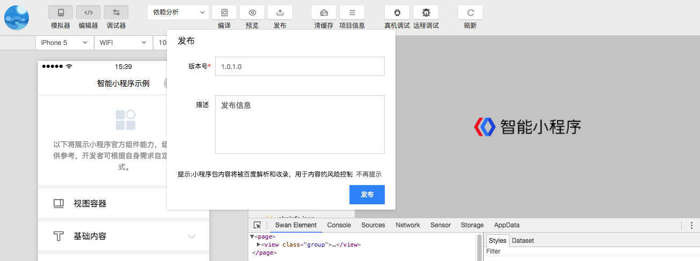

### 前提条件
* 开发者已登录，且在项目成员中。添加项目成员请见：<a href="https://smartprogram.baidu.com/docs/introduction/register_prepare/">开发前准备</a>。
* 填写项目信息时的 AppID 正确。
当登录用户没有开发权限或者AppID不正确时,工具栏预览和发布按钮会被置灰。

## 预览

当点击预览按钮时，开发者工具会对当前项目进行编译，然后制作压缩包上传到服务器，并生成小程序和 web 小程序的预览二维码，用百度app扫码后可以看到相应页面。

## 发布

当点击发布按钮时，开发者工具会对当前项目进行编译，然后制作压缩包上传到服务器，上传成功后，可以在智能小程序官网的开发管理一栏看到提交的相关信息。

