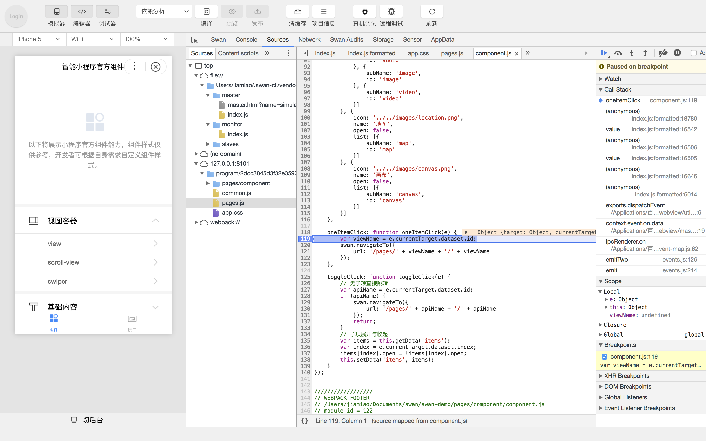

调试工具分为 6大功能模块：Swan、Sources、Network、Console、Storage、App data、Sensors。

## Swan Element panel

Swan Element panel 用于帮助开发者查看真实的页面结构以及对应的 css 属性，同时可以通过修改对应 css 属性，在模拟器中实时看到修改的情况（仅为实时预览，无法保存到文件）。通过调试模块左上角的选择器，还可以快速定位页面中组件对应的 swan 代码。
<video src='https://b.bdstatic.com/miniapp-docs/swanElement190131.mp4' type='video/mp4' controls='controls'  width='100%' height='100%'>
</video>

## Sources panel
Sources panel 用于显示当前项目的脚本代码文件。

**注：当代码运行到断点的时候，整个小程序都停止了，所以模拟器会出现白屏或者无法操作的情况**
## Network panel

Network Panel 中展示了 request 和 socket 的请求情况。

## Console panel

开发者可以在此输入和调试代码, 程序中的 console 信息也会在 Console panel 中提示。
<video src='https://b.bdstatic.com/miniapp-docs/console190131.mp4' type='video/mp4' controls='controls'  width='100%' height='100%'>
</video>

## Storage panel

Storage panel 用于显示当前项目使用 swan.setStorage 或者 swan.setStorageSync 后的数据存储情况。

可以直接在 Storage panel 上对数据进行删除（按 delete 键）、新增、修改。
<video src='https://b.bdstatic.com/miniapp-docs/storage190131.mp4' type='video/mp4' controls='controls'  width='100%' height='100%'>
</video>

## AppData panel
用于显示当前项目运行时智能小程序 AppData 具体数据，实时地反映项目数据情况，可以在此处编辑数据，并及时地反馈到界面上。
<video src='https://b.bdstatic.com/miniapp-docs/appdata190131.mp4' type='video/mp4' controls='controls'  width='100%' height='100%'>
</video>

## Sensors panel
用于设置地理信息、陀螺仪、指南针数据，调用相关 API 时会读取在这里设置好的数据。
<video src='https://b.bdstatic.com/miniapp-docs/sensor190131.mp4' type='video/mp4' controls='controls'  width='100%' height='100%'>
</video>

## Swan audits

<a href="http://smartprogram.baidu.com/docs/develop/devtools/audits/">体验评分</a>，是一项给小程序的体验打分的功能，它会在小程序运行过程中实时检查，分析出一些可能影响开发者体验的地方，并且定位问题，及时给出相应的优化建议。
