>此功能在`2.21.0-rc`之后版本可用。

为了方便开发者更简单快捷地进行代码版本管理，简化一些常用的 Git 操作，以及降低代码版本管理使用的学习成本，开发者工具集成了 Git 版本管理面板。

开发者可以在打开的项目窗口里，点击工具栏上的“版本管理” 按钮进入 Git 版本管理界面。

## 提交工作区更改

在 “本地修改” 可以查看到目前工作目录的变更及对比，并直接通过勾选文件前面的复选框将其添加到暂存区。右键点击工作区或者此文件，可以丢弃修改。输入提交标题和详情，点击提交按钮即可以提交本次的变更。在标题栏或详情上输入`:`可以使用常用的 Gitmoji 符号。

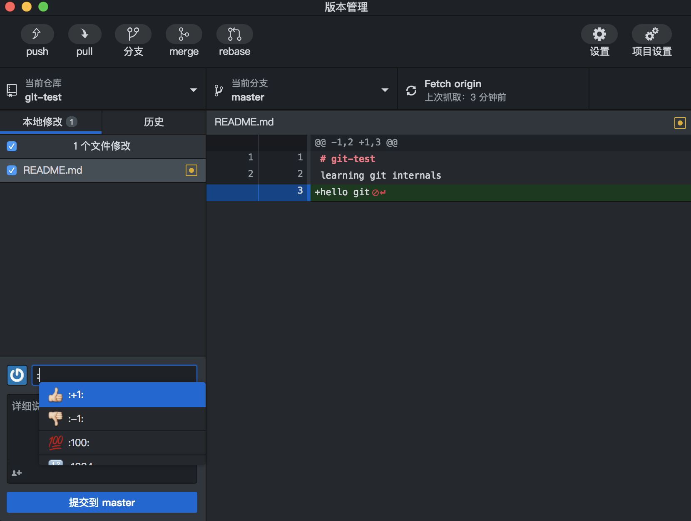 

## 查看历史

点击“历史”，可以查看到当前分支的最新提交记录，可点击“当前分支”切换分支。每个提交记录都可以看到变更的内容以及目录树详情。展开目录树后，在文件上右键点击，可以拷贝文件路径，或者在编辑器中打开。

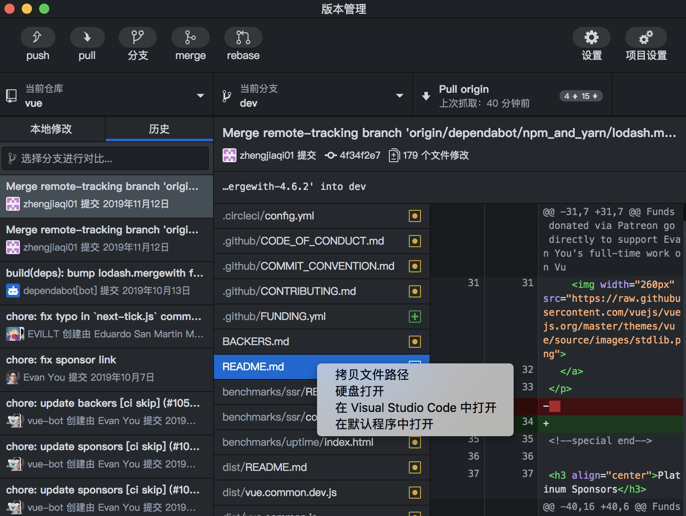 

## 分支对比

在“历史”中，可以选择一个分支与当前分支进行对比。可以看到当前分支落后或超前于被选择分支的提交信息，并可进行快速merge。

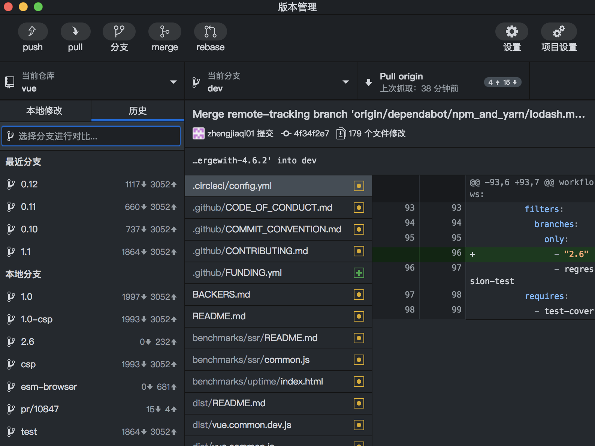 

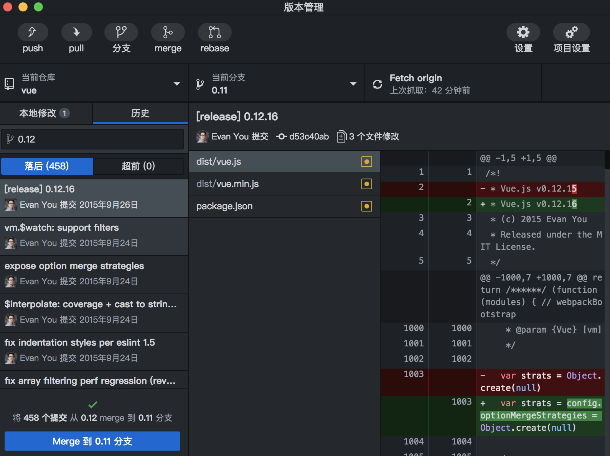 

## 切换和新建分支

要切换某分支，可点击“当前分支”切换分支。要新建分支，点击 “分支” 按钮即可。

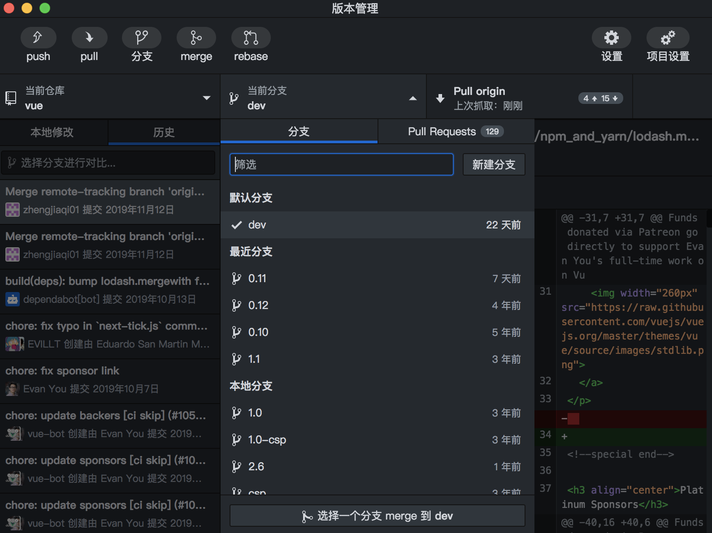 

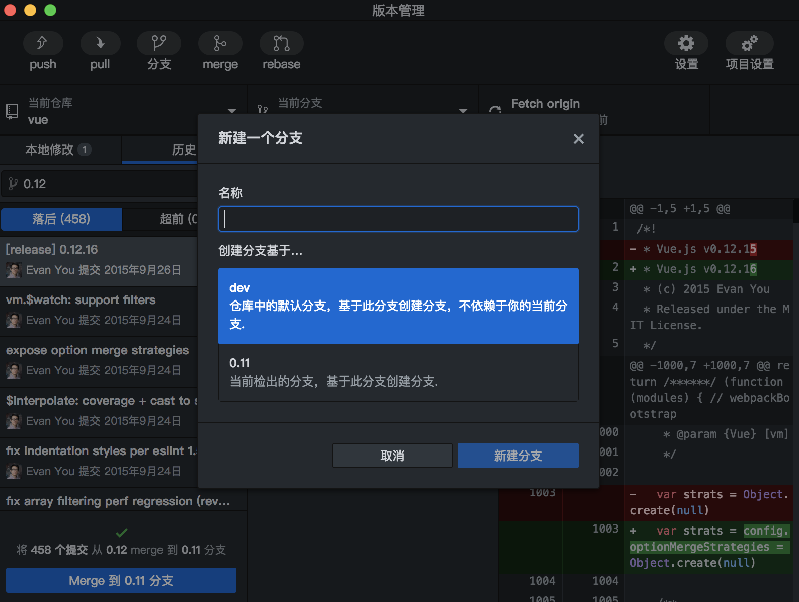 

## pull、push、merge、rebase和fetch

通过工具栏上的pull、push、merge、rebase和fetch按钮，可以很方便地对远程仓库执行各种操作。某些远程仓库可能需要身份验证配置，可以在 “设置” 页中 “账户” 中配置这些信息。

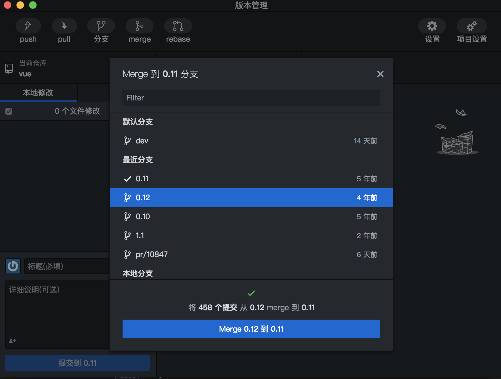 

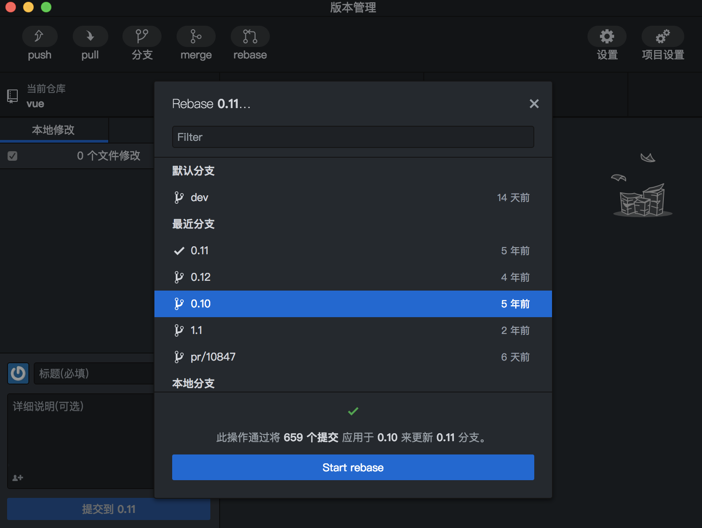 

## 账户设置

如果你的远程仓库托管于github，可以在设置 “账户” 中登录。
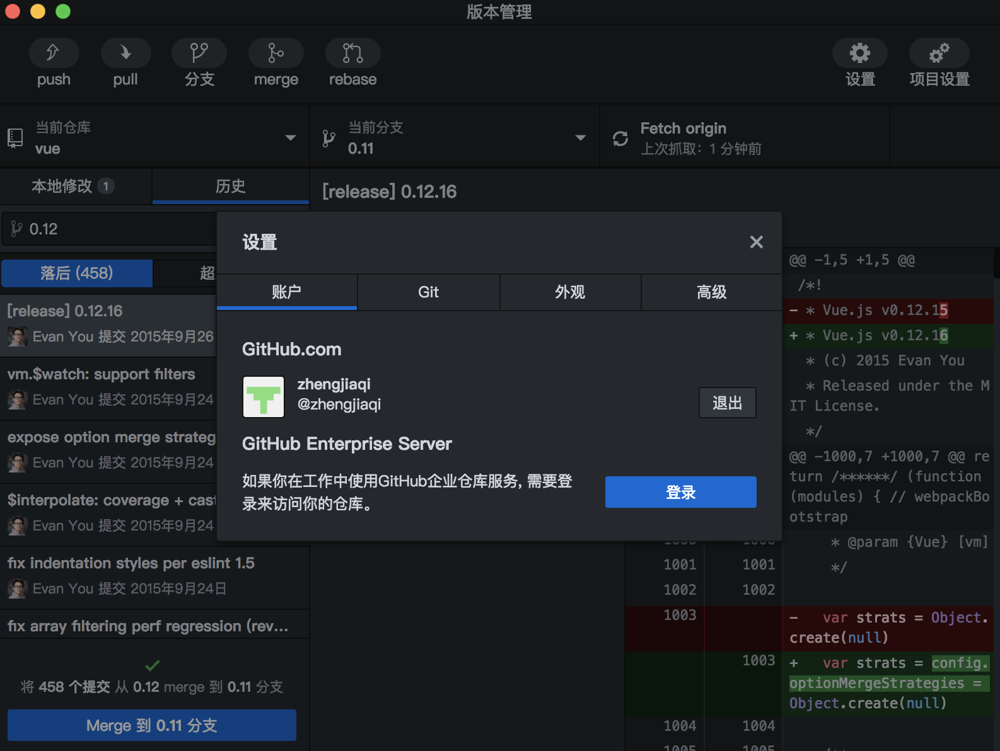 

## 用户设置

在设置 “git” 中可以对用户名进行配置。配置完成后，下次提交时，将会使用此用户名和邮箱进行提交。
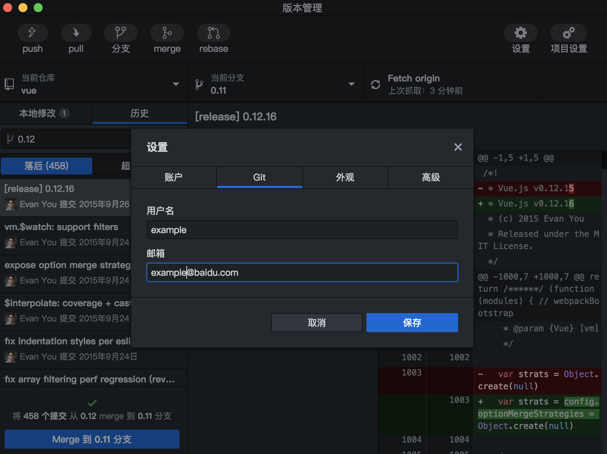 

## 初始化 Git 仓库
如果所在的项目文件夹下没有找到 Git 仓库，可以根据提示初始化一个仓库，并可选择是否自动生成一个 .gitignore 文件模板。

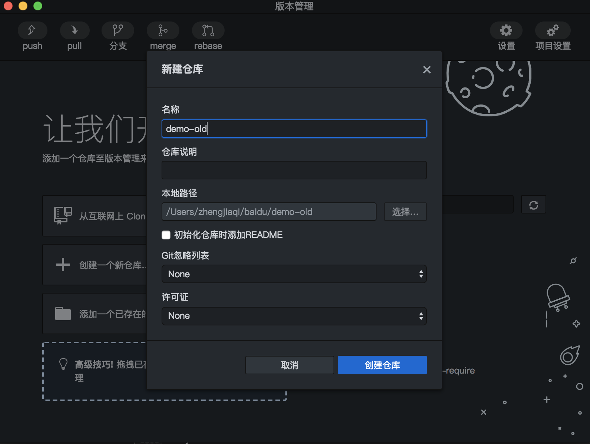 

## 添加 Git 仓库
如果还未添加 Git 仓库，可以根据提示添加或clone一个仓库，并可在“当前仓库” 中随时添加仓库。

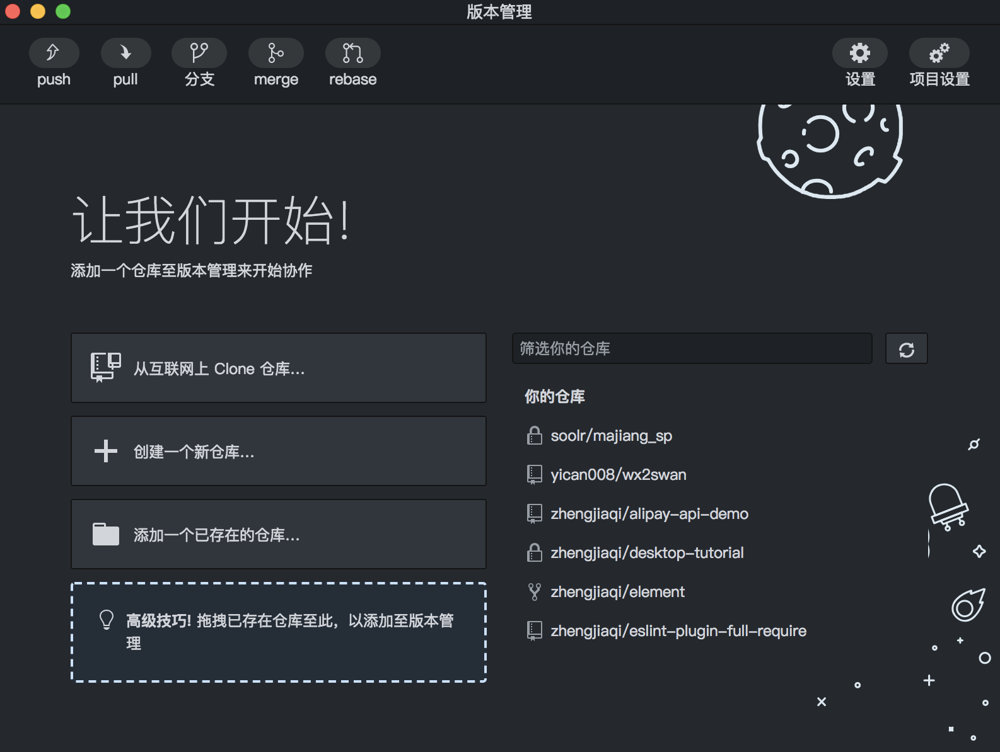 

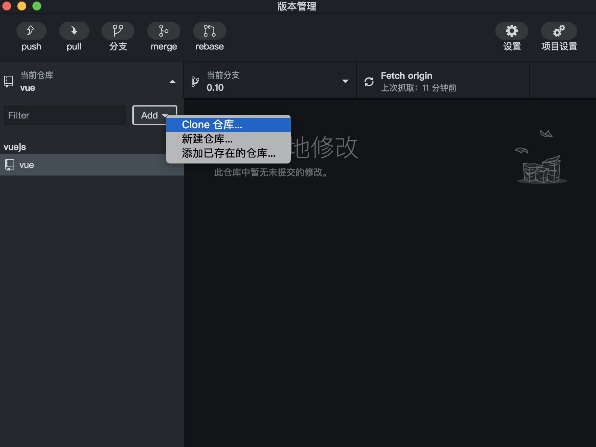 