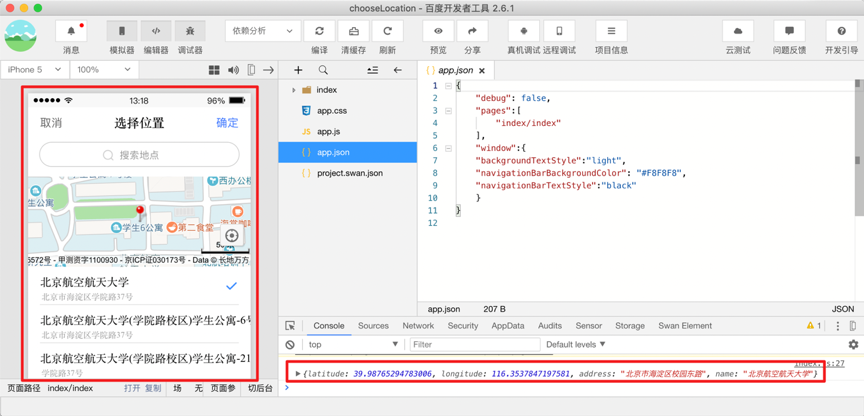

#### Q：如何查询指定地点的经纬度？

A：当前我们提供方式可以查询到您指定地点的经纬度

* 推荐使用[swan.chooseLocation](https://smartprogram.baidu.com/docs/develop/api/location/swan-chooseLocation/)可获取到选择当前位置的经纬度。

    在开发者工具中调用 swan.chooseLocation 用日志输出看到经纬度(坐标系GCJ02，可以直接用于小程序)，具体方法可参考官方示例[在开发者工具中预览效果](swanide://fragment/09f8e00c2d4fd069e5001041293d07191557727424300)。

    

* 使用地图拾取器

    1. [百度地图拾取器](http://api.map.baidu.com/lbsapi/getpoint/index.html)：坐标系BD09，不能直接用于小程序，需要开发者转换为GCJ02。后期小程序优化后可以支持该坐标系。      

    2. [腾讯地图拾取器](https://lbs.qq.com/tool/getpoint/)：坐标系GCJ02，可直接使用。

    3. [高德地图拾取器](https://lbs.amap.com/console/show/picker)：坐标系GCJ02，可直接使用。


####  Q: request 请求在 iOS 端会进入 fail 回调函数的原因有哪些？

A:请查看 url 中是否出现了中文，如需要使用中文字体，请对中文字符进行 [encodeURIComponent](http://smartprogram.baidu.com/docs/develop/api/net_request/)。


#### Q：小程序页面头部可否支持渐变色？

A：使用 navigationBarBackgroundColor 无法做到渐变色的效果，可以选择使用透明框，新增返回按钮，然后进行设置。或将navigationStyle 设置成 custom，在全屏页面中制作导航栏，自定义背景色。

#### Q：请问下有关闭小程序这样的 api 吗？ 

A: 暂时没有。

#### Q：tabBar 下按钮是否可以直接拨打电话？

A: 不可以。


#### Q：swan.request 成功后如何刷新页面？

A：当刷新页面指的是想更新部分模块的数据时，可以在接口请求成功后，使用 setData 将获取到的数据进行重置。

#### Q：如何在百度小程序里可以同时播放两个音频？

A：可以多次创建 createInnerAudioContext，然后使用 setInnerAudioOption，将设置 mixWithOther 为 true。


####  Q：video自动播放的流量提醒出现策略是什么？

A：非 Wi-Fi 情况播放视频会出现流量弹窗，继续播放后，小程序生命周期里再次播放video，不会出现弹窗。如果杀进程，再次进入，会继续提醒弹窗，目前不支持开发者控制。

#### Q：video全屏后的手势引导出现策略是什么？

A：全屏手势引导点击一次后不在出现，目前也不支持开发者控制。

####  Q：web-view页面里如何使用拨打电话接口

A：请参考如下示例，示例中swan.js版本号仅为参考，请参考最新版本号进行开发。
```
<!DOCTYPE html>
<html lang="en">
    <head>
        <meta charset="utf-8">
        <title>call phone</title>
        <script  src="https://b.bdstatic.com/searchbox/icms/searchbox/js/swan-2.0.6.js"></script>
    </head>
    <body>
        <button onclick="callMobile()">clickMe</button>
    </body>
    <script type="text/javascript">
        function callMobile() {
            swan.makePhoneCall({
                phoneNumber: '10086' 
            });
        }
    </script>
</html>
```

#### Q：我现在有个需求下载app的时候，同时写口令，也就是剪切板。打开app的时候，端上会读剪切板。请问小程序支持写口令吗？

A：不支持

#### Q：小程序组件提供的弹窗能插图片内容吗？

A：不支持，小程序API提供的弹窗暂时都不支持插入图片，可自行写弹层逻辑，注意，自己写的弹层底部的的蒙层是盖不住顶bar(标题栏)。

####  Q：百度小程序支持导航吗？或是支持调起其它导航APP?

A：不支持导航，可以使用openLocation 打开宿主app内置的地图导航。

#### Q：百度小程序如何获取用户IP地址？

A：暂时不支持。

#### Q：dataset数据为空时，返回布尔值true？

A：[已知情况](https://github.com/baidu/san/commit/b4b044cfa27782e524995278809b3d8a9fb3b193)，小程序底层框架是基础 `san`, `san` 里面有个为开发者提供便利性的处理：对没有 `value` 声明的 `attr`，默认为`true`。
```
<!-- child 组件中，data strong为true -->
<child strong>text</child>
```
不过，这个处理并不区分空串声明和无value声明。因为：

- 基本，组件的数据绑定都是表达式
- 空串一般做为组件某数据项的默认值，通过initData达到。除非必须区分null、undefined和空串，否则基本不会这么用。
所以，如果非要传空串，可以采用如下方法：
```
attr1="{{''}}"
```

#### Q：富文本框里的 图片，如何使用 previewImage这个api？

A：使用方法如下：
1. 如果整个页面都是rich-text，那么可以用一个[web-view](/develop/component/open_web-view/)组件加载h5，在h5中自己实现一个类似rich-text组件的功能（把 js tree/ dom片段渲染成最终 html），预览图片可以用h5功能来做，或者百度的端能力
。
2. 如果小程序页面中部分区域是rich-text，想要实现rich-text中预览图片不行，因为rich-text中会屏蔽所有的事件。

#### Q：如何判断浏览器类型动态加载 jssdk？

A：可以使用  下面 来判断
```
var uaStr = 'baiduboxapp'
var userAgent = navigator.userAgent.toLowerCase();
var str = userAgent.indexOf(uaStr)
console.log(uaStr)
alert(userAgent.substr(str,uaStr.length))
alert(userAgent)
```

#### Q：百度小程序有直接把图片转为base64的吗？类似微信wx.getFileSystemManager().readFileSync(tempFilePaths[0], 'base64')

A：目前还没有支持转化的api，可以先让在后台生成base64后，传递到前端进行使用。 

#### Q：我是在手机百度内打开的小程序，然后内嵌的H5页面 。怎么跳回原生的小程序页面呢

A：开发者您好，为您准备了webview的3个功能，方便您使用，请看代码：

```
<!DOCTYPE html>
<html lang="en">
<head>
<meta charset="utf-8">
<title>H5打电话/H5跳转小程序/H5向小程序通信</title>
<script  src="https://b.bdstatic.com/searchbox/icms/searchbox/js/swan-2.0.11.js"></script>
</head>
<body>
    <button onclick="callMobile()">clickMe</button>
    <div onclick="toWebPage()">跳回小程序web页面</div>
</body>

<script type="text/javascript">

// 打电话功能

function callMobile() {
    swan.webView.getEnv(function(res){
        console.log(res);
        if(res.smartprogram){
            swan.makePhoneCall({
            phoneNumber: '10086'
        });
        }else {
            window.location.href = "tel:10086";
                }
        })
    }

//跳回小程序页面

function toWebPage() {
    swan.webView.navigateTo({url: '/index/web/web?a=1'});
    }
// 通信（分享/后退/销毁场景下触发）
    swan.webView.postMessage({ data: {foo: 'bar'} })
</script>
</html>

```


