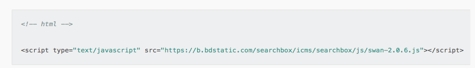

## 框架

#### Q：filter是否支持三目运算？

A：不支持。

#### Q：如何避免横屏播放时，icon 变大的问题？

A：请使用px单位来书写css，不建议使用rpx等其他单位。

#### Q：使用touchstart、touchend、touchemove旋转切换图片安卓卡顿，该如何处理？

A：建议使用 webview 组件实现相关功能，请勿频繁使用setData操作。

#### Q：小程序可以调用echarts.js 或者 highchart.js 画图嘛？

A：暂不支持。

####  Q：百度小程序里面可以和微信小程序一样实用rpx嘛？

A：支持的。

####  Q：请问如何设置首页背景图刚好铺满屏幕？

A：可以按照以下设置方式进行尝试：
	给body标签指定背景图，这样背景图就可以填充整个浏览器viewport了

代码片段：
```
body{
	margin: 0; 
	background: url("xxx图片地址") no-repeat;
	background-size: cover;
	background-position: center center;
	background-attachment:fixed;
}
```
>注意：
1.为了使背景图片的宽高不小于容器的宽高，需设置background-size: cover;进行填充，如果背景图小于body标签的尺寸，浏览器会拉伸图片。当把一个图片拉伸时，图片会变模糊，所以在选择背景图片时，宽高要大一些。
2.为了让背景图始终相对于viewport居中，需设置background-position: center center;
3.当内容的高度大于viewport的高度时，会出现滚动条。希望背景图始终相对于viewport固定，即使用户滚动时也是一样，解决方案：background-attachment: fixed;

## API & 组件

####  Q: request 请求在 iOS 端会进入 fail 回调函数的原因有哪些？

A:请查看 url 中是否出现了中文，如需要使用中文字体，请对中文字符进行 [encodeURIComponent](http://smartprogram.baidu.com/docs/develop/api/net_request/)。


#### Q: 在webview 中使用了 cookie，导致存储信息与小程序不能共享的原因是什么？

A: web-view 网页与小程序之间不支持除 JSSDK 提供的接口之外的通信； 
1. 小程序中如需设置cookie 建议使用Storage； 参见[详情](https://smartprogram.baidu.com/docs/develop/api/storage_save/) 。
2. 如需要共享小程序参数到 webview 页面中， 可在 webview的src中加上链接参数。


#### Q: webview 中参入含有中文使用三方自己的约定方式进行编码 iOS 打开后出现白屏的情况该如何处理？
A： 避免在链接中带有中文字符，在 iOS 中会有打开白屏的问题，如需要使用中文字体，请对中文字符进行 [encodeURIComponent](http://smartprogram.baidu.com/docs/develop/api/net_request/)。

#### Q: 如何在web-view中使用拨打电话的功能？
A：如果想在 web-view 使用 JSSDK 提供的接口能力，需要引入 [swanjs](https://smartprogram.baidu.com/docs/develop/component/open/#web-view/) 包，如下示例：



#### Q：小程序页面头部可否支持渐变色？

A：使用 navigationBarBackgroundColor 无法做到渐变色的效果，可以选择使用透明框，新增返回按钮，然后进行设置。或将navigationStyle 设置成 custom，在全屏页面中制作导航栏，自定义背景色。

#### Q：请问下有关闭小程序这样的 api 吗？ 

A: 暂时没有。

#### Q：tabBar 下按钮是否可以直接拨打电话？

A: 不可以。


#### Q：cover-view可以使用border吗？ 

A: cover-view 为原生组件，原生组件为系统提供的控件不支持单边设置；对于 cover-view 只支持基本的定位、布局、文本样式。不支持设置单边的 border、background-image、shadow、overflow: visible 等。

#### Q：video的原生video控件enable-progress-gesture属性支持动态更新吗？ 

A：支持。

#### Q： scroll-view 的scroll-top。设置是否是无效的?

A：使用竖向滚动时，需要给 <scroll-view> 一个固定高度，通过 CSS 设置 height。

#### Q：使用两个text组件，组件之间有间隙，在不同手机端偶现，影响部分用户体验的问题该如何解决？

A：如果设置 inline-block 会出现间隙，建议父级元素使用font-size:0 ，然后子元素再设置 font-size,可以去除 inline-block 元素间间距。

#### Q：swan.request 成功后如何刷新页面？

A：当刷新页面指的是想更新部分模块的数据时，可以在接口请求成功后，使用 setData 将获取到的数据进行重置。

#### Q：如何在百度小程序里可以同时播放两个音频？

A：可以多次创建 createInnerAudioContext，然后使用 setInnerAudioOption，将设置 mixWithOther 为 true。

#### Q：这个分包预加载只能加载一个分包吗

A：端能力的 root 参数为 string 类型，只能配置一个。但是可以通过 app.json 中的 preloadRule 配置多个子包。

####  Q：video自动播放的流量提醒出现策略是什么？

A：非 Wi-Fi 情况播放视频会出现流量弹窗，继续播放后，小程序生命周期里再次播放video，不会出现弹窗。如果杀进程，再次进入，会继续提醒弹窗，目前不支持开发者控制。

#### Q：video全屏后的手势引导出现策略是什么？

A：全屏手势引导点击一次后不在出现，目前也不支持开发者控制。

####  Q：web-view页面里如何使用拨打电话接口

A：请参考如下示例
```
<!DOCTYPE html>
<html lang="en">
    <head>
        <meta charset="utf-8">
        <title>call phone</title>
        <script  src="https://b.bdstatic.com/searchbox/icms/searchbox/js/swan-2.0.6.js"></script>
    </head>
    <body>
        <button onclick="callMobile()">clickMe</button>
    </body>
    <script type="text/javascript">
        function callMobile() {
            swan.makePhoneCall({
                phoneNumber: '10086' 
            });
        }
    </script>
</html>
```

#### Q：我现在有个需求下载app的时候，同时写口令，也就是剪切板。打开app的时候，端上会读剪切板。请问小程序支持写口令吗？

A：不支持

#### Q：小程序组件提供的弹窗能插图片内容吗？

A：不支持，小程序API提供的弹窗暂时都不支持插入图片，可自行写弹层逻辑，注意，自己写的弹层底部的的蒙层是盖不住顶bar(标题栏)。

####  Q：百度小程序支持导航吗？或是支持调起其它导航APP?

A：不支持导航，可以使用openLocation 打开宿主app内置的地图导航。

#### Q：百度小程序如何获取用户IP地址？

A：暂时不支持。

#### Q：dataset数据为空时，返回布尔值true？

A：[已知情况](https://github.com/baidu/san/commit/b4b044cfa27782e524995278809b3d8a9fb3b193)，小程序底层框架是基础 `san`, `san` 里面有个为开发者提供便利性的处理：对没有 `value` 声明的 `attr`，默认为`true`。
```
<!-- child 组件中，data strong为true -->
<child strong>text</child>
```
不过，这个处理并不区分空串声明和无value声明。因为：

- 基本，组件的数据绑定都是表达式
- 空串一般做为组件某数据项的默认值，通过initData达到。除非必须区分null、undefined和空串，否则基本不会这么用。
所以，如果非要传空串，可以采用如下方法：
```
attr1="{{''}}"
```

## Web 化

#### Q：小程序后台审核的 Web 化地址多了一个appkey的参数，有什么影响吗？
A：在预览和审核地址中，会带 appkey 的参数，上线后正式环境没有该参数。

#### Q: Web 化的样式有问题，影响收录吗，是否会对用户产生影响？

A: 会。爬虫的抓取过程，不仅会分析页面文本，页面样式，动态数据，页面交互等所有页面状态都是爬虫收录的重要参考。因此， Web 化页面样式有问题可能会影响收录效果。

#### Q：Web 化页面样式有问题该如何处理？
A：可以通过[ Web 化预览](https://smartprogram.baidu.com/docs/develop/web/webintroduction)调试排查样式问题，如是 Web 化实现的问题，欢迎社区反馈。

#### Q: Web 化后代理接口出错该如何处理？
A： 代理接口出错分以下两种情况：
* 如果错误码为 416 ，则是 request 域名校验未通过。请按该指示完成设置：“小程序后台-设置-开发设置-服务器域名-request的合法域名”。
* 如果非 416 错误码，请检查开发者服务器接口是否针对  Web 化请求环境校验不通过，或者开发者服务器接口不稳定。

#### Q: Web 化的 SEO 信息要在哪里配置？
A：SEO 信息设置请参考[页面基础信息介绍](https://smartprogram.baidu.com/docs/introduction/rank/#%E8%AE%BE%E7%BD%AE%E9%A1%B5%E9%9D%A2%E5%9F%BA%E7%A1%80%E4%BF%A1%E6%81%AF/)， [页面基础信息设置方式](https://smartprogram.baidu.com/docs/develop/api/pageinfo/) 。

#### Q: 移动端站点有 m 站和 mip 站，应该如何配置 url-mapping？
A: 多个 H5 地址指向同一个小程序路径可以配置多条`H5  => 小程序path`规则，具体规则语法请参考：[配置URL映射规则](https://smartprogram.baidu.com/docs/introduction/rank/#%E9%85%8D%E7%BD%AEURL%E6%98%A0%E5%B0%84%E8%A7%84%E5%88%99/)

#### Q: 小程序 Web 化sitemap提交后多久生效？
A：提交完成一周之后即可生效。

#### Q: Web 化的展示形式是怎样的？
A：请阅读[流量接入说明](https://smartprogram.baidu.com/docs/introduction/intro/)了解。

## 工具

#### Q: 为什么 Electron 2.x 在部分中文 win7 上无法打开？

A：
**现象**：部分 windows7 下 1.x 工具可以打开，升级到 2.x 后，打开工具无反应，后台没有启动任何进程。
**原因分析**：应该是启动时直接崩溃，未找到有效错误信息。猜测是 electron 的bug，远程协助连接问题机器，尝试安装 electron 官方 demo 后发现，启动 demo 直接报错，搜索错误信息找到相关的 [issue](https://github.com/electron/electron/issues/12980) 。

**解决方案**

 - 安装 [windows 系统更新](https://support.microsoft.com/en-us/help/4343900/windows-7-update-kb4343900)
 - 命令行执行 `netsh winsock reset`
 - 重启电脑


#### Q: 小程序支持使用 npm 吗？

A：支持，把开发工具的编译模式更改为“依赖分析“模式就可以使用npm安装依赖包了。


#### Q: 转换工具转换完使用依赖分析报错时该如何处理？

A:切换成普通编译


#### Q: 点击预览或调试按钮提示当前版本的开发者工具无法发布小程序时，该如何处理？

A: 确认为最新开发者工具，考虑appid填写错误，如：小游戏填写小程序的appid

#### Q: 开发者工具一直提示编译中，无法结束时该如何处理？

A: 请尝试下述解决方案：
* Windows 可尝试 `C:\Users\你的用户名\.swan-cli` 这个目录，重启工具。
* Mac 下 删除 `~/.swan-cli` 目录，重启工具

#### Q：预览时显示“编译进程异常退出”怎么办？

A：请尝试升级最新版开发者工具，并使用菜单栏中的一键修复功能（菜单栏 -> 帮助 -> 一键修复）。

#### Q：开发者工具上已经用开发账户登录了，为什么还是没有调试权限（模拟器、编辑器、调试器、预览、发布）呢？

A：请确认您在"项目信息"中填写了appid，并且您当前的登录账号具备appid的操作权限。

#### Q：最新版开发者工具App预览码和远程调试的二维码扫出来的内容不一致是为什么？

A：远程调试的基础库版本是内置的，跟App内置的基础库版本可能有差异，如果出现不一致的情况以预览效果为准。

#### Q：百度小程序IDE支持git代码仓库管理吗？

A：不支持

#### Q：小程序开发工具点预览生成的二维码，反解的链接，想问下这个链接如何携带query？

A：打开开发者工具，选择"添加编译"，可以自定义"页面路径"、"页面参数"等编译参数，用自定义的编译模式来预览，就可以带上特定的query了。

####  Q：工具上调试查看h5数据的方法是什么？

A：在chrome中打开web化地址，使用chrome自带开发者工具查看。

####  Q：什么情况下会提示 捕捉到白屏case？

A：白屏检测检测当小程序大面积白屏的时候会捕捉到。

