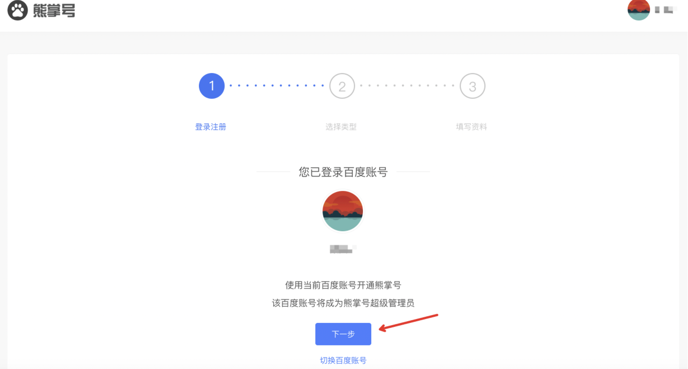
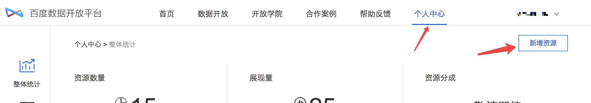
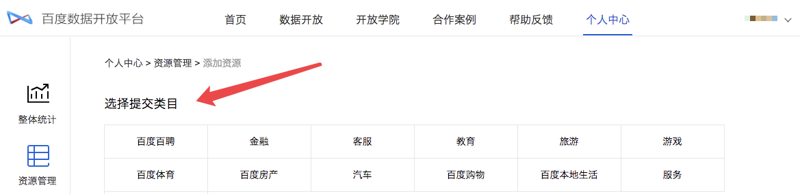
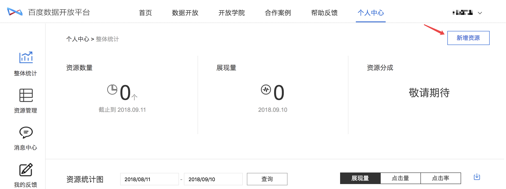
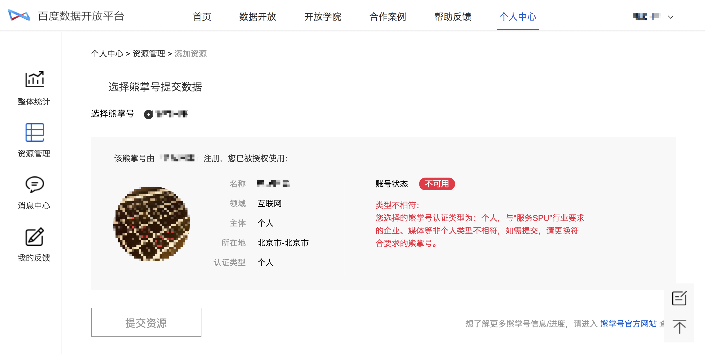
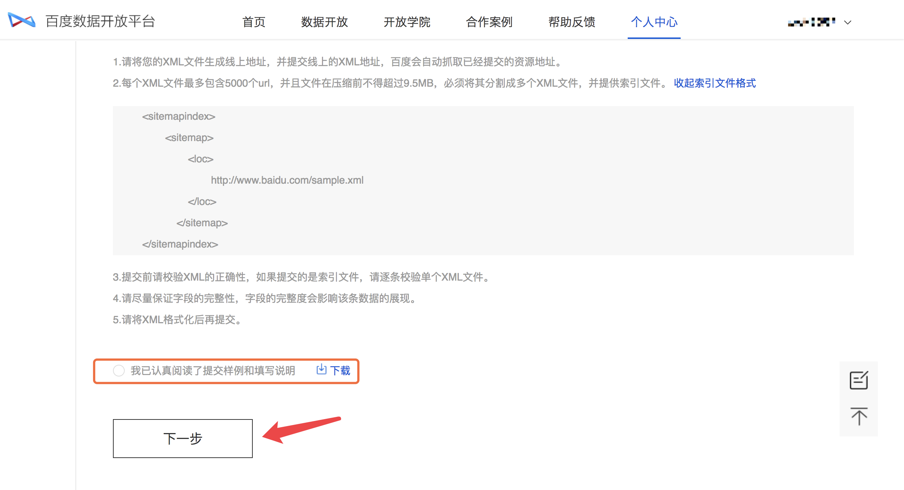
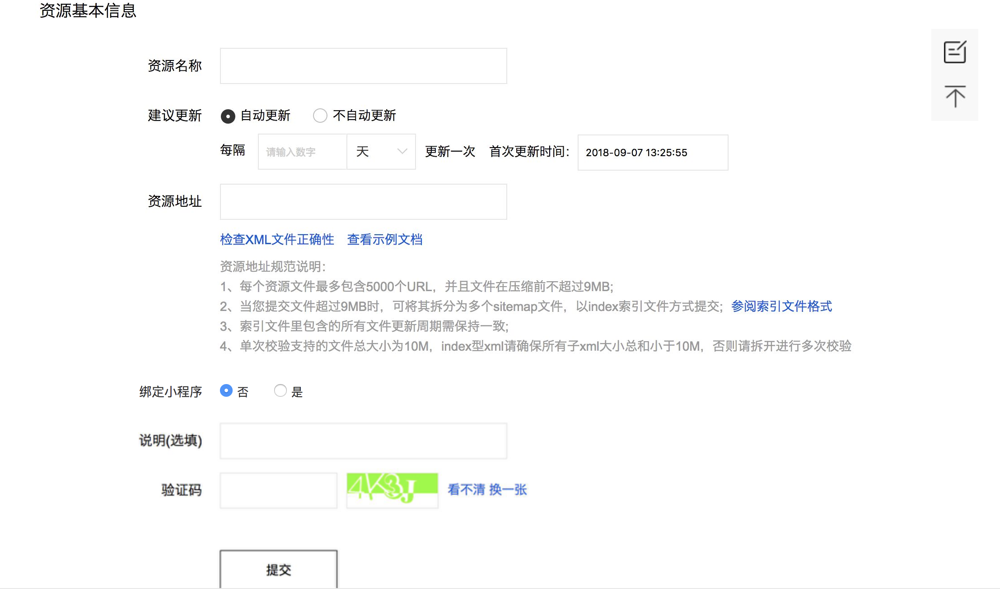
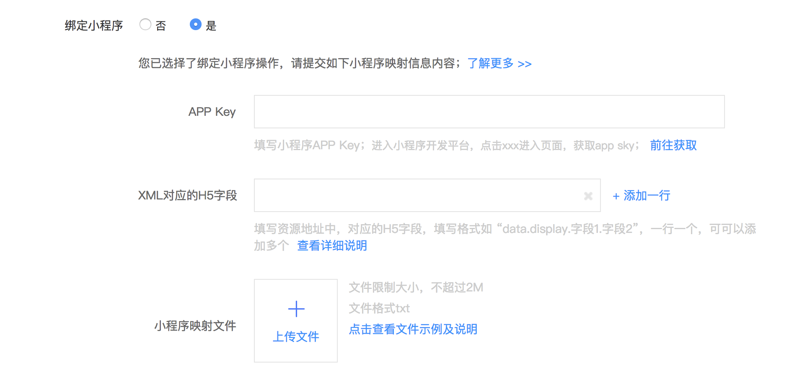

如果智能小程序需要以阿拉丁特型卡片的形式展现在搜索结果页中，需要按照下文所描述的步骤进行配置。

#### 步骤一：帐号注册
- 注册百度帐号，该帐号将用于登录[智能小程序平台](https://smartprogram.baidu.com)和[百度数据开放平台](https://open.baidu.com)。
- 确认该百度帐号和熊掌号进行绑定，如果没有熊掌号，请移步[熊掌号主页](https://xiongzhang.baidu.com)注册帐号。
如下图所示，点击注册熊掌号：

按照提示，完成熊掌号的绑定：

- 确认帐号是否可用
如果已经注册百度帐号，并成功绑定熊掌号，可直接访问[百度数据开放平台](https://open.baidu.com)确认是否可用。
点击“新增资源”

当看到下面页面后，确认该帐号可用于提交数据。

- 将百度帐号发送给百度BD

#### 步骤二：提交数据
- 进入[百度数据开放平台](https://open.baidu.com)，点击个人中心，进入如下页面：

点击新增资源，打开如下类目选择列表，如果之前已百度帐号提供给百度BD，您将看到“服务”类目：

- 进入熊掌号选择页面，注意以下几点
    - 如果未注册熊掌号，请前往熊掌号官⽹网注册，审核通过后⽅方可进⾏行行后续操作
    - **熊掌号认证类型⼀一般为⾮非个⼈人类型，如认证类型与该类⽬目不不相符，则⽆无法提交**
如果您的熊掌号已注册，且满足要求，可点击“提交资源”继续完成后续操作

- 下方页面是xml样里页，即线上展现样式数据格式的详细说明：
    - 需要将该xml样里下载至本地，按要求将数据填充；
    - 将生成好的xml文件上传至开发者网站在线服务器，生成可通过http/https协议访问的xml链接地址；
    - 点击下一步，进入数据内容提交页面

- 将生成的xml链接在`资源地址`输入框中提交，并完善基本信息

具体注释：
    - 资源名称：主要⽤用于后续维护，因此对资源名称的拟定规范，尽可能的表达出该资源的核⼼心需求即可。
    - 建议更新：数据提交后，设定百度定时抓取该⽂文件的频率，因此建议与⽂文件更更新频率保持⼀一致。
    - 资源地址：即⽣生成的xml⽂文件地址，建议提交前先校 验⼀一下正确性
- 小程序映射关系绑定，如下图所示，分别填写如下信息

    - 小程序appkey：可从智能小程序平台获取，[查看详细介绍](https://open.baidu.com/#/academy/article?article_id=53)
    - xml对应的H5字段：填写资源地址中，对应的H5字段，填写格式如 “data.display.字段1.字段2”。[查看详细介绍](https://open.baidu.com/#/academy/article?article_id=54)
    - 小程序映射文件：主要提供TXT映射⽂件，文件限制⼤小，不不超过2M。[查看详细介绍](https://open.baidu.com/#/academy/article?article_id=56)

上述操作完成之后，将等待百度工作人员审核，一般审核时间为5个工作日内。
审核通过并完成上线后，可在百度搜索结果页展现。