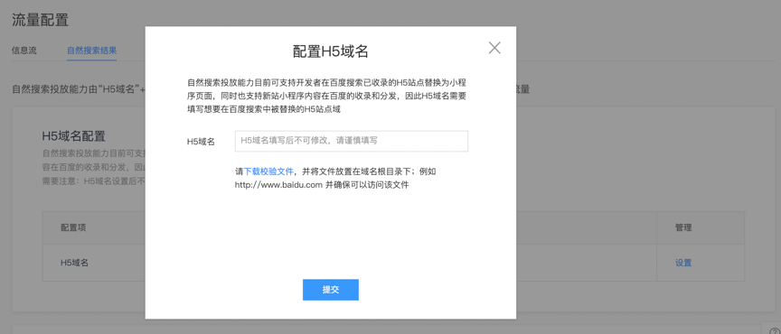

开发者依次进行**配置代理域名、配置url映射规则、申请并绑定熊掌号、配置seo信息、提交sitemap**的操作，即可完成智能小程序对接自然结果的配置。

## 配置代理域名

1. 进入<a href="https://smartprogram.baidu.com/mappconsole/main/apps">智能小程序平台</a>，单击进入小程序首页，单击“设置>开发设置”。
2. 在开发设置页面的“代理域名设置”中，单击“去开启”按钮，在弹出的对话框中，依次配置“小程序域名”和“H5域名”。

    

**说明**： 

|域名|举例|说明|
|---|---|---|
|小程序域名|https://smartapps-tieba.baidu.com|1、先在“业务域名”中按规范配置业务域名，将校验文件放置在域名的根目录下，并确保校验文件可以正常访问。<p>2、智能小程序进行web化之后，对外提供访问的域名，需要开发者在自己的服务器上基于反向代理进行配置，一般为开发者主域下的二级域名，详见[文档说明](https://smartprogram.baidu.com/docs/develop/server/upstream/)。<p>3、在“业务域名”中已配置的域名列表中选择“小程序域名”。|
|H5域名|https://tieba.baidu.com|1、**“H5域名”是指开发者H5站点的域名，一经配置之后不可更改，请谨慎填写。**<p>2、开发者H5站点的域名，应先在“业务域名”中进行添加。<p>3、不能与小程序域名相同。|
 **说明**：
 对于新站小程序可不填H5域名，同时也不会被自然搜索收录和替换。
    
3. 完成上述操作后，开发者工具上方的操作区域中会增加“web预览”的按钮，此时智能小程序已经开启了“web化”的配置开关，开发者工具会对智能小程序的web化编译进行特殊处理。

<!-- 此时`小程序域名`并不能对外提供访问，需要进行后续步骤。 -->

## 配置url映射规则

> 将您希望进入搜索的小程序页面进行配置即可。

1. 在 app.json 中增加 url-mapping 字段，配置智能小程序与其对应的H5页面的 url 的映射规则，供搜索引擎在自然结果中将H5站url进行匹配和替换。

    ```json
    {
        "pages": [
            "path/to/smartapp/page1/page1",
            "path/to/smartapp/page2/page2",
            "path/to/smartapp/page3/page3"
        ],
        "url-mapping": {
            "path/to/smartapp/page1/page1":"/path/to/h5/page1?query1=${appquery1}&query2=${appquery2}",
            "path/to/smartapp/page2/page2":"/path/to/h5/page2?query3=${appquery3}&query4=${appquery4}",
            "path/to/smartapp/page3/page3":"/path/to/h5/page3?query5=${appquery5}&query6=${appquery6}"
        }
    }
    ```

    **说明**：
    *  url-mapping 字段为 Object，在pages 中配置的每一个页面的 url 作为 key，每一个小程序页面对应的 H5 页面作为 value; 每一对"key-value"作为一个完整的url映射。
    *  url 映射规则通过字符串模板的方式进行定义，模板变量的界定符是`${}`。需要将 Web 版智能小程序 url 中的 query 部分，和字符串模板进行编译，生成正式的 url 实例。
    *  url 映射规则不包含 host 部分，具体的 host 需要开发者在上述步骤中的**H5域名**部分进行配置。

    **配置示例** 

    以百度贴吧智能小程序为例，在app.json中配置url-mapping字段如下：

    ```json
        {
            "pages": {
                "pages/index/index",
                "pages/pb/pb",
                "pages/frs/frs"
            }
            "url-mapping": {
                "pages/index/index":"/",
                "pages/pb/pb":"/p/${tid}",
                "pages/frs/frs": "/?kw=${kw}"
            }
        }
    ```
    **说明**：
    * 百度贴吧智能小程序首页为：`http://smartapps-tieba.baidu.com/pages/frs/frs?kw=baidu `， 
    * 映射到百度贴吧的H5站点域名：`http://tieba.baidu.com/?kw=baidu` 。

2. **在开发者工具中重新提包**。因为在“配置代理域名”中已经开启web化的开关，开发者工具会在编译和上传流程中加入对智能小程序web化的特殊处理。
    > 建议在正式提包之前，通过开发者工具“web预览”的功能，进行web化效果的确认。

3. url映射规则不仅可以在app.json中进行配置，同样也可以在智能小程序平台中进行配置。进入<a href="https://smartprogram.baidu.com/mappconsole/main/apps">智能小程序平台</a>，单击进入小程序首页，单击“投放管理>自然搜索管理>URL Pattern”，对url映射规则进行线上配置。

    

4. 通过开发者工具上传url映射规则的配置，则会产出一个智能小程序web化的“内部域名”，该内部域名的格式为`https://${appkey}.smartapps.cn`，该域名不应该对外直接提供访问，需要通过上文提到的“小程序域名”反向代理到该“内部域名”。

完成上述操作后“小程序域名”将展示出web化智能小程序的页面。通过查看源代码可以发现，配置url映射规则的目的是在web化的智能小程序页面头部插入“canonical标签”一对一指向对应H5页面，该标签的数据会被爬虫抓取并建立智能小程序和H5站页面的对应关系。

## 配置seo信息

智能小程序被搜索引擎正常收录的前提是进行网页化的处理，以普通网页的形式被爬虫发现和抓取，可以理解为每一个智能小程序页面都会转码成一张网页。开发者需要为当前的小程序页面配置seo相关的信息，包括title、description、keywords，这三类信息需要保持和小程序对应的H5站页面一致。具体接口详见<a href="http://smartapp.baidu.com/docs/develop/api/seo/#setDocumentTitle/">配置seo</a>。


## 申请并绑定熊掌号

智能小程序被百度搜索分发，必须要绑定熊掌号。如果还未申请熊掌号，请移步[熊掌号首页](https://xiongzhang.baidu.com)申请帐号。

请确保和熊掌号关联的百度帐号和登录[智能小程序平台](https://smartprogram.baidu.com/)的百度帐号相同。**在熊掌号平台中需要将之前配置好的代理域名和熊掌号进行绑定。**

**开发者需要将熊掌号ID和智能小程序的appkey邮件发送至 jiangfeiyu@baidu.com。**由百度工作人员将熊掌号和小程序进行绑定。

## 提交sitemap

开发者需要线下准备好web化的智能小程序sitemap，用来通知搜索引擎识别可被收录的web化智能小程序页面。

1. 进入<a href="https://smartprogram.baidu.com/mappconsole/main/apps">智能小程序平台</a>，单击进入小程序首页，单击“投放管理>自然搜索管理”。
2. 上传sitemap，可以在当前页面中下载sitemap的说明文档。目前支持存量上传和增量上传两种方式。其中存量上传并非实时生效，切更新耗时较长；增量上传数据更新耗时低，日均限额提交500个。

    

