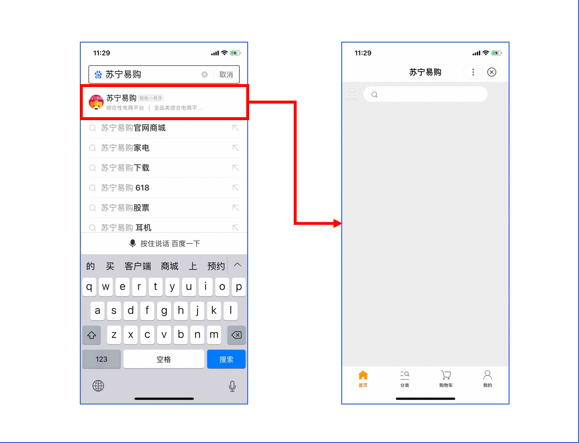

### 案例介绍——苏宁易购

苏宁易购是国内领先的综合网购平台，目前位居中国B2C市场份额前三强，商品涵盖家电、手机、电脑、超市、母婴、服装、百货、海外购等品类。客户成单转化诉求强烈，通过性能优化，带来了苏宁易购小程序成单转化较H5转化的飞升。

## 背景
初版本苏宁易购小程序成单转化较H5优势不明显。

## 问题剖析
通过评测，最初版本的小程序性能表现较差，主要表现为：页面打开慢、白屏。用户缺乏耐心而中途退出，导致页面打开率低，而页面较低的打开率，直接影响了后续的转化。

## 解决方案

优化性能，提升页面到达率

<table style="margin-top: -480px;">
<tr>
    <td>问题发现</td>
    <td>问题定位</td>  
    <td>优化措施</td>
    <td>参考链接</td>          
<tr>
<tr>
    <td rowspan="3"> 页面加载缓慢、打不开 </td>
    <td>前端渲染时长较长</td>
    <td>图片存储位置、大小、格式优化</td>
    <td rowspan="3"> [分包加载](https://smartprogram.baidu.com/docs/develop/framework/subpackages/) [性能分析工具](https://smartprogram.baidu.com/docs/develop/framework/performance-analysis-tool/) [性能优化建议](https://smartprogram.baidu.com/docs/develop/framework/performance-tips/) [白屏优化建议](https://smartprogram.baidu.com/docs/develop/framework/whitescreen/) </td>
</tr>
<tr>
    <td>包体积大</td>
    <td>分包</td>
</tr>
<tr>
    <td>下载占比高</td>
    <td>支持预下载</td>
</tr>
</table>

## 优化效果

* 整体加载时长缩短 **41.7%**
* 主包加载时长缩短 **56.7%**
* 包体积减少了 **50%**
* 页面到达率提升了 **8.5%** 

## 案例总结
开发者可结合官方操作文档，定期自查小程序，优化小程序性能，提升用户体验，进而提升业务收益。
