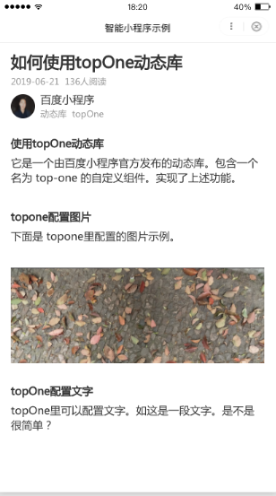

### topOne动态库功能介绍
topOne是一个由百度小程序官方发布的名为“topOne”的图文组件。通过提供指定的参数展示图文内容。包括文章标题、用户信息（头像，其他信息）、段落、图片等。

### 使用topOne动态库
topOne 动态库包含一个名为 top-one 的自定义组件。

#### topOne动态库配置

app.json 文件**代码示例**

```
"dynamicLib": {
    // 'myTopOne' 是个可自己定的别名。本小程序中统一用这个别名引用此动态库。
    "myTopOne": {
        // 这个 provider 就是发布的动态库唯一名字，须写 'topOne'。
        "provider": "topOne"
    }
},
```
页面 json 文件**代码示例**
在页面的 json 文件中，如下配置来使用此动态库中的叫做 top-one 的自定义组件：

```
{
    "navigationBarTitleText": "智能小程序示例",
    "usingComponents": {
        // 这里 key 中的 'top-one' 是个可以自己任意指定的别名，
        // 本页面或者本组件在模板中统一用此别名引用这个自定义组件。
        // 这里的 'myTopOne' 就是上面定义的，本小程序使用此动态库的别名。
        // 这里 value 最后部分的 'top-one' 是此动态库的公开的自定义组件（publicComponents）的名称。
        "top-one": "dynamicLib://myTopOne/top-one"
    }
}
```
swan 文件引入**代码示例**

```
<top-one topOneArticleTitle="{{d.topOneArticleTitle}}"
    topOneArticleInfo="{{d.topOneArticleInfo}}"
    topOneUserInfo="{{d.topOneUserInfo}}"
    topOneContentNodes="{{d.topOneContentNodes}}" />
```
js 文件中设置数据**代码示例**

```
data: {
    d: {
        topOneArticleTitle: '如何使用topOne动态库',
        topOneArticleInfo: ['2019-06-21', '136人阅读'],
        topOneUserInfo: {
            photo: 'https://b.bdstatic.com/searchbox/icms/searchbox/img/toponesmallimg.png',
            name: '百度小程序',
            info: ['动态库', 'topOne']
        },
        topOneContentNodes: [
            {type: 'caption', text: '使用topOne动态库'},
            {type: 'section', text: '它是一个由百度小程序官方发布的动态库。包含一个名为 top-one 的自定义组件。实现了上述功能。'},
            {type: 'caption', text: 'topone配置图片'},
            {type: 'section', text: '下面是 topone里配置的图片示例。'},
            {type: 'img', src: "https://b.bdstatic.com/searchbox/icms/searchbox/img/toponebigimg.jpg"},
            {type: 'caption', text: 'topOne配置文字'},
            {type: 'section', text: 'topOne里可以配置文字。如这是一段文字。是不是很简单？'}
        ]
    }
});
```
### topOne动态库字段详解
|属性名|类型|必填|说明|
|---|---|---|---|
|topOneArticleTitle |String|是|文章的标题|
|topOneArticleInfo | Array|否|文章信息，例如时间，阅读量等，数组每一项为写字符串|
|topOneUserInfo | Object|否|用户信息，用户头像，用户名称，用户备注。详情见下文。|
|topOneContentNodes | Array|是|文章内容。使用的为rich-text组件。|

- topOneUserInfo：支持三个属性：photo，name，info。  

|属性 |  类型 |类型说明 |
|---|---|---|
|photo | String|图片路径|
|name | String|用户姓名信息|
|info|Array|其他信息|

- topOneContentNodes：该属性的值为一个数组，数组每一项包含一个对象。对象支持如下几种格式。

|类型|取值说明|
|---|---|
|标题 | {type: 'caption', text: '标题 content'}|
|文章内容 | {type: 'section', text: '文章 content'}|
|图片 | {type: 'img', src: 'xxx'}|

### 展示示例


