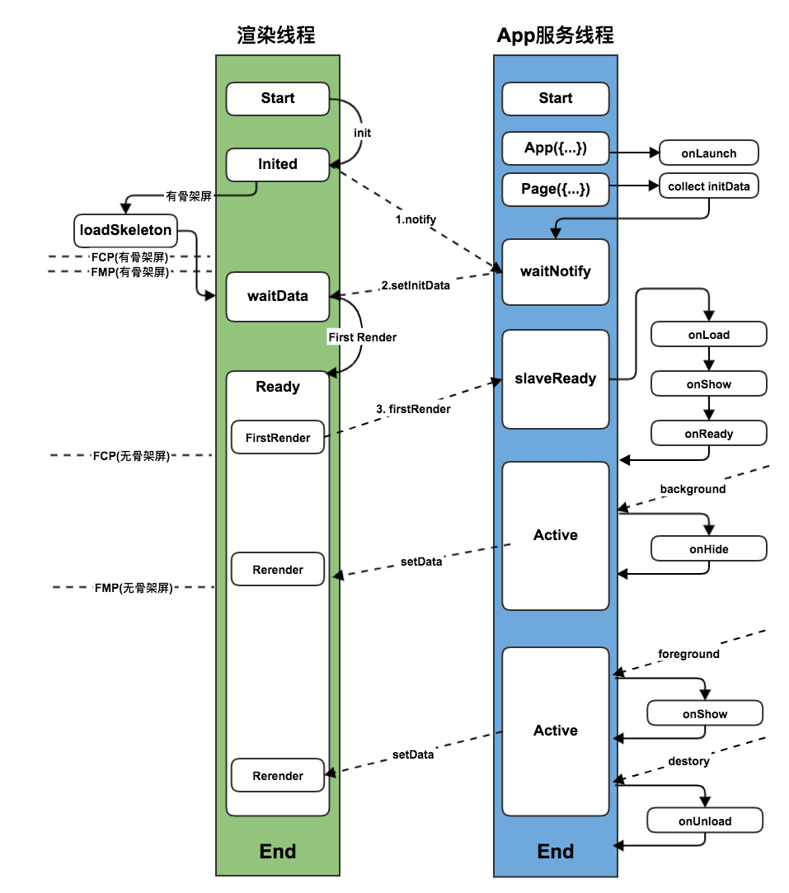
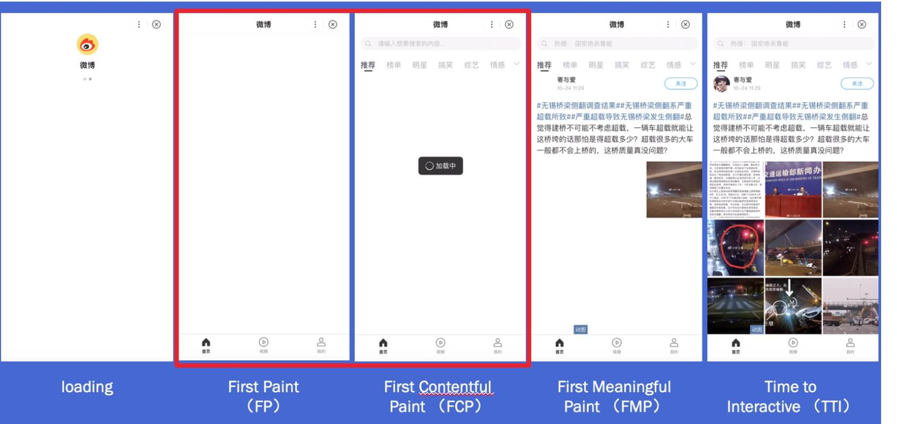

## 原理图：
以下内容详细的描述了一个页面被渲染的全过程。

 

**注释：**
1. FCP: First Contentful Paint，即首次有内容的绘制；
2. FMP: First Meaningful Paint，即首次有意义的绘制；

下列加载时间线屏幕截图直观的介绍了`FCP`与`FMP`的含义：

 

## 首页初次渲染全过程
### 1. 初始化
渲染线程和`App`服务线程同步的进行初始化，在`App`服务线程初始化时收集`App`和`Page`的初始化数据，并且执行`App.onLaunch`回调中的相关逻辑。

此处我们以一个例子进行说明：
```js
// app.js
App({
    globalData: 'init data',
    onLaunch(options) {
        this.globalData = 'onLaunch data';
    }
});
```

```js
// /pages/index/index.js
Page({
    data: {
        title: 'Index',
        appData: getApp().globalData // onLaunch data
    }
})
```

初始化后`App`服务线程收集到的`initData`如下:
```js
{
    value: {
        title: 'Index',
        appData: 'onLaunch data'
    },
    otherMsg: ... // 其他信息
}
```

### 2. notify
当渲染线程初始化后，向`App`服务线程派发消息，请求获取初始化渲染数据。
同时，如果开发者有配置骨架屏，小程序会优先加载骨架屏，此时即为`FCP`完成。**如果骨架屏的高度撑满整个页面，那么我们认为此时为`FMP`完成，如果骨架屏信息不足以撑满整个屏幕，那么我们认为此次渲染非有效的`FMP`**。

### 3. setInitData
`APP`服务线程将初始化渲染数据派发给渲染线程，渲染进程拿到这些初始化数据后，会初始化页面及自定义组件，最后将所有内容渲染到页面上。

### 4. firstRender
渲染线程完成首次渲染后，此时已经可以获取整个页面的所以信息，渲染线程派发`firstRender`消息通知`APP`服务线程。`App`服务线程收到此消息后执行页面和自定义组件相关的生命周期。

整个生命周期执行顺序如下所示：
```js
// 初始化时同步执行
app onLaunch
// 收到 firstRender，并且客户端派发onShow事件
-> app onShow
-> cpnt created -> cpnt attached -> page onLoad
-> cpnt show    -> page onShow
-> cpnt ready   -> page onReady
```

**注释：cpnt 指一个自定义组件。**

### 5. setData
`APP`服务线程触发以上生命周期后，逻辑层一般执行了众多的`setData`，每次`setData`均会使得`App`服务线程向渲染线程传送数据，引起页面的重新渲染。
