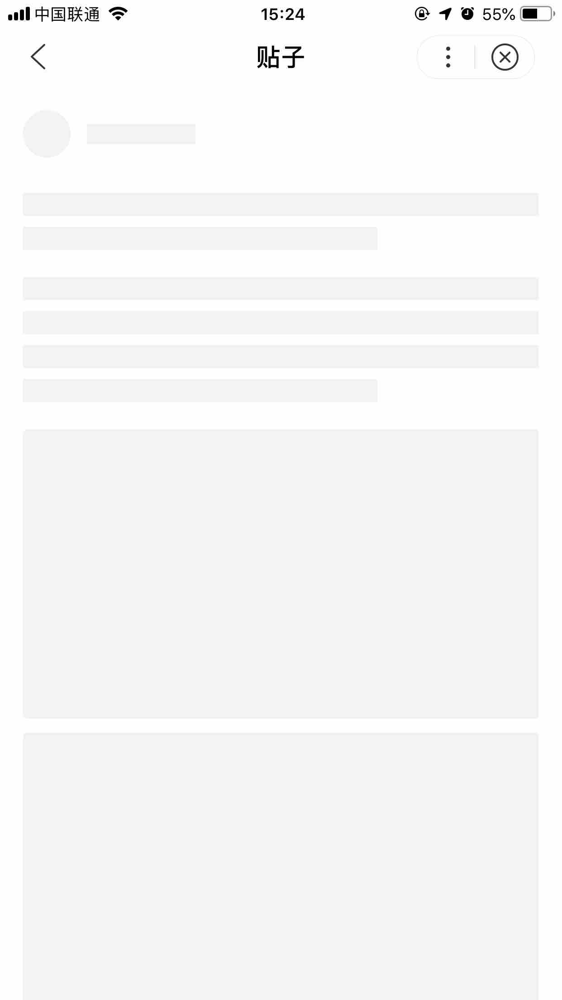

## 白屏检测说明
**白屏定义**：用户触发页面打开后，间隔一定时间后仍然没有任何页面绘制，则认定为白屏。

**白屏检测原理**：从用户点击小程序入口开始计算时间，6s后进行截图分析。当截图为空白页面或只有背景色，则记为一次白屏。请注意：此统计规则在2019年9月6日发生变更，变更前为从小程序页面框架创建时开始计时。

**白屏监控范围**：仅针对小程序进入时的首个页面进行检测。

**数据解读**：白屏率 = 白屏发生PV / 小程序冷启动打开PV，开发者可以在小程序平台上看到自己小程序白屏率的数据情况。在上述检测机制下，无论小程序启动时出现异常还是页面加载过程较慢，6S时被监测到无内容展示，都会视为白屏。因此在进行白屏优化时，需要从两方面着手，一方面对页面异常问题进行排查，另一方面着重优化页面的性能。

## 白屏优化
###   排查异常
小程序白屏数据出现异常上涨时，可以从以下三个方面着手排查分析：
####   服务稳定性
1. 小程序页面数据请求是否正常：
通过线上巡检，发现有小程序存在自身服务不稳定的情况。例如小程序页面数据请求返回4XX，5XX错误等。
2. HTTPS证书是否存在问题：
排查HTTPS证书是否已过期，导致小程序相关请求失败，无法展示数据。
有些小程序可能误使用了自签的HTTPS证书，由于无法被信任，用户也无法强制信任，导致页面数据获取失败。

####  业务逻辑
有些小程序的页面数据展示可能存在前置条件，例如需要登录、定位等。在条件不满足时，可能存在兼容处理问题。这里给出常见的几种case：
1. 页面打开时需要首先进行授权，获取权限：
授权失败时需要有响应的兼容逻辑或者给予明确提示。
2. 页面打开时需要登录才可展示内容：
例如常见的购物类小程序，用户未登录时需要有相应的提示，以及触发登录的按钮或者入口。
3. 网络连接失败时，页面兼容性不足：
这种情况最好是有对应的错误页和重试入口，保证用户可再操作，提供自主恢复的能力。
4. 逻辑中存在自设校验，校验不通过：
有些小程序是从微信小程序迁移而来，内部逻辑中可能存在自设的平台检测校验等，迁移时或者版本更新时没有同步变更，导致校验不通过，从而导致页面异常。

####  框架兼容性
小程序框架自身也在不断更新，所支持的能力也在不断更新和扩充。同样，开发者也会对小程序自身也会进行版本更新。这里就涉及到了兼容性问题。小程序框架版本修复Bug记录和版本兼容性，请参考以下连接了解和主动规避：
1. 语法支持性：[运行环境](https://smartprogram.baidu.com/docs/develop/framework/operating-environment/)
2. 版本兼容性：[兼容性说明](https://smartprogram.baidu.com/docs/develop/swan/compatibility/)
3. 框架更新日志及修复问题说明：[历史更新日志](https://smartprogram.baidu.com/docs/develop/tutorial/swanchangelog/)

###  优化性能和体验
已有启动性能数据，平均数据和80分位数据较快不一定能保证白屏率就低，白屏case大概率发生在性能的长尾数据中。
从平台跟进的多个小程序白屏数据分析结果来看，小程序白屏率高的主要因素是页面数据加载和渲染较慢。如果小程序上线后白屏数据就处于高位，或者版本更新后白屏数据上涨，可以通过以下方面进行分析和优化：
1. 页面结构：
部分小程序的页面内容重度依赖于服务器的返回，在服务端没有数据返回的时候，页面没有任何内容展示，这样的情况在遇到网络波动或者服务发生抖动的时候会造成白屏率的陡增。开发者可以在服务端数据返回之前通过动画，文案体验上的优化来减小白屏率。
2. 页面数据加载方式：
针对一次请求返回的数据过多的情况，可以从两个角度来优化：1 、非关键数据延迟请求，2、非关键数据延迟渲染
非关键数据延迟请求：

    ```
    swan.request({
        url: 'https://www.baidu.com/keyData',
        success: res => {
            this.setData({
                keyData: res
            });
            swan.request({
                url: 'https://www.baidu.com/nonKeyData',
                success: res => {}
            });
        }
    })
```
    非关键数据延迟渲染
    ```
        this.setData({keyData}, () => {
            this.setData({nonKeyData});
        });
    ```
3. 增加过渡态提示：
页面加载时，可以使用Loading组件等形式进行提示，给用户一个提示，提升用户体验。
4. 使用骨架屏：
骨架屏形式类似下图，可以很好的提升用户使用小程序时的体验。
    <div class="m-doc-custom-examples">

    <div class="m-doc-custom-examples-correct">
        
    </div>
    <div class="m-doc-custom-examples-error ">
        
    </div>
    </div>
5. 默认态处理：
例如在涉及到定位时，部分小程序会等待定位完成后才展示数据，可以增加默认态数据，定位完成后再更新页面数据。

