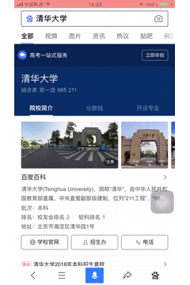
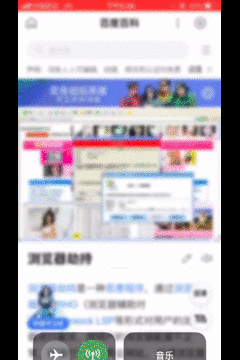
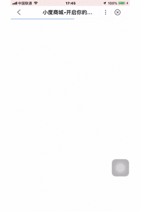
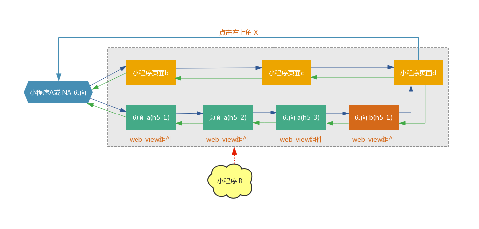
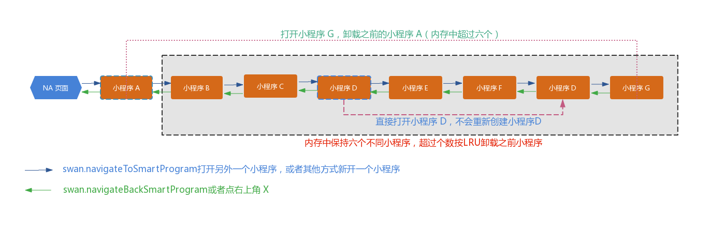

在智能小程序中，导航跳转是连接两个页面的纽带，由于框架导航实现底层原理的黑盒效应，以及页面容器的场景和类型不同，导致我们在开发小程序过程中，不能清晰的判断页面的一些表现，例如返回图标（客户端绘制的一个左箭头图标，位于顶部导航栏的最左侧，用于返回上一个小程序页面容器）与首页图标（客户端绘制的一个小房子图标，用于打开小程序 app.json 配置的首页）使用场景不明确。

通过对 SWAN 框架进行分析，我们整理了全面的导航原理以及页面跳转后客户端的表现，希望为您的开发带来帮助。

更多内容参见：[顶部导航栏的UI设计参考文档](https://smartprogram.baidu.com/docs/design/component/topnav/)、[导航路由开发文档](https://smartprogram.baidu.com/docs/develop/api/show_tab/)、[webview组件开发文档](/develop/component/open_web-view/)。


## 页面跳转底层原理

智能小程序提供了5种导航方式（[路由方式](/develop/framework/app_service_routestyle/)），即: navigateTo、redirectTo、navigateBack、switchTab、reLaunch，除直接调用API的方式，还可以通过navigator组件绑定属性的方式触发路由跳转（[navigator组件](/develop/component/nav/)）。
假设从A页面跳转到B页面，针对5种不同的跳转，通过智能小程序分析，客户端和SWAN框架配合如下：

|跳转方式|实现方式|场景|
|---|---|---|
|[navigateTo](/develop/component/nav/)|SWAN框架携带开发者参数，通知客户端打开一个新的页面容器，客户端打开后将相关参数回传给SWAN框架，并通知框架开始加载开发者代码，紧接着框架实例化一个新的页面并将其推入页面栈中，然后利用初始数据进行初始化页面渲染。|只能打开非 tabBar 页面|
|[redirectTo](https://smartprogram.baidu.com/docs/develop/api/show_tab/#swan-redirectTo/)|SWAN框架携带开发者参数，通知客户端打开一个新的页面容器，客户端打开后将相关参数回传给SWAN框架，并通知框架开始加载开发者代码，紧接着框架将页面栈顶的信息更新为待跳转页面的信息，同时创建页面实例，然后利用初始数据进行初始化页面渲染。|只能打开非 tabBar 页面|
|[navigateBack](https://smartprogram.baidu.com/docs/develop/api/show_tab/#swan-navigateBack/)|有两种方式返回上一个页面，一种是主动操作（android物理返回、双端右滑、通过顶bar的返回按钮），此场景下返回时客户端会通知SWAN框架将页面栈顶页弹出；另一种是调用API的方式或者利用navigator组件返回上一页，此场景下是由框架直接通知客户端关闭当前页面容器，客户端关闭成功后通知SWAN框架将页面栈顶页弹出。|可作用于任意页面|
|[switchTab](https://smartprogram.baidu.com/docs/develop/api/show_tab/#swan-switchTab/)|有两种方式进行tab切换，一种是主动操作（在tab页点击另一个tab），客户端会通知SWAN框架对页面栈信息进行更新，另一种是通过API或利用navigator组件通知客户端跳转到某一tab页，客户端跳转完成时通知SWAN框架进行页面栈信息更新。|只能打开 tabBar 页面|
|[reLaunch](https://smartprogram.baidu.com/docs/develop/api/show_tab/#swan-reLaunch/)|SWAN框架将页面栈清空，然后利用开发者传入的url重新初始化为第一个页面。|可打开任意页面|


## 原生小程序页面

假设我们的所有页面都在原生小程序页面跳转：

- 当首次打开的页面为非二级页面（app.json pages 配置的首项页面或者 tabBar 页面），那么此页面不会有返回按钮和首页图标，此时如果通过跳转下一个新的页面（客户端新开一个容器，且不为tabBar页面），则会在顶部导航栏左侧增加一个返回按钮；
- 当首次打开的页面为二级页面（非 app.json pages 配置的首项页面或者非 tabBar 页面），那么此页面就会出现首页图标，此时如果通过导航跳转下一个新的页面（客户端新开一个容器，且不为tabBar页面），则会在首页图标左侧增加一个返回按钮；
- 在跳转多次后，当我们操作返回到上一个页面时，客户端会将当前页面容器关掉，将待返回到的页面容器从后台切到前台展示，这一过程客户端顶部导航栏不会有刷新操作。

如果我们不想使用客户端的原生顶部导航栏，转而想进行导航栏自定义，那么可以在 app.json 或者对应 page.json 增加配置（`navigationStyle: custom`）（[配置 app.js 文件](/develop/tutorial/processjs/)），此时客户端就会隐藏掉原生顶部导航栏，开发者就可以通过标签样式进行定制化导航栏（围包括状态栏）。


## web-view组件撑起的h5页面

### 使用说明

**使用 webview 组件承载 h5 页面是智能小程序官方不推荐的。**
因为这和原生小程序页面相比性能有极大的劣势，并不能给我们的用户带来更好的体验。但是，我们初期就有先迁移 h5 页面到小程序中的诉求。
> 在 web-view 组件承载 h5 页面中，如果想要跳转到一个新的小程序页面（即客户端新开一个容器），需要配合 jssdk 进行操作（[web-view 组件](/develop/component/open_web-view/)）。

### 场景举例

当需要从 h5 无缝转接到小程序，首先想到的就是小程序内放置一个`web-view`组件来链接之前的 h5 页面，一行代码就完成了迁移到小程序的难题。

**实际情况如下图**：



小程序，页面左上角没有返回按钮，只能不停的往下点，无法返回。

**问题原因**：
使用 web-view 组件的 h5 中跳转到 h5 的下一个页面，客户端并没有打开一个新的小程序页面，而是在当前 web-view 组件加载了新的网页，这样导致客户端的页面栈没有增加新的小程序页面，导航栏的返回按钮没有出现，导航栏上还是原来的按钮。
> 正常情况下，小程序直接打开一个非首页小程序页面，会出现首页图标，如未点击首页或者右上角'更多'里面的回首页或者首页图标，在跳转到新的小程序页面的时候，首页图标将会一直存在。

#### 解决方案 


通过跳转新的小程序页面，比如在将要加载的 h5 也放个 webview 组件，触发新的小程序页面加载，下一个页面的左上角是会有返回按钮，体验上和原生一致。

效果图:
 

那么问题来了，怎么把点击的链接传到第二个页面呢？
我们可以在 webview 组件页面使用 jssdk 中 h5 页面跳转到小程序页面的方法 swan.webView.navigateTo，然后再携带一个 url 参数：

```
//webview 组件页面javascript
navigate(url) {
    swan.webView.navigateTo({url: '../webview/webview?weburl=' + url});
}
```

接着在小程序另外一个新的 webview 组件页面中：
```
// pages/webview/webview.js
Page({
    data: {
    url:''
    },
    // 监听页面加载,获取H5页面传递过来的weburl
    onLoad: function (options) {
    this.setData({
      url: options.weburl 
    });
  }
});
```

并赋值给 webview.swan 中的 src 属性：
```
// pages/webview/webview.swan
<web-view src="{{url}}"></web-view>
```
#### 不推荐使用的解决方案
* 客户端上可以通过侧滑可以返回到webview组件的上一个个网页内容。缺点：一方面没有原生导航栈返回的动画效果，另一个方面作为用户来说，这个操作隐藏的比较深，难以发现。
* 在每个H5页面都加上一个带返回按钮的导航栏。缺点：因为小程序页面的头部已经有个导航栏了，再加一个的话就显得非常的不协调，影响用户体验。
* 使用自定义导航栏样式，新增导航栏,在app.json或者对应page.json增加配置（`navigationStyle: custom`）（[app配置](/develop/tutorial/processjs/)）缺点：webview组件页面不支持自定义导航栏样式。

### web-view 组件的返回 

点击返回按钮:

- 如果当前是在使用 webview 组件的小程序页面，webview 组件首先回退展示的前一个 h5 内容，类似浏览器的网页返回。
- 如果 web-view 组件没有内容可以返回，就触发小程序页面栈的返回效果。
- 如果是当前小程序页面栈首页，再返回，会回到上一个小程序或者非小程序 NA 页面。

举例：
 

**小程序页面栈内部导航流程图**：
 

## 小程序间跳转


当我们从一个小程序打开另一个小程序，单个小程序间页面跳转参见[原生小程序页面](#原生小程序页面)、[web-view组件撑起的h5页面](#web-view组件撑起的h5页面)，目前百度 App 客户端支持打开的小程序最多为6个，当超出之后会按打开顺序依次替换掉最先打开的小程序，当用户主动进行小程序切换（点击右上角将当前小程序送入后台，或者在android多任务直接切换到某一个小程序页面）时，会触发每个小程序的部分生命周期，并不会刷新导航栏。因此可以继续在跳转到某个小程序后，继续使用之前的导航跳转方法。

**小程序间的导航流程图**：
 

