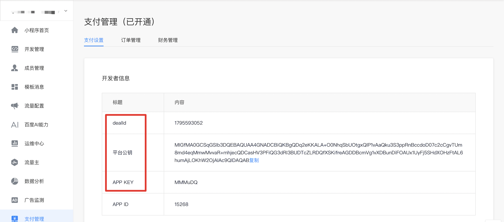

## 核心参数获取 

### 参数解释

* dealId
第三方业务订单创建后跳转百度收银台支付必带参数之一，是百度收银台的财务结算凭证，与账号绑定的结算协议一一对应，每笔交易将结算到dealId对应的协议主体，详见[平台技术术语](https://dianshang.baidu.com/platform/doclist/index.html#!/doc/nuomiplus_2_base/anchor/term.md)。

* appKey
第三方业务订单创建后跳转百度收银台支付必带参数之一，是第三方应用在百度电商开放平台的唯一标识字符串，详见[平台技术术语](https://dianshang.baidu.com/platform/doclist/index.html#!/doc/nuomiplus_2_base/anchor/term.md)。注意：本appKey并非智能小程序平台分配，注意不要混淆。

* 平台公钥
平台给到第三方的公钥，用来校验百度收银台的签名，详见[平台技术术语](https://dianshang.baidu.com/platform/doclist/index.html#!/doc/nuomiplus_2_base/anchor/term.md)。

<br />

### 获取dealId.appKey.平台公钥

服务审核通过后，通过查看服务详情【管理中心->我的服务->查看】可以获得这三个参数,如下图：



##  通用参数组装 

**bizInfo组装** 
bizInfo参数是为了给业务方透传信息使用的，属于选填属性。
其中封装了部分核心参数，是为了在下游展示环节做冗余备份处理，推荐开发者按下表封装这些核心参数

|参数名称|类型|是否必填	|说明|
|-----|-----|-----|------|
|tpData|Object|否|bizInfo组装键值对集合|
|appKey|String|否|表示应用身份的唯一ID|
|dealId|String|否|百度收银台的财务结算凭证|
|tpOrderId|String|否|业务方唯一订单号|
|totalAmount|String|否|订单总金额，以分为单位|
|returnData|Object|否|业务方用于透传的业务变量|
|displayData|Object|否|收银台定制页面展示属性，非定制业务请置空|


 >整个orderInfo是个json对象； 
 >bizInfo  这个键值是一个以字符串形式存放的json对象； 
 >在签名和验签过程中，如开发者在任何一个环节没有严格按照文档要求操作均会导致此“签名错误”，请认真阅读文档。 


**代码示例**

```
{
    "tpData":{
        "appKey":"MMMabc",
        "dealId":"470193086",
        "tpOrderId":"3028903626",
        "rsaSign":"",
        "totalAmount":"11300",
        "returnData":{
            "bizKey1":"第三方的字段1取值",
            "bizKey2":"第三方的字段2取值"
        },
        "displayData":{
            "cashierTopBlock":[
                [
                    {
                        "leftCol":"订单名称",
                        "rightCol":"爱鲜蜂"
                    },
                    {
                        "leftCol":"数量",
                        "rightCol":"1"
                    },
                    {
                        "leftCol":"小计",
                        "rightCol":"113"
                    }
                ],
                [
                    {
                        "leftCol":"服务地址",
                        "rightCol":"北京市海淀区中关村南大街5号百度大厦"
                    },
                    {
                        "leftCol":"服务时间",
                        "rightCol":"2018/05/20 13:30-14:00"
                    },
                    {
                        "leftCol":"服务人员",
                        "rightCol":"娜娜"
                    }
                ]
            ]
        }
    }
}


```

<br />


