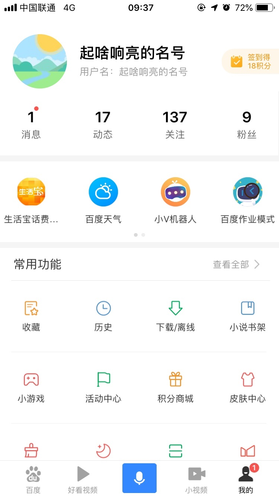
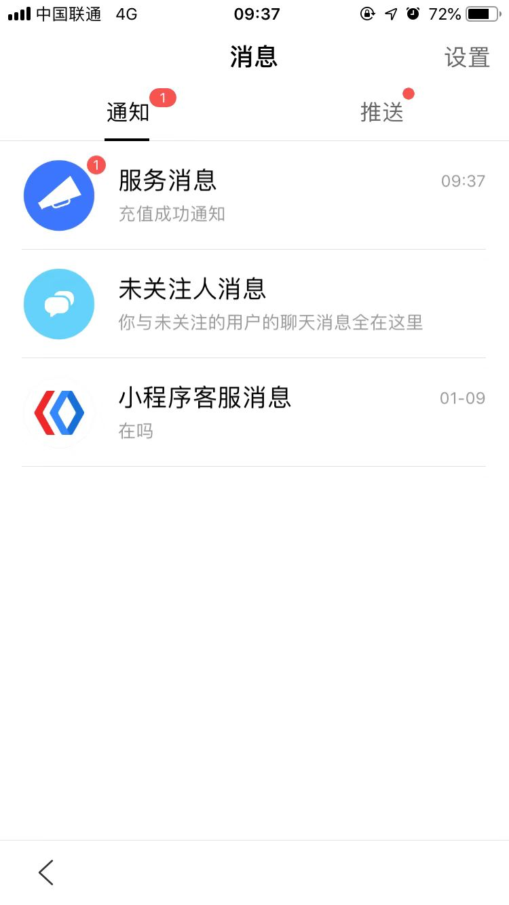
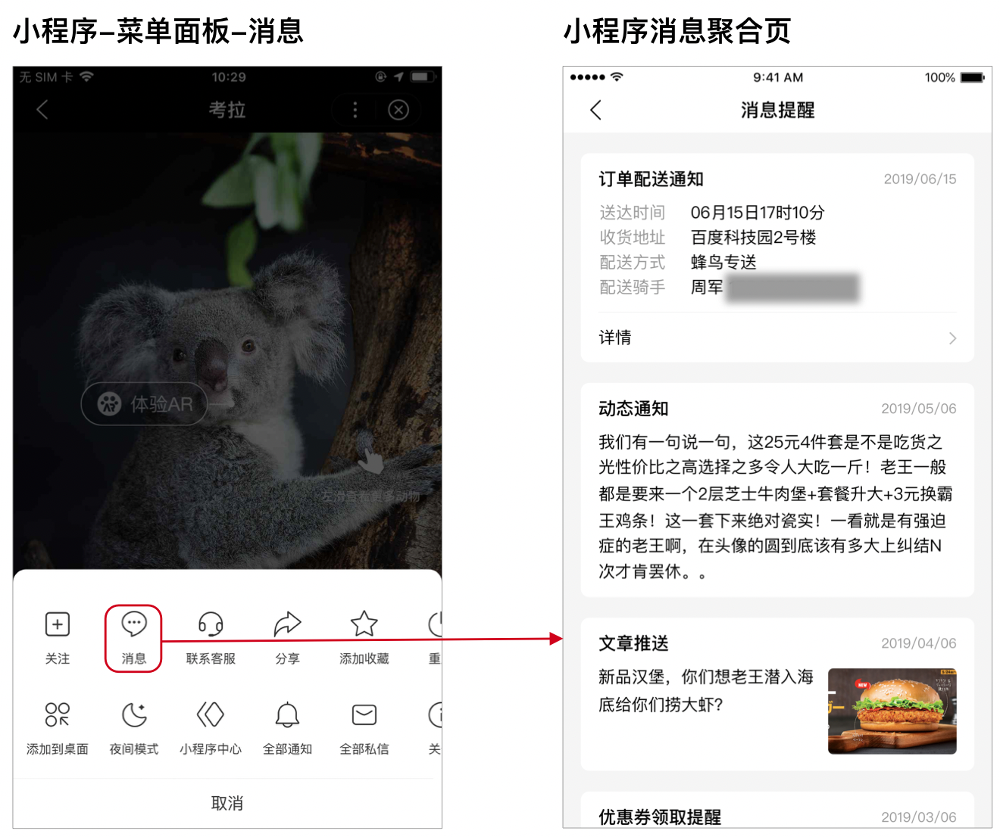
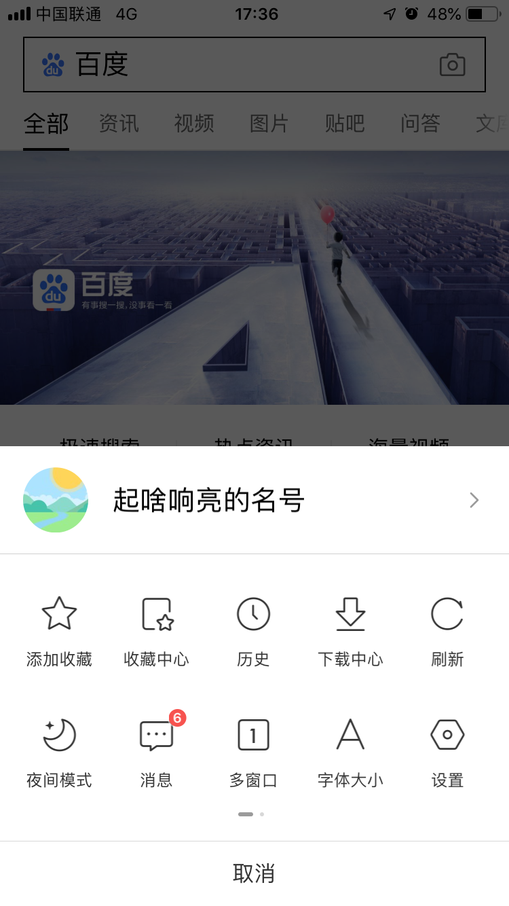
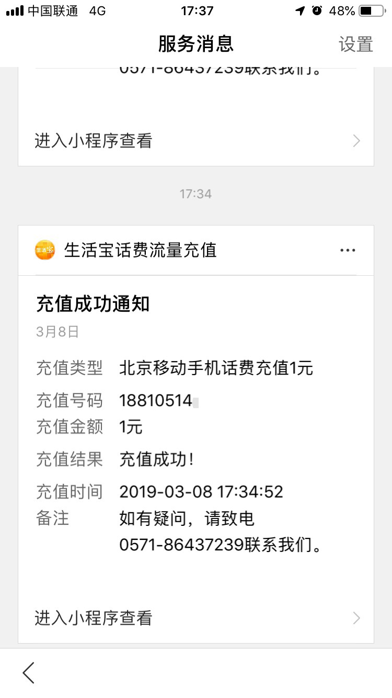

 
开发者可通过模板消息高效触达用户，通知用户当前行为的结果及状态、订阅的推送内容等信息；同时可在消息中配置跳转小程序指定页面地址，当用户查看并点击消息体时返回小程序，进入开发者配置的小程序指定页面，详见[模板消息使用说明](https://smartprogram.baidu.com/docs/develop/serverapi/useintroduction/)


## 功能介绍

### 场景介绍
模板消息可以方便开发者更高效的触达用户，例如：交易状态、物流状态、订阅提醒等；用户在小程序内产生交互行为后，开发者可以通过用户交互行为产生的凭证配置模板消息，发送给用户。目前仅支持文本消息

现已开放的模板消息有三类：**支付类、表单类、订阅类**，三种类型的下发条件有所差异，详见[模板消息下发条件](https://smartprogram.baidu.com/docs/develop/serverapi/sendintroduction/)

#### 支付类适用场景
```
与小程序内用户支付流程相关的交互场景，如 订单未支付提醒、付款结果通知、订单发货通知 等
```
#### 表单类适用场景
```
用户在小程序内提交表单信息的交互场景，如 预约成功通知、业务受理通知、专家回复通知 等
```
#### 订阅类适用场景
```
用户主动发起订阅某个信息的交互场景，如 商品降价提醒、动漫开播通知、演唱会开售提醒 等
```

### 模板消息示意图

- 主要入口
<div class="m-doc-custom-examples">
	<div class="m-doc-custom-examples-correct">
		
		<!-- <p class="m-doc-custom-examples-title">正确</p><p class="m-doc-custom-examples-text">内容左右边距应至少34px(17pt)。</p> -->
	</div>
	<div class="m-doc-custom-examples-error ">
		
		<!-- <p class="m-doc-custom-examples-title">错误</p><p class="m-doc-custom-examples-text">边距过宽，页面元素过于集中。</p> -->
	</div>
</div>

 

- 搜索结果页入口
<div class="m-doc-custom-examples">
	<div class="m-doc-custom-examples-correct">
		
		<!-- <p class="m-doc-custom-examples-title">正确</p><p class="m-doc-custom-examples-text">内容左右边距应至少34px(17pt)。</p> -->
	</div>
	<div class="m-doc-custom-examples-error ">
		
		<!-- <p class="m-doc-custom-examples-title">错误</p><p class="m-doc-custom-examples-text">边距过宽，页面元素过于集中。</p> -->
	</div>
</div>
- 小程序内消息聚合入口（需升级至百度APP v11.16版本以上）
<div class="m-doc-custom-examples">
	<div class="m-doc-custom-examples-correct">
		
		<!-- <p class="m-doc-custom-examples-title">正确</p><p class="m-doc-custom-examples-text">内容左右边距应至少34px(17pt)。</p> -->
	</div>
	<div class="m-doc-custom-examples-error ">
		
		<!-- <p class="m-doc-custom-examples-title">错误</p><p class="m-doc-custom-examples-text">边距过宽，页面元素过于集中。</p> -->
	</div>
</div>
- 消息体
<div class="m-doc-custom-examples">
	<div class="m-doc-custom-examples-correct">
		
		<!-- <p class="m-doc-custom-examples-title">正确</p><p class="m-doc-custom-examples-text">内容左右边距应至少34px(17pt)。</p> -->
	</div>
	<div class="m-doc-custom-examples-error ">
		
		<!-- <p class="m-doc-custom-examples-title">错误</p><p class="m-doc-custom-examples-text">边距过宽，页面元素过于集中。</p> -->
	</div>
</div>
- 订阅类消息的用户授权面板
<div class="m-doc-custom-examples">
	<div class="m-doc-custom-examples-correct">
		
		<!-- <p class="m-doc-custom-examples-title">正确</p><p class="m-doc-custom-examples-text">内容左右边距应至少34px(17pt)。</p> -->
	</div>
	<div class="m-doc-custom-examples-error ">
		
	</div>
	<div class="m-doc-custom-examples-error ">
		
	</div>	
</div>
 


