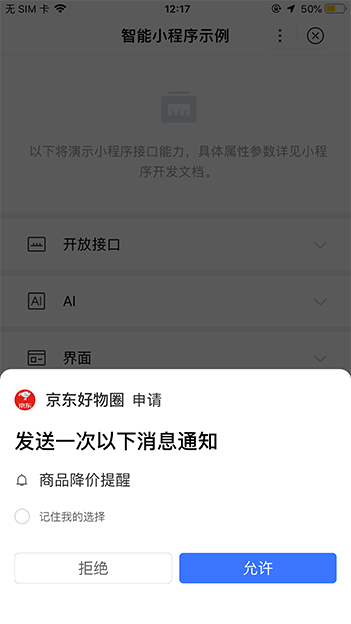

### 使用场景
模板消息可以方便开发者更高效的触达用户，例如：交易状态、物流状态，订单评价等；用户在小程序内产生交互行为后，开发者可以通过用户交互行为产生的凭证配置模板消息来发送给用户。
> 目前模板消息仅支持文本消息。

## 功能介绍
目前已经开放的模板消息主要是三类：支付类消息、表单类消息、订阅类消息。
> 三种类型的下发条件有所差异，详见<a href="http://smartprogram.baidu.com/docs/develop/serverapi/open_infomation/#%E4%B8%8B%E5%8F%91%E6%9D%A1%E4%BB%B6%E8%AF%B4%E6%98%8E/">下发条件说明</a>。

### 消息的入口

* 百度App-我的tab-消息中心
    > 支付类、表单类、订阅类消息均有该入口。

<!-- 
 -->

	

		
		<!-- 
正确

内容左右边距应至少34px(17pt)。
 -->
	

	

		
		<!-- 
错误

边距过宽，页面元素过于集中。
 -->
	

* 搜索结果页菜单面板
    > 支付类、表单类、订阅类消息均有该入口。

	

		
		<!-- 
正确

内容左右边距应至少34px(17pt)。
 -->
	

	

		
		<!-- 
错误

边距过宽，页面元素过于集中。
 -->
	

 

* 手机通知栏
    > 仅限支付类、订阅类消息，部分Android厂商机型可能受限。

    
* 模板消息体的样式示意：

    

* 订阅类消息的用户授权面板示意：

    

