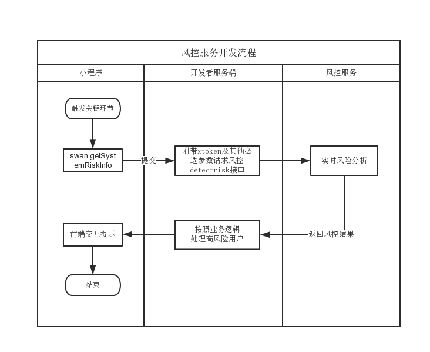

## 使用场景

 - **营销活动反作弊**
  识别在抽奖、签到、平台装券、商家领券等营销形式上出现的大规模作弊刷取奖品的情况。

 - **恶意下单攻击**
识别在电商/打车等场景下，出现大规模恶意下单退单、刷取销量、恶意注册等行为。

 - **电商交易反欺诈**
识别卖家或买家采取虚假交易等方式骗取平台补贴、激励的行为。

 - **稀缺物品抢购**
识别手机抢购，抢票，排队及专家挂号场景下，恶意刷取的行为。

 - **榜单投票恶意刷量**
识别明星粉丝打榜、投票、点赞、关注等操作上的作弊行为。
 
## 功能介绍

 百度智能小程序风控服务，是基于业务场景结合IP画像、设备指纹、黑卡检测、威胁情报等多维度信息实时识别风险的专业防护服务，可有效识别和解决渠道推广、支付安全、营销活动存在的作弊问题，通过对设备伪造、群控、模拟器、设备注入、脚本攻击等黑产常用手段的识别与打击，从而保障开发者个人/企业的营销资金不被黑产恶意套取，提升业务的投资回报率（ROI）。

> - 服务优势：精准识别、持续对抗、响应快速、海量数据共享

 

 
## 使用说明
建议开发者在自身业务的关键环节增加风险判断，比如拆红包环节、领取优惠券环节、拉新环节、生单环节等，针对高作弊风险用户做特殊逻辑处理。风控服务API在使用前，需开发者先通过小程序的[swan-getSystemRiskInfo](https://smartprogram.baidu.com/docs/develop/api/open_riskInfo/#swan-getSystemRiskInfo)接口获取风控核心参数xtoken。
>- 为了保证服务质量，希望开发者尽可能传递完整detectrisk接口参数。
>- 切勿针对xtoken做缓存处理等，确保每次请求均通过swan-getSystemRiskInfo实时获取。


**开发流程**



## detectrisk 
**解释**：检测用户是否是作弊用户。
**接口调用请求说明**：
```
POST https://openapi.baidu.com/rest/2.0/smartapp/detectrisk?access_token=ACCESS_TOKEN
```

#### 参数说明

**query参数**:

|参数名|	类型|	是否必须|	描述|
|---|---|---|---|
|access_token|	string|	是|	[接口调用凭证](https://smartprogram.baidu.com/docs/develop/serverapi/power_exp/)|

**post参数**:

|参数名|	类型|	是否必须|	描述|
|---|---|---|---|
|appkey|	string|	是|	小程序appkey|
|xtoken|	json string|	是|	小程序通过[`swan-getSystemRiskInfo`](/develop/api/open_riskInfo/#swan-getSystemRiskInfo)获取的内容,格式：`{"key":"xxxx","value":"xxxx"}`|
|type |string	|是|	运营活动的类型，该值由风控平台分配。目前只有一种marketing|
|clientip|string|是|客户端的IP，非小程序服务本地IP|
|ts|int|是|服务器的时间戳，秒级
|ev|string|否|事件类型，预先分配事件ID定义。<br/>1、点击活动按钮（或者活动操作），活动相关操作默认选择此事件<br/>2、 进入活动页面<br/>3、注册<br/>4、登录<br/>5、分享<br/>6、点赞<br/>7、评论<br/>8、 提现<br/>9、下单/提单<br/>10、支付<br/>11、业务自定义动作<br/>12、浏览feed<br/>13、开宝箱<br/>14、领取红包<br/>15、分享feed<br/>16、做任务<br/>17、签到<br/>18、排行榜<br/>19、邀请<br/>20、新客红包<br/>21、摇一摇<br/>22、语音红包<br/>23、视频红包<br/>24、金融授信<br/>25、答题<br/> |
|useragent|string|否|客户端请求小程序Server的useragent|
|phone|string|否|加密后的电话号码，加密方法：sha1|

**返回值说明**:

|名称|类型|描述|
|---|---|---|
|errno|	int|错误码 0：正确返回，1：异常返回|
|errmsg| string |错误信息|
|request_id|	string|请求ID，标识一次请求|
|data|	object| 详细数据，errno为0的情况下才有意义|

**data字段描述**:

|名称|类型|描述|
|---|---|---|
|level|	string|风险级别，目前有四个，风险等级依次降低（其中1最高，4最低)<br/>1 - 高危 <br/> 2 - 嫌疑 <br/>3 - 普通 <br/>4 - 正常。<br/>建议开发者将风险等级为1、2的做拦截处理|
|tag| array |对应的描述|


**返回值示例**:
```json
{
    "data": {
        "level": "3",
        "tag": [
            "空"
        ]
    },
    "errmsg": "succ",
    "errno": 0,
    "request_id": "3922098303",
    "timestamp": 1561110003
}
```