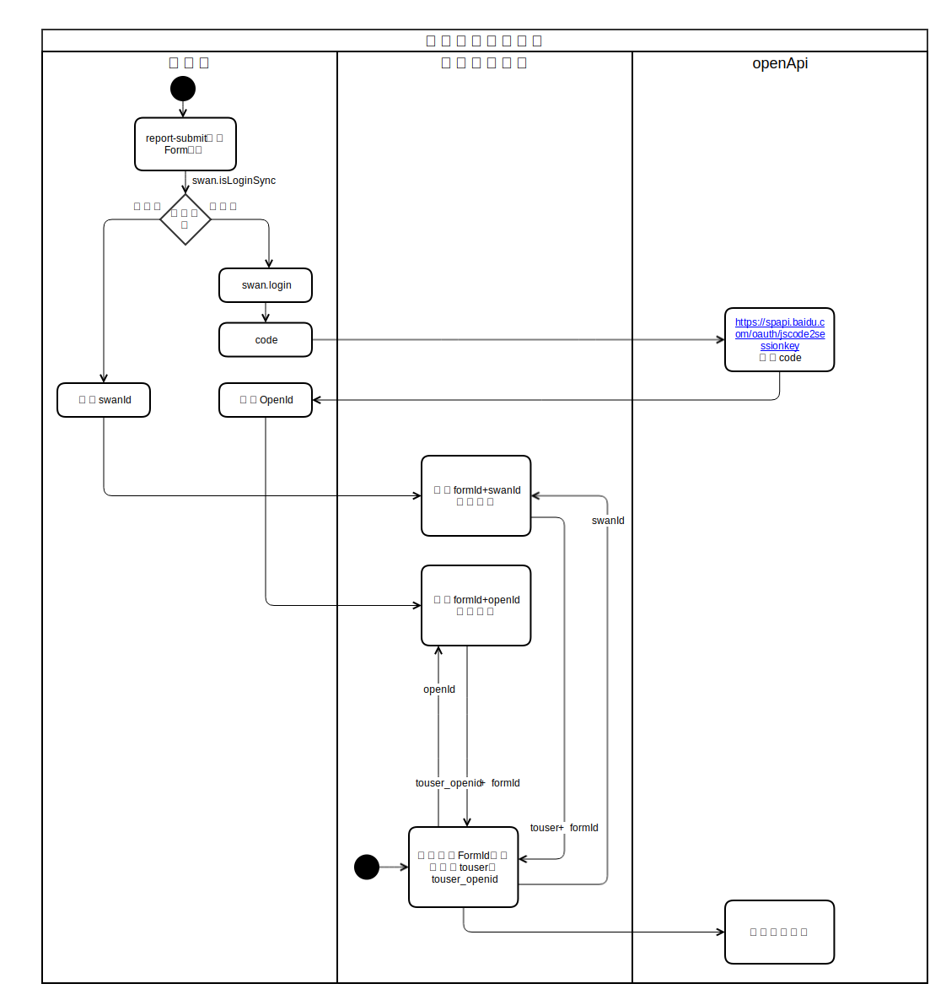

 

**解释：**推送模板消息

**百度APP中扫码体验：**


**接口调用请求说明：**请提前在开发者平台创建消息模板。用`application/x-www-form-urlencoded`方式提交数据。

```
POST https://openapi.baidu.com/rest/2.0/smartapp/template/send?access_token=ACCESS_TOKEN

```


**名词解释：**

- [swan_id](http://smartprogram.baidu.com/docs/develop/api/open_userinfo/#swanid%E6%9C%BA%E5%88%B6%E8%AF%B4%E6%98%8E/)：百度生成的与设备相关的唯一标识，APP卸载重安装不会变
- open_id：百度用户登录唯一标识
- formId：[form_id官方文档介绍](/develop/component/formlist_form/)

**参数说明：**

| 参数名            | 类型      | 是否必须 | 描述   |
|----|--|------|-----|
| access\_token  | String  | 是    | [接口调用凭证](https://smartprogram.baidu.com/docs/develop/serverapi/power_exp/)|
| touser         | String  | 是    | 接收者swan\_id，与touser\_openId二选一 （使用方式参考下面规则）|
| touser\_openId | String  | 是    | 接收者open\_id，与touser 二选一（使用方式参考下面规则） |
| template\_id   | String  | 是    | 所需下发的模板消息的id  |
| data           | Objec   | 是    | \{"keyword1": \{"value": "2018\-09\-06"\},"keyword2": \{"value": "kfc"\}\}为json对象 |
| page           | String  | 否    | 跳转小程序页面地址 pages/xxx/xxx?f=xxxx   |
| scene\_id      | String  | 是    | 表单提交场景下，为 submit 事件带上的 formId；支付场景下，为本次支付的 payId、orderId   |
| scene\_type    | Integer | 是    | 场景id类型，1：表单；2：百度收银台订单；3:直连订单        |
| ext            | Object  | 否    | \{"xzh\_id":111,"category\_id":15\}      |

**touser&touser_openId使用规则说明：**

- 百度登录用户使用touser_openId，游客用户使用touser，详见[如何判断当前用户是游客状态还是登录状态](#如何判断当前用户是游客状态还是登录状态？)。

### Q&A


#### 如何判断当前用户是游客状态还是登录状态？
 - scene_id最后一位是 1 代表登录状态, 最后一位是 0 代表未登录游客状态
 - 通过[swan.isLoginSync](http://smartprogram.baidu.com/docs/develop/api/open/log_swan-isLoginSync/) API可以判断当前用户是否为登录状态

#### 如何获取swan\_id & open\_id？
 - 获取swan\_id：[swan.getSwanId](https://smartprogram.baidu.com/docs/develop/api/open/userinfo_swan-getSwanId/)
 - 获取open\_id：参考官方文档 [获取登录用户OpenId](https://smartprogram.baidu.com/docs/develop/api/open_log/)


### 模板消息开发流程图：



### 错误码

| 错误码  | 说明               |
|-------|------------------|
| 2002 | 参数错误             |
| 4001 | template\_id 不正确 |
| 4002 | 消息推送接口调用失败       |
| 4003 | 表单无效             |
| 4004 | 场景id无效           |
| 6001 | 无 push 权限        |
