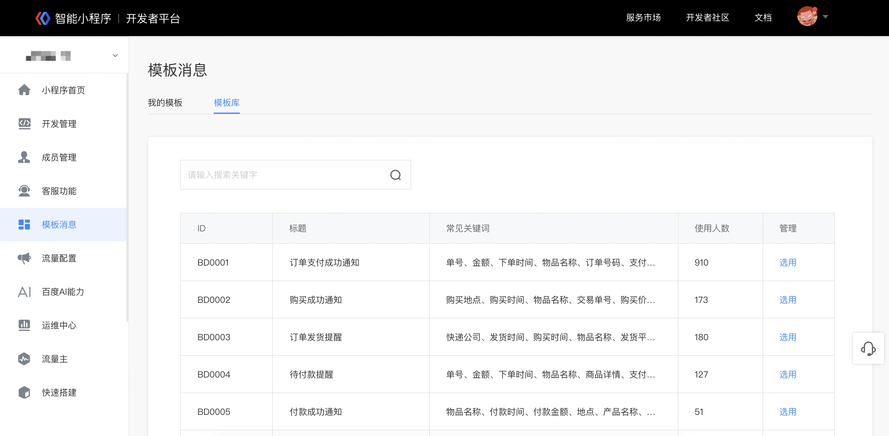
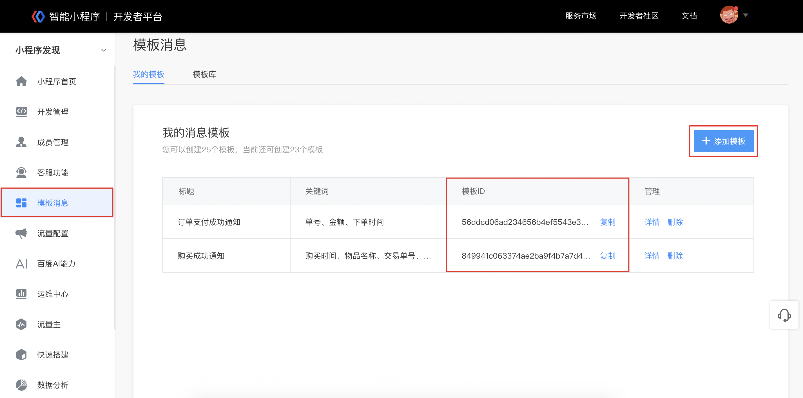

 
 

## 步骤一： 选用模板，获取模板ID

 1. 打开智能小程序开发者平台，选择**「模板消息」**，在**「模板库」**列表页选择对应的消息模板，或通过搜索关键词来查找所需要的消息模板；
 2. 如果没有合适的消息模板或关键词，可以申请新增模板或关键词，审核通过后即可使用；
 3. 添加模板完成后，可以在「我的模板」里看到对应模板的**模板ID**，用于发送模板消息。

## 步骤二：获取发送模板消息所需要的凭证

### 支付类消息：通过支付获取 orderId 或者 payId

**orderId（推荐）**

用户通过百度收银台支付后，开发者可以通过收银台「通知支付状态」接口中获取到[orderId](https://smartprogram.baidu.com/docs/develop/function/tune_up_notice/) ，用于发送支付类模板消息。

接入百度收银台流程详见 [百度收银台支付](https://smartprogram.baidu.com/docs/introduction/pay/)

**payId**

当用户通过直连（微信、支付宝）支付等完成支付行为时，可以获取payId用于发送支付类模板消息。

### 表单类消息：通过form组件获取表单 formId

**formid**

页面内的 [< form/>](https://smartprogram.baidu.com/docs/develop/component/formlist_form/)组件，当属性`report-submit`为**true**，且属性`report-type`为**defalut**（默认）时，可以声明为需发送表单类消息，此时用户点击按钮提交表单，可以获取用于发送表单消息的表单**formId**

### 订阅类消息：通过form组件获取订阅 formId

**formid**

页面内的 [< form/>](https://smartprogram.baidu.com/docs/develop/component/formlist_form/)组件，当属性`report-submit`为**true**，且属性`report-type`为**subscribe**时，可以声明为需发送订阅类消息，此时用户点击按钮，首先弹出授权面板，用户授权成功后可以获取用于发送订阅类消息的订阅**formId**

## 步骤三：调用接口下发模板消息

开发者调用消息发送接口[sendTemplateMessage](https://smartprogram.baidu.com/docs/develop/serverapi/sendTemplateMessage/)给用户发送消息，需根据消息类型传入不同的参数，同时可在接口 page 参数中配置跳转到小程序的指定页面 path

### 相关API列表

|接口中文名 | 接口英文名 | 
|---|---|
|获取小程序模板库标题列表 | [getTemplateLibraryList](https://smartprogram.baidu.com/docs/develop/serverapi/getTemplateLibraryList/) | 
|获取模板库某个模板标题下的关键词库|[getTemplateLibraryById](https://smartprogram.baidu.com/docs/develop/serverapi/getTemplateLibraryById/) |
|组合模板并添加至帐号下的个人模板库|[addTemplate](https://smartprogram.baidu.com/docs/develop/serverapi/addTemplate/) |
|获取帐号下已存在的模板列表|[getTemplateList](https://smartprogram.baidu.com/docs/develop/serverapi/getTemplateList/) |
|删除帐号下的某个模板|[deleteTemplate](https://smartprogram.baidu.com/docs/develop/serverapi/deleteTemplate/) |
|推送模板消息|[sendTemplateMessage](https://smartprogram.baidu.com/docs/develop/serverapi/sendTemplateMessage/) |