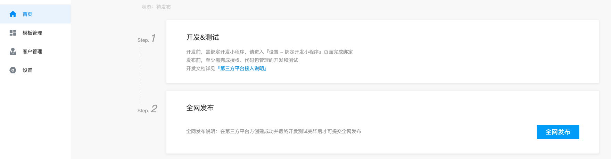

## 创建第三方平台

### 一、第三方服务商入驻
百度智能小程序第三方服务商平台目前为邀请制内测，请您发送邮件至 TP-smartprogramme@baidu.com 申请入驻。

### 二、创建第三方平台
您可在智能小程序官网以第三方服务商超级管理员账号登陆后，在管理中心/第三方平台中，创建一个第三方平台应用。（同一个账号最多可创建5个第三方平台应用）

#### 第一步：填写基本信息
填写您的第三方平台基本信息，该信息将展示在用户授权页面。其中**官方网站**需填写您的主体在工信部完成备案的网址。查询工信部备案。

#### 第二步：选择权限
选择您的平台所需获取的用户权限，选中后该权限将展示在用户授权页面中，并可被用户选择

#### 第三步：填写开发资料
填写开发相关信息，具体如下：

* 授权发起页域名：指小程序在登录授权给第三方平台时的授权回调域名，在用户扫码授权流程中，同时必须从本域名内网页跳转到登录授权页，才可完成登录授权。
* 授权测试名单：在全网发布前，仅该列表内的小程序才可进行授权，以便测试。
* 授权接收URL	：用于接收授权成功、更新、解除通知，也用于接收ticket。ticket是验证平台方的重要凭据，在获取第三方平台access_token时需要提供最新推送的ticket以供验证身份合法性。此ticket作为验证平台方的重要凭据，请妥善保存。
* 消息验证TOKEN：第三方平台在代替小程序接收消息时，用此Token来校验消息。
* 消息加解密Key：在代替小程序收发消息过程中使用。
* 消息与事件接收URL：该URL用于接收已授权小程序的消息和事件。
* 服务域名：服务器域名。
* 业务域名：小程序内H5跳转域名限制规则，业务域名需要经过ICP备案。
* 白名单IP地址列表：仅当第三方平台IP地址在该列表中时，才被允许调用相关接口。

### 三、第三方平台开发

开发并实现第三方平台授权、代开发、代运营相关能力，具体可参考：[第三方接入文档](https://smartprogram.baidu.com/docs/develop/third/develop/)。

### 四、第三方平台发布
当您的第三方平台相关功能开发完成并测试通过后，可以提交全网发布。百度将会对您的平台基本信息和相关功能进行审核和检测，通过后您的平台即可正式接受全网开发者的小程序授权，并代其实现相关业务。

同时，平台全网发布后，您的平台信息将被展示在官方的查询平台中，地址：[https://smartprogram.baidu.com/developer/search.html](https://smartprogram.baidu.com/developer/search.html)。

