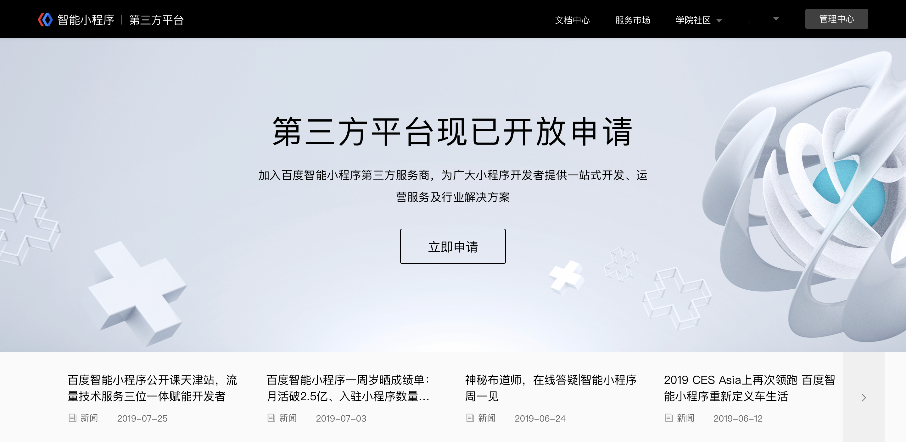
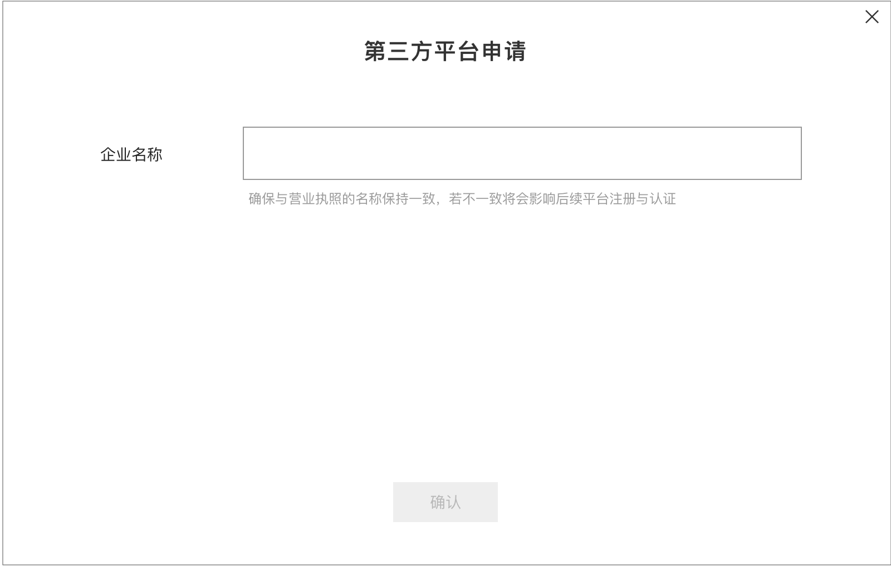
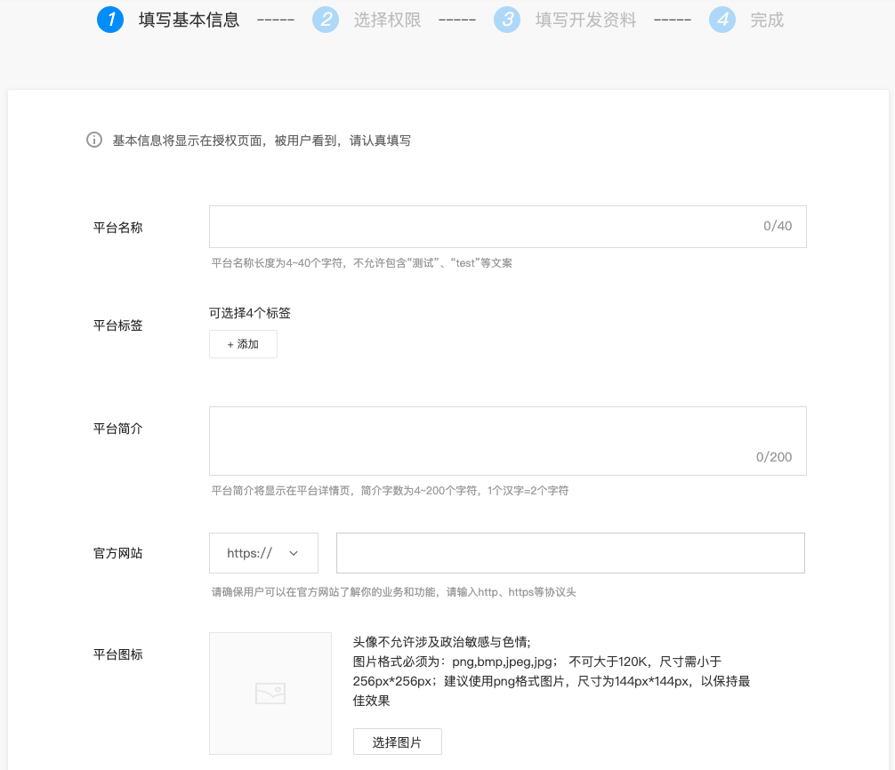
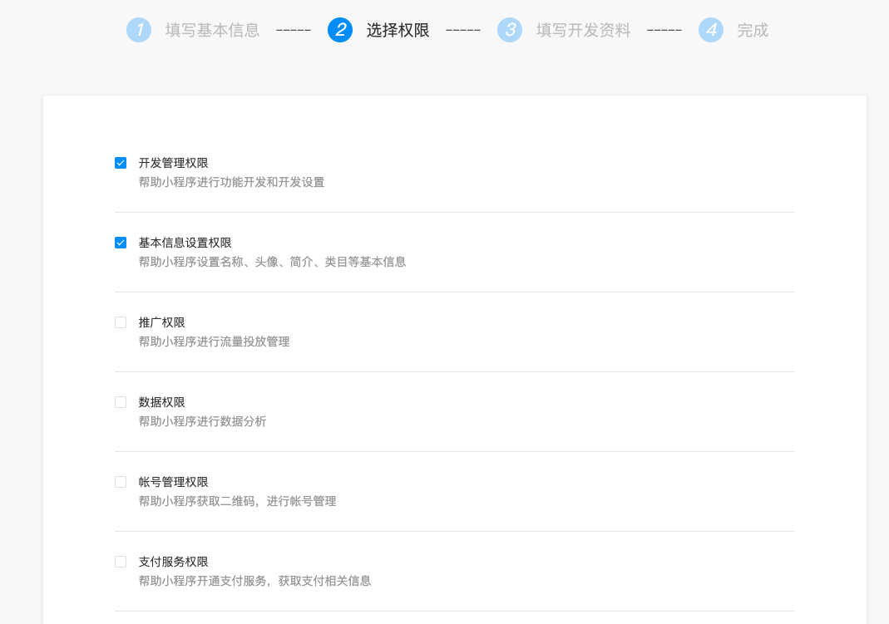
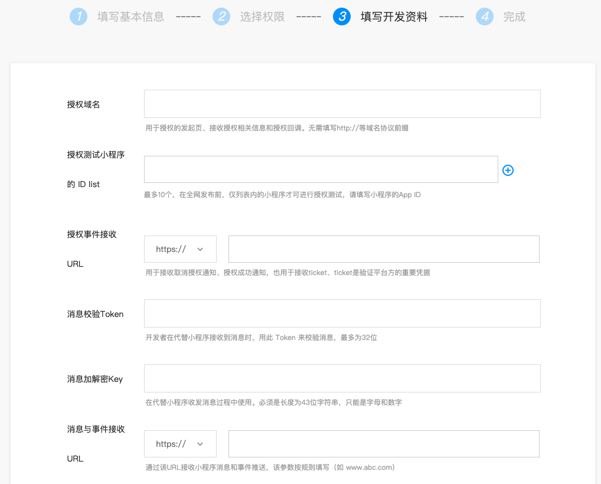
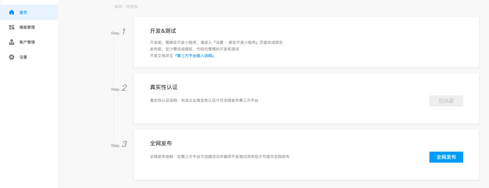
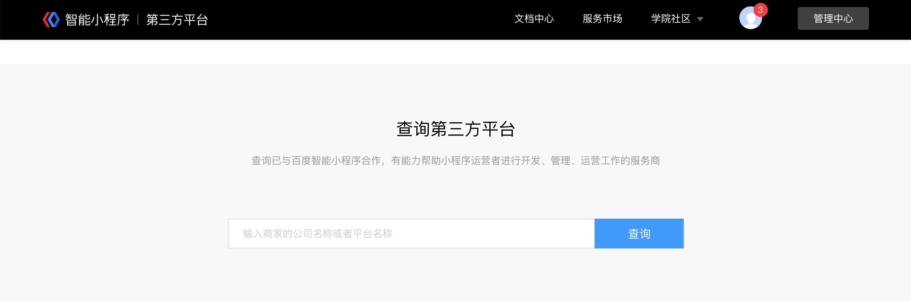

## 入驻并创建第三方平台 

### 一、申请入驻
百度智能小程序第三方服务商平台目前已开放公测，您可以前往[第三方平台官网](https://smartprogram.baidu.com/developer/tpindex.html)提交您的入驻申请。

>目前暂不支持百家号、熊掌ID个人类型账号申请入驻。
> 目前暂不支持被添加为管理员或成员的账号申请入驻,需更换为超管账号进行申请。

前往[第三方平台官网](https://smartprogram.baidu.com/developer/tpindex.html)，点击立即申请按钮。

 

百度会对您的服务商资质进行审核，根据账号的主体认证状态不同，具体流程如下：

#### 1. 针对未进行过主体认证的账号：
填写企业名称，需确保与营业执照的名称一致，否则将影响后续平台注册与认证。

 
请务必再次确认是否使用当前帐号及企业主体申请入驻第三方平台，确认提交后，百度将对您的服务商资质进行审核。
>注意：审核通过后，账号将与该企业主体绑定，且短期内不支持解绑。

#### 2. 针对已进行过主体认证的账号：
自动复用主体认证时所提交的企业信息，确认使用当前帐号及企业主体申请入驻后，将进入服务商资质审核流程。

 

### 二、主体认证
服务商资质审核通过后，将自动进入主体认证环节。认证成功后，可进入管理中心创建第三方平台。

具体流程可参考：[主体认证](http://smartprogram.baidu.com/docs/introduction/register/)

>注意：主体认证时所提交的企业信息应当与入驻申请时填写的企业名称保持一致。

已进行过主体认证的账号，将跳过此环节，可直接进入管理中心创建第三方平台。

 
### 三、创建第三方平台                                                                                                        
您可在登录第三方服务商超级管理员账号后，前往管理中心/第三方平台，创建一个第三方平台应用。（同一账号最多可创建5个第三方平台应用）

#### 第一步：填写基本信息
填写您的第三方平台基本信息，该信息将展示在用户授权页面。其中**官方网站**需填写您的主体在工信部完成备案的网址。

#### 第二步：选择权限
选择您的平台所需获取的用户权限，选中后该权限将展示在用户授权页面中，并可被用户选择

#### 第三步：填写开发资料
填写开发相关信息，具体如下：

* 授权发起页域名：指小程序在登录授权给第三方平台时的授权回调域名，在用户扫码授权流程中，同时必须从本域名内网页跳转到登录授权页，才可完成登录授权。
* 授权测试名单：在全网发布前，仅该列表内的小程序才可进行授权，以便测试。
* 授权接收URL	：用于接收授权成功、更新、解除通知，也用于接收ticket。ticket是验证平台方的重要凭据，在获取第三方平台access_token时需要提供最新推送的ticket以供验证身份合法性。此ticket作为验证平台方的重要凭据，请妥善保存。
* 消息验证TOKEN：第三方平台在代替小程序接收消息时，用此Token来校验消息。
* 消息加解密Key：在代替小程序收发消息过程中使用。
* 消息与事件接收URL：该URL用于接收已授权小程序的消息和事件。
* 服务域名：服务器域名。
* 业务域名：小程序内H5跳转域名限制规则，业务域名需要经过ICP备案。
* 白名单IP地址列表：仅当第三方平台IP地址在该列表中时，才被允许调用相关接口。

### 四、第三方平台开发

开发并实现第三方平台授权、代开发、代运营相关能力，具体可参考：[第三方接入文档](https://smartprogram.baidu.com/docs/develop/third/develop/)。

### 五、第三方平台发布
当您的第三方平台相关功能开发完成通过主体真实性认证后，可以提交全网发布。百度将会对您提交的平台基本信息进行审核，并对所选权限集对应的能力进行检测。具体流程如下：

#### 1.真实性认证检测
在您提交全网发布前，请确保您的账号已完成主体真实性认证，具体可参考：[真实性认证文档](https://smartprogram.baidu.com/docs/introduction/authenticity/)。

#### 2.权限集能力检测
在您完成主体真实性认证及平台开发后，可提交全网发布。

在您点击全网发布后，百度将会对您所选的平台权限集所对应能力的实现情况进行自动化检测，请确保您已经使用授权测试小程序验证相关能力。具体检测机制可参考：[第三方平台发布检测](https://smartprogram.baidu.com/docs/develop/third/publication/)。

#### 3.平台基本信息审核
在您通过权限集能力检测后，百度将会对您的平台基本信息进行人工审核，请您耐心等待审核结果。

通过审核后，平台全网发布成功，您的平台信息即可在第三方平台官方主页中被查询到，地址：[https://smartprogram.baidu.com/developer/tpindex.html](https://smartprogram.baidu.com/developer/tpindex.html)。

