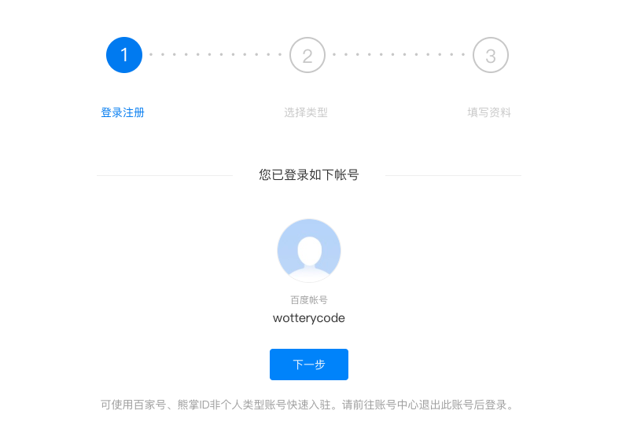
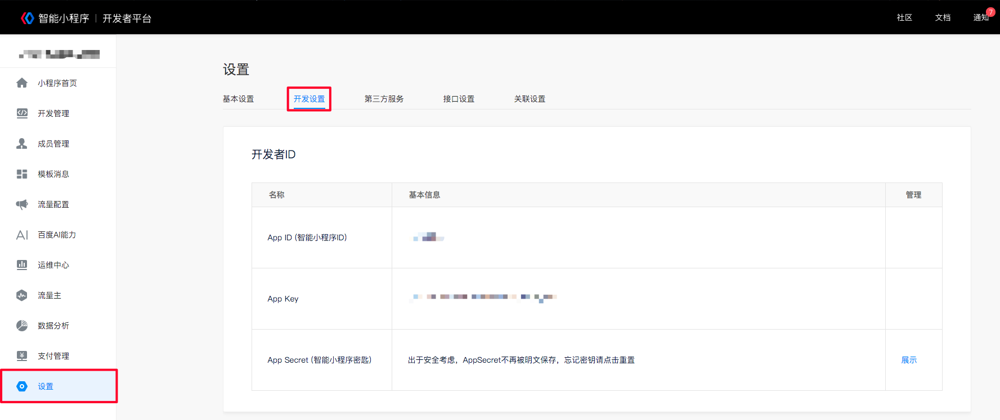

## 申请账号

进入[小程序注册页](https://smartprogram.baidu.com/developer/registerxiongzhang.html) 根据指引填写信息和提交相应的资料，就可以拥有自己的小程序帐号。

在这个[小程序管理中心](https://smartprogram.baidu.com/developer/index.html)，会罗列所有与你相关的小程序，并且可以进行权限设置、查看数据报表、发布小程序等操作。

登录，并进入小程序`管理中心`，可以在菜单 “设置” - “开发设置” 看到小程序的 App ID (智能小程序ID) 了 。

小程序的 AppID 相当于小程序平台的一个身份证，后续你会在很多地方要用到`AppID`。

有了小程序帐号之后，我们需要一个[工具](https://smartprogram.baidu.com/docs/develop/devtools/page/)来开发小程序。

## 安装开发者工具

前往[开发者工具下载页面](https://smartprogram.baidu.com/docs/develop/devtools/history/) ，根据自己的操作系统下载对应的安装包进行安装，有关开发者工具更详细的介绍可以查看 [《开发者工具介绍》](https://smartprogram.baidu.com/docs/develop/devtools/show_sur/) 。

打开小程序开发者工具，用手机百度App扫码登录开发者工具，准备进入你的第一个小程序开发之旅吧！

## 你的第一个小程序

根据以下步骤，建设一个属于你的小程序工程吧~

- 在工具栏点击新建；
- 依次补充项目信息（填写名称、选择目录、填写AppId）；
- 点击完成即可快速生成一个小程序工程；
- 进入开发者工具后，工具会自动编译小程序源码；
- 稍等片刻就可以在开发者工具中预览你的第一个小程序。

## 编译预览

点击工具上的编译按钮，可以在工具的左侧模拟器界面看到这个小程序的表现，也可以点击预览按钮，通过手机百度App的扫一扫在手机上体验你的第一个小程序。