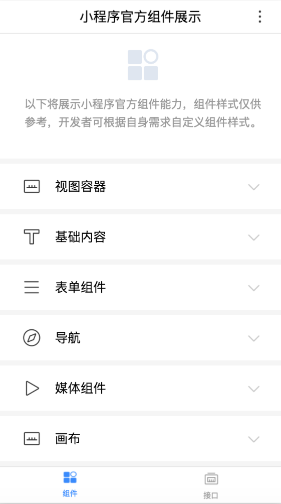

随着小程序不断支持更多的功能，旧版本的客户端可能会出现不支持新增功能的情况，因此在使用新增功能时需做兼容性处理。
 
* 通过 swan.getSystemInfo 或者 swan.getSystemInfoSync 获取到小程序的 SWAN 版本号。
* 通过 swan.canIUse 详情来判断是否可以在该 SWAN 版本下直接使用对应的API或者组件。

## 版本比较 
智能小程序客户端和智能小程序 SWAN 版本号风格为 Major.Minor.Patch（主版本号.次版本号.修订号）。 开发者可以根据版本号参考以下代码进行兼容性处理：

```js
function compareVersion(v1, v2) {
  v1 = v1.split('.')
  v2 = v2.split('.')
  var len = Math.max(v1.length, v2.length)

  while (v1.length < len) {
    v1.push('0')
  }
  while (v2.length < len) {
    v2.push('0')
  }

  for (var i = 0; i < len; i++) {
    var num1 = parseInt(v1[i])
    var num2 = parseInt(v2[i])

    if (num1 > num2) {
      return 1
    } else if (num1 < num2) {
      return -1
    }
  }

  return 0
}

compareVersion('1.11.0', '1.9.9')
// 1
```

**注意: **
此方法同样适用于判断百度 App版本，但在不得不使用百度 App版本进行判断兼容的情况下，请使用 SWAN 版本进行判断兼容。

## 接口
开发者可以用以下代码来判断新增API是否支持用户的手机机型：
```js
if (swan.createCanvasContext) {
  swan.createCanvasContext()
}
else {
  swan.showModal({
    title: '提示',
    content: '当前客户端版本过低，无法使用该功能，请升级。'
  })
}
```
## 参数
开发者可以用以下代码判断 API 的参数或者返回值是否有新增：
```js
swan.showModal({
  success: function(res) {
    if (swan.canIUse('showModal.cancel')) {
      console.log(res.cancel)
    }
  }
})
```
## 组件
由于新增的组件或属性在旧版本上是否既不会被处理，也不会报错。开发者可以用以下代码对旧版本进行降级处理：
```js
Page({
  data: {
    canIUse: swan.canIUse('cover-view')
  }
})
<video controls="{{!canIUse}}">
  <cover-view s-if="{{canIUse}}">play</cover-view>
</video>
```
## Android 与 iOS 差异

|功能|Andriod|iOS|
|--|--|--|
|webp格式|支持|不支持|


## 基础库最低版本设置
进入小程序主页后，单击左导航栏中的“设置 > 基本信息”，单击“设置”。
 
 