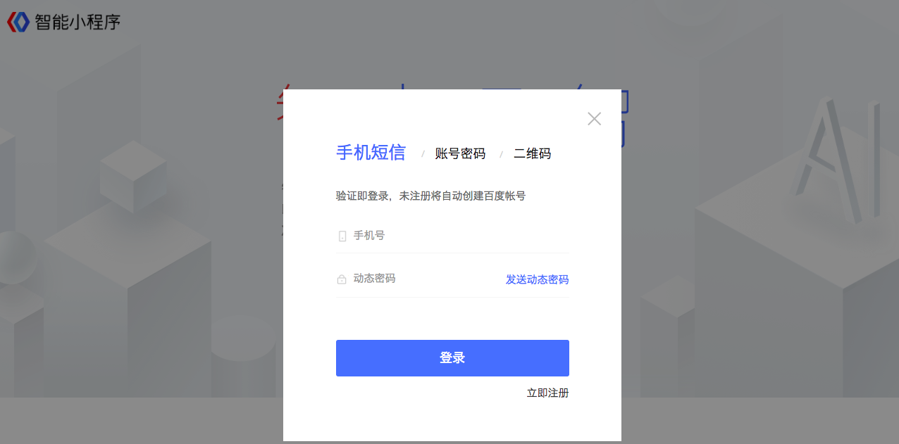

申请帐号
-----

使用百度帐号（没有百度帐号会自动创建）登录 [智能小程序开发者后台](https://smartprogram.baidu.com/mappconsole/main/login)。

登录成功后，选择类型、填写信息并提交相应的资料。

提交完资料，等待审核。审核通过后，就可以拥有自己的智能小程序帐号。

审核通过后，登录 [智能小程序开发者后台](https://smartprogram.baidu.com/mappconsole/main/login) 。 打开“智能小程序首页”-“设置”-“开发设置”， 查看智能小程序的 AppID 。

安装百度开发者工具
----

下载百度开发者工具。 [Windows 64版下载地址](http://smartprogram.baidu.com/mappconsole/api/devDownload?system=windows&type=online)  |   [Mac版下载地址](http://smartprogram.baidu.com/mappconsole/api/devDownload?system=mac&type=online)。

你的第一个智能小程序
-----

成功安装百度开发者工具后，打开后出现以下界面。用户可以新建项目或者打开现有智能小程序项目。

新建项目需要开发者填写项目的名称、项目开发路径和 AppID 。信息校验无误后脚手架会自动生成智能小程序的初始化文件。

如果开发者尚没有 AppID 可以点击 "注册"，注册 AppID 或者点击 "智能小程序" 选择体验模式，但体验模式下部分 API 可能无法正常调用。

 

编译
-----

点击百度开发者工具上的编译按钮，可以在百度开发者工具的左侧模拟器界面看到这个智能小程序的表现，也可以点击预览按钮，通过百度APP的扫一扫在手机上体验你的第一个智能小程序。

