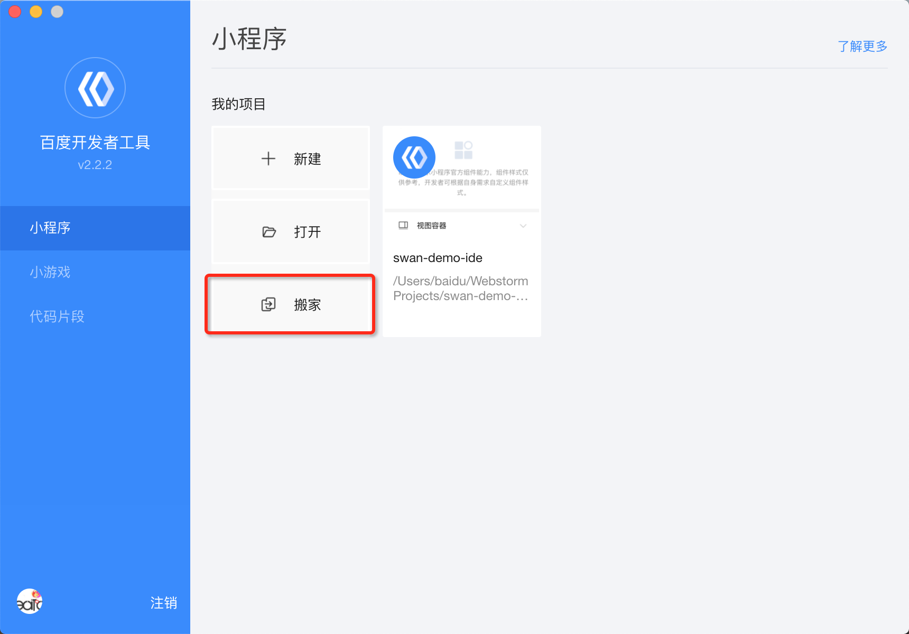

对于有其它小程序开发经验的开发者，我们还提供了如下开发解决方案：
* 搬家工具：针对曾经开发过微信小程序的开发者，帮助您把微信小程序的部分代码迁移到百度智能小程序上。
* 框架开发：支持 Taro、Mpvue、WePY、Okam 四种不同的框架，只写一套代码，通过编译即可生成在不同端（微信/百度/支付宝/字节跳动小程序、H5、React-Native 等）运行的代码。

> 为了更好的了解开发者的需求，帮助您减少不必要的工作量，我们邀请您填写<a href="https://smartprogram.baidu.com/docs/html/third_party/acess-wenjuan/#/wenjuan/">智能小程序接入技术问卷调查</a>。


## 搬家工具


搬家工具，是基于`Abstract Syntax Tree`开发的辅助工具，可以帮助您把微信小程序的部分代码迁移到百度智能小程序上。工具可进行静态语法上的转换，根据一些规则去转换代码，抹平微信小程序语法和百度智能小程序语法上的差异，为大家减少因平台差异带来的苦恼。
需要注意的是：工具做不到运行时 diff 的抹平，也做不到一个 API 从无到有的过程。所以，需要大家根据转换 log，进行二次开发。


### 获取途径
当前支持NPM和百度开发者工具入口两种方式，请您根据需求进行选择：

* 正常`node.js`和`NPM`支持的情况下，因为版本的差异和报错信息抛出的问题，推荐用`NPM`的方式。
* 在 windows 下，由于`node.js`环境兼容性较差，建议使用开发者工具中的入口。

#### NPM
执行以下操作，在[NPM官网](https://www.npmjs.com/package/wx2swan)获取工具：
1. 全局按照个命令行工具： `npm install -g wx2swan`;
2. 执行命令： `wx2swan wxmp`  wxmp 是微信小程序的目录;
3. 查看生成目录的 log；

```
log
├── error.json   （没法转换过来的，目前不支持的，比如百度暂未支持的API，二次开发时需要修改的）
├── info.json    （搬家工具转换操作的log）
└── warning.json （根据经验，有可能引起报错的，二次开发时候需要重点注意的）

```
4. 根据开发者工具报错以及转换 log 进行二次开发。

#### 百度开发者工具入口
除了上面 NPM 的方式使用搬家工具，您还可以在在百度开发者工具里进入搬家工具：
1. **登录开发者工具。**
2. 在欢迎页中选择“搬家”，进行转换。



## 框架开发
小程序的开发除去常见的原生小程序语法的开发模式，还可以应用层框架开发，用类现代框架 (vue/react) 的语法去开发小程序，提升开发体验和解决跨平台的问题。本文主要讲解如何用常见的小程序框架开发百度小程序。


### Taro

#### 第一步: 安装开发工具
安装 Taro 开发工具 `@tarojs/cli`;
使用 npm 或者 yarn 的方式都可以获取，也可以直接使用 npx(在 npm 5.2+ 下)

```
	$ npm install -g @tarojs/cli
	$ yarn global add @tarojs/cli

```

#### 第二步: 初始化项目
使用命令创建模板项目

```
	$ taro init swan-taro
```

也可以参考 [Taro 开发百度小程序示例](https://github.com/zhengjiaqi/taro-demo-swan)

#### 第三步: 安装依赖
进入项目目录，安装依赖

```
	$ npm install
```

#### 第四步: 构建目标代码

> 去掉 --watch 将不会监听文件修改，并会对代码进行压缩打包

```
	# npm script
	$ npm run dev:swan // 开发模式
	$ npm run build:swan // 线上模式
	# 仅限全局安装
	$ taro build --type swan --watch
	$ taro build --type swan
```

#### 第四步: 开发者工具打开项目
可以通过两种方式打开项目：
方式一：使用开发者工具打开生成的 `dist` 目录，进行调试、预览、上传，
方式二：使用 2.8.1 及以上版本开发者工具打开项目目录，同时进行以下配置，配置完成后，就可以在开发者工具中开发、调试、预览、上传。

1. `npm run build:swan`
2. 在 `project.swan.json`文件中增加配置 `"smartProgramRoot": "dist"`（如果已有此配置，请忽略）
3. 在项目信息面板中设置如下自定义预处理指令。
	- 编译前预处理: `npm run dev:swan` 并勾选 **异步执行**
	- 上传前预处理: `npm run build:swan`
4. 重新打开项目

### mpvue

#### 第一步: 初始化项目
使用示例项目:

```
	$ git clone git@github.com:hucq/mpvue-platform-sample.git
```

也可以参考 [mpvue 开发百度小程序示例](https://github.com/zhengjiaqi/mpvue-demo-swan)

#### 第二步: 安装依赖
进入项目目录，安装依赖

```
	$ npm install
	$ npm install mpvue@beta mpvue-loader@beta mpvue-template-compiler@beta
```

#### 第三步: 构建目标代码

```
	$ npm run dev:swan  // 开发模式
	$ npm run build:swan // 线上模式
```

#### 第四步: 开发者工具打开项目
可以通过两种方式打开项目：
方式一：使用开发者工具打开生成的 `dist/swan` 目录，进行调试、预览、上传，
方式二：使用 2.8.1 及以上版本开发者工具打开项目目录，同时进行以下配置，配置完成后，就可以在开发者工具中开发、调试、预览、上传。

1. `npm run build:swan`
2. 在 `project.swan.json`文件中增加配置 `"smartProgramRoot": "dist/swan"`（如果已有此配置，请忽略）
3. 在项目信息面板中设置如下自定义预处理指令。
	- 编译前预处理: `npm run dev:swan` 并勾选 **异步执行**
	- 上传前预处理: `npm run build:swan`
4. 点击编译按钮

### WePY

#### 第一步: 安装开发工具
安装WePY开发工具 `wepy-cli`;

```
	$ npm install -g wepy-cli@1.7.3-alpha6

```

#### 第二步: 初始化项目
使用命令创建模板项目

```
	$ wepy init standard
```
也可以参考 [WePY 开发百度小程序示例](https://github.com/qianliu013/swan-wepy-todo-demo)

#### 第三步: 安装依赖
进入项目目录，安装依赖

```
	$ npm install
```

#### 第四步: 构建目标代码

注：去掉 --watch 将不会监听文件修改，并会对代码进行压缩打包

```
	# 仅限全局安装
	$ wepy build -o baidu --watch
	$ wepy build -o baidu
```

#### 第五步: 开发者工具预览
在百度开发者工具中选择打开项目目录下的`dist`目录，就可以在开发者工具中预览项目。

### Okam

#### 第一步：安装 CLI 工具

* Node 安装（要求 `Node >=8 && NPM >= 3`），具体安装可以到[官网下载](https://nodejs.org)；
* CLI 工具安装:
 ```
 npm install okam-cli -g
 ```

#### 第二步：初始化项目

```shell
okam init my-project
cd my-project
npm install
```

#### 第三步：构建目标代码

|代码|说明|
|--|--|
| `npm run dev`| 带 watch 开发模式|
|`npm run dev:clean`| 删掉构建产物（不包括项目配置文件）并重新构建且带 watch 开发模式|
|`npm run dev:server`|带 watch && 开发 Server 开发模式|
|`npm run build`| 删掉构建重新构建（没有 watch && 开发 Server）|
|`npm run prod`| 生产环境构建|

#### 第四步: 开发者工具打开项目
可以通过两种方式打开项目：
方式一：使用开发者工具打开生成的 `dist` 目录，进行调试、预览、上传，
方式二：使用 2.8.1 及以上版本开发者工具打开项目目录，同时进行以下配置，配置完成后，就可以在开发者工具中开发、调试、预览、上传。

1. `npm run prod`
2. 在 `project.swan.json`文件中增加配置 `"smartProgramRoot": "dist"`（如果已有此配置，请忽略）
3. 在项目信息面板中设置如下自定义预处理指令。
	- 编译前预处理: `npm run dev` 并勾选 **异步执行**
	- 上传前预处理: `npm run prod`
4. 点击编译按钮

更多关于 `Okam` 使用，可以参考 [Okam 文档](https://ecomfe.github.io/okam)。


