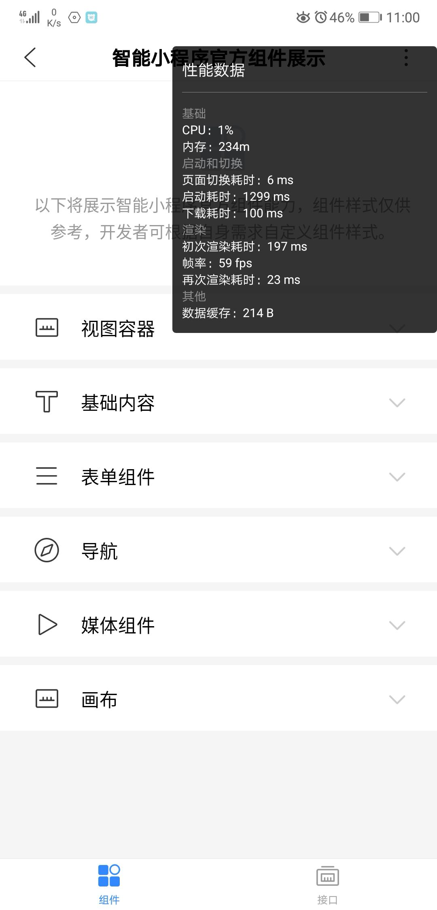

### 性能面板

从百度APP 10.8.0 开始，我们提供了性能面板让开发者了解智能小程序的性能。开发者可以在开发版智能小程序下打开性能面板，打开方法：进入开发版智能小程序，进入右上角更多按钮，点击「性能窗口开关」。

### 性能面板指标说明

|指标|说明|
|----|----|
|CPU| 智能小程序进程的 CPU 占用率，仅 Android 下提供|
|内存| 智能小程序进程的内存占用，仅 Android 下提供|
|启动耗时| 智能小程序启动总耗时|
|下载耗时| 智能小程序包下载耗时，首次打开或资源包需更新时会进行下载|
|页面切换耗时 | 智能小程序页面切换的耗时|
|帧率/FPS | 智能小程序页面刷新帧率| 
|首次渲染耗时 | 页面首次渲染的耗时|
|再次渲染耗时|  页面再次渲染的耗时（通常由开发者的 setData 操作触发）|
|数据缓存  |  智能小程序通过 Storage 接口储存的缓存大小 |
