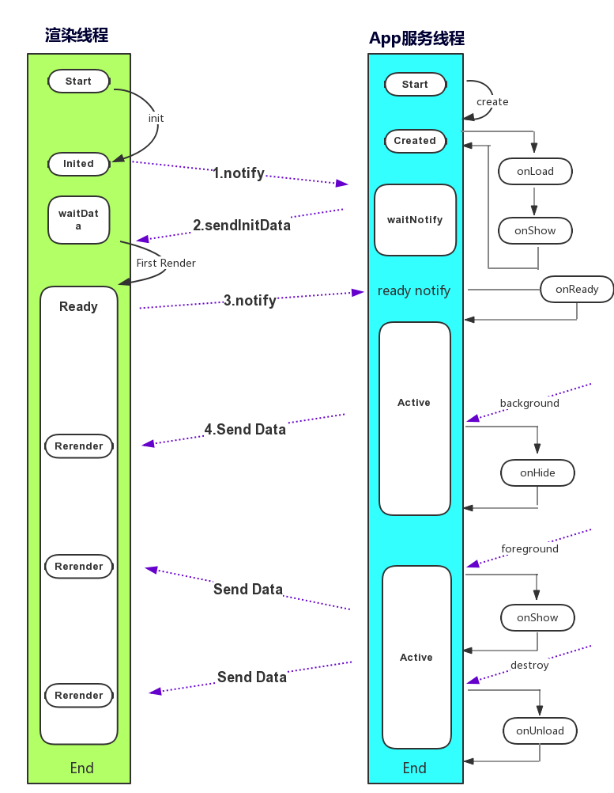

#### 属性介绍：

|属性|类型|描述|触发时机|
|----|----|----|--------|
|onLaunch|Function|SWAN 初始化的生命周期函数|当 SWAN App 初始化完成时，会触发 onLaunch（全局只触发一次）|
|onShow|Function| SWAN App 展示时调用的生命周期函数|SWAN App 从后台进入前台，触发 onShow|
|onHide|Function| SWAN App 隐藏时调用的生命周期函数|SWAN App 从前台进入后台，触发 onHide|
|onLoad|Function| 监听页面加载的生命周期函数|SWAN App 页面加载完成，触发 onLoad|
|onReady|Function| 监听页面初次渲染完成的生命周期函数|SWAN App 页面渲染完成，触发 onReady|
|onUnload|Function| 监听页面卸载的生命周期函数|页面卸载，触发 onUnload|
|onError|Function|错误监听函数|当 SWAN App 发生错误时，会触发|

#### 原理图：
 

 1、**notify**:当渲染线程初始化后，向APP服务线程派发消息，请求获取初始化渲染数据；
 2、**sendInitData**:APP服务线程将初始化渲染数据派发给渲染线程；
 3、**notify**:渲染线程渲染达到Ready状态后，派发消息通知APP服务线程；
 4、**SendData**:APP服务线程触发onReady事件，向渲染线程传送数据；

 **说明**
 每次前台切后台会触发Page的onHide生命周期函数，后台切前台触发Page的onShow。
