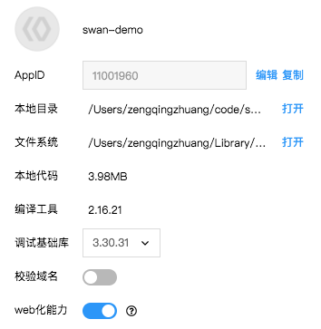

## 调试

> 具体调试方法请参考<a href="https://smartprogram.baidu.com/docs/develop/devtools/smartappdebug_function/">调试</a>章节。

## Web 化
在工具菜单栏单击“项目信息”，在弹出框中勾选“接入百度搜索”，即可接入自然搜索。

## 预览

当点击预览按钮时，开发者工具会对当前项目进行编译，然后制作压缩包上传到服务器，并生成小程序和 web 小程序的预览二维码，用百度app扫码后可以看到相应页面。

## 发布

当点击发布按钮时，开发者工具会对当前项目进行编译，然后制作压缩包上传到服务器，上传成功后，可以在智能小程序官网的开发管理一栏看到提交的相关信息。

