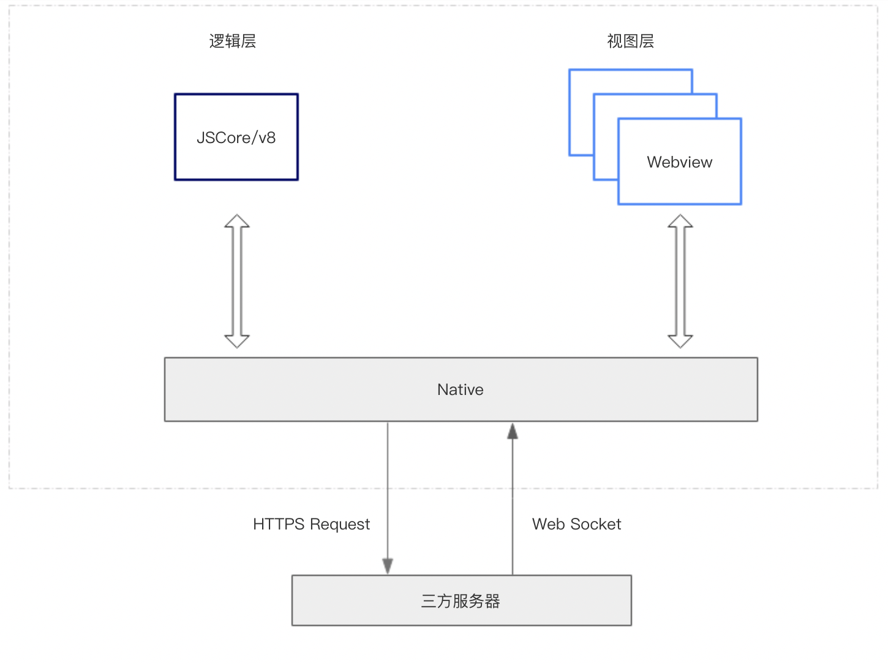

## 小程序宿主环境

我们称宿主客户端（例如百度App）给小程序所提供的环境为宿主环境。小程序借助宿主环境提供的能力，可以完成许多普通网页无法完成的功能。

上一讲中我们把小程序涉及到的文件类型阐述了一遍，结合初始化项目，我们继续来讲一下这些文件之间都是如何配合工作的。

### 视图层和逻辑层
首先，我们来简单了解下小程序的运行环境。小程序的运行环境分成视图层和逻辑层，其中`SWAN`模板和`CSS`样式工作在视图层，`JS`脚本工作在逻辑层。

小程序的视图层和逻辑层分别由两个线程管理：视图层的界面使用了WebView 进行渲染；逻辑层采用JSCore/v8线程运行JS脚本。一个小程序存在多个页面，所以视图层存在多个WebView线程，这两个线程的通信会经由宿主（例如百度App）客户端（下文中也会采用Native来代指宿主客户端）做中转，逻辑层发送网络请求也经由Native转发，小程序的通信模型下图所示。



有关视图层和逻辑层的详细文档参考 [小程序框架]() 。

### 程序与页面
宿主客户端在打开小程序之前，会把整个小程序的代码包下载到本地。

紧接着通过`app.json`的`pages`字段就可以知道你当前小程序的所有页面路径:

```json
{
  "pages":[
    "pages/index/index"
  ]
}
```

这个配置定义了一个页面，位于`pages/index/index`。而写在 pages 字段的第一个页面就是这个小程序的首页（打开小程序看到的第一个页面）。

于是宿主客户端就把首页的代码装载进来，通过小程序底层的一些机制，就可以渲染出这个首页。

小程序启动之后，在`app.js`定义的`App`实例的`onLaunch`回调会被执行:

```js
App({
  onLaunch() {
    // 小程序启动之后 触发
  }
});
```

整个小程序只有一个 App 实例，是全部页面共享的，更多的事件回调参考文档 [注册程序 App](https://smartprogram.baidu.com/docs/develop/framework/app_service_register/) 。

接下来简单看看小程序的页面是怎么写的。

我们可以观察到`pages/index`文件夹下其实是包括了4种文件：
- 首先宿主客户端会根据`index.json`配置对视图层容器界面进行装饰，例如顶部的颜色和title你都可以在这个`json`文件里进行定义；
- 然后客户端就将会装载这个页面的`SWAN 结构`和`CSS 样式`；
- 最后客户端会加载`index.js`，执行小程序逻辑。

可以看到`index.js`的大体内容如下:

```js
Page({
    // 参与页面视图的数据
    data: {
        userInfo: {}
    },
    onLoad() {
        // 页面视图后生命周期方法
    }
});
```

`Page`是一个页面构造器，这个构造器就生成了一个页面。在生成页面的时候，小程序框架会把`data`数据和`index.swan`一起初始化渲染出最终的结构，于是就有了小程序的初始化页面。

在渲染完视图之后，页面实例就会收到一个`onLoad`的回调，我们可以在这个回调函数中处理其它的逻辑。

有关于`Page`构造器更多详细的文档参考[注册页面](https://smartprogram.baidu.com/docs/develop/framework/app_service_page/)。

### 组件
小程序提供了丰富的基础组件给开发者，开发者可以像搭积木一样，组合各种组件拼合成自己的小程序。

就像`HTML`的 div、p 等标签一样，在小程序里边，我们只需要在`SWAN`写上对应的组件标签名字就可以把该组件显示在界面上，例如需要在界面上显示视频，只需要这样写即可：

```xml
<video></video>
```

使用视频组件的时候，还可以通过属性传递值给组件，让组件可以以不同的状态去展现，例如，我们希望视频循环播放，那么需要声明视频组件的 loop（是否自动播放）属性:

```xml
<video loop></video>
```

同时，组件的内部行为也会通过事件的形式让开发者可以感知，例如用户点击视频组件上的暂停图标，那么可以在逻辑层编写`onPause`方法来处理暂定后的业务逻辑：

```xml
<video bindpause="onPause" loop></video>
```

当然也可以通过`style`或者`class`来控制组件的外层样式，以便适应小程序界面宽度高度等。

更多的组件可以参考 [小程序的组件](https://smartprogram.baidu.com/docs/develop/component/componetlist/)。

### API
为了让开发者可以很方便的调起宿主提供的能力，例如获取位置、系统信息等，智能小程序给开发者提供了大量的`API`，以供其完成具有原生般的开发功能。

例如，要获取系统信息时，只需要：

```js
swan.getSystemInfo({
    success: res => {},
    fail: err => {}
});
```

调用百度App扫一扫能力，只需要：

```js
swan.scanCode({
  success: res => {
    console.log(res);
  }
});
```

**注意：**

- 大多数`API`的回调都是异步，需要处理好代码逻辑的异步问题。

更多的 API 能力见 [小程序的API](https://smartprogram.baidu.com/docs/develop/api/apilist/)。

通过这一节讲解，我们大概了解了小程序运行的一些基本概念，当开发完一个小程序之后并得到充分测试没问题之后，就需要发布我们的小程序啦。
在下一讲，我们将会一起了解发布前需要做什么准备。